# AI 芯片 Kernel 转行计划与长期推理系统路线

> 版本：5.0（单文档、纯转行执行版）  
> 制定日期：2026-08-08  
> 第一目标：先进入上海 AI 芯片公司的 Kernel / 算子 / 性能岗位  
> 长期目标：入行后利用真实工作场景，在 12～24 个月内向 LLM 推理系统延伸  
> 当前薪资基线：年度总包约 50 万  
> 使用方式：只依据本文件执行；先自评，再用从零任务核验，最后按阶段门槛决定学习、投递或转岗

---

## 1. 个人定位与转行原则

### 1.1 当前画像

- 所在城市：上海。
- 工作经历：9 年 WiFi 芯片行业物理层/射频软件经验。
- 当前收入：税前月薪约 4 万，年度总包约 50 万。
- CUDA、GEMM、Softmax、Norm、Attention、NCU、vLLM 等主题已有科普级理解。
- 当前不足不是“完全不知道”，而是尚未证明能独立设计、实现、优化、排错和交付。
- 当前日常工作占用大量时间，而工作内容与最终 AI 推理目标并不完全同向；继续等待“全部学完”会增加机会成本。

### 1.2 两步职业路径

```text
现在：WiFi 芯片物理层/射频软件
  -> 第一步：AI 芯片 Kernel / 算子 / 性能岗位
  -> 第二步：模型执行、runtime、推理引擎性能
  -> 长期：LLM 推理系统 / AI Infra
```

第一步不是绕路，而是让日常工作本身开始积累 GPU/NPU 架构、算子、模型 workload、runtime 和性能方法。进入正确团队后，即使工作依然繁忙，工作时间也会转化为最终目标的经验。

### 1.3 转行决策原则

1. **不等待推理系统全部学完。** 达到 Kernel 转岗门槛后立即开始市场验证。
2. **不以初级身份重新开始。** 目标是把 9 年芯片经验迁移为同职级附近的软硬协同能力。
3. **不要求一步到终点。** 第一份 AI 芯片工作重点看技术方向和积累速度，不只看职位名称。
4. **不为“进入 AI”接受无关岗位。** 工作内容必须真实包含计算 kernel、算子库、性能或 runtime。
5. **不只比较月薪。** 比较年度现金、奖金、股票、职级、工作强度、团队质量和未来转推理系统的路径。

### 1.4 关于“4 万月薪标准”的说明

“4 万”不是一个全国统一的技术等级。城市、公司、学历、年限、奖金和股票都会改变报价。本计划把它理解为：

> 年度总包约 50 万、社招中级到资深初段、需要独立交付和复杂问题闭环的岗位能力。

本计划不根据某个薪资数字机械推导技术等级，也不承诺完成清单就一定获得 50 万 Offer。执行标准只看五类结果：能否从零实现、能否补齐工程边界、能否解释性能因果、能否复现交付、能否在真实面试中稳定证明。

---

## 2. 上海岗位策略：Kernel 先行

### 2.1 优先投递的岗位名称

| 优先级 | 岗位类型                             | 为什么适合当前路径                             |
| ------ | ------------------------------------ | ---------------------------------------------- |
| P0     | AI 算子开发 / 高性能算子研发         | 直接积累算子实现、精度、性能和模型 workload    |
| P0     | GPU/NPU Kernel 性能优化              | 最能复用芯片理解、底层调试和 profiling 能力    |
| P0     | AI 芯片软件 / 算子库工程师           | 同时接触芯片架构、runtime、算子 ABI 和模型适配 |
| P1     | 异构计算 / 模型适配与性能工程师      | 可作为进入 AI 芯片软件栈的桥接岗位             |
| P1     | GPU 软件性能 / Performance Architect | 强调系统性能方法和软硬件协同，适合经验迁移     |
| P2     | AI 编译器后端 / Codegen              | 只有具备 MLIR/TVM/编译器基础时再重点投递       |

筛选时要区分：招聘信息中的 Linux/OS Kernel 是操作系统内核或驱动，不等于 AI 计算 Kernel。除非岗位同时包含 AI workload、算子或 runtime，否则不作为主线。

### 2.2 暂不作为第一跳的岗位

- 纯模型算法、训练策略或论文研究岗位。
- 以 K8s、平台运维和 API 接入为主的推理部署岗位。
- 只做客户支持、项目交付，无法接触核心算子和 runtime 的岗位。
- 要求多年 vLLM/SGLang 线上经验的高级推理系统岗位。
- 要求多年 MLIR/LLVM 后端经验的纯编译器专家岗位。

### 2.3 Kernel 第一跳的 T 型标准

| 能力域                     | 第一跳目标 | 入行后推理系统目标 | 当前策略                           |
| -------------------------- | ---------: | -----------------: | ---------------------------------- |
| C++ / Python / Linux 工程  |         L4 |                 L4 | 复用 9 年工程经验并补 AI 工程边界  |
| GPU 架构与 CUDA            |         L4 |                 L4 | 当前主攻                           |
| 算子实现与优化             |         L4 |                 L4 | 当前主攻                           |
| 性能测量与根因定位         |         L4 |                 L4 | 当前主攻和差异化优势               |
| Transformer / LLM 推理原理 |         L3 |                 L4 | 当前达到算子上下文，入行后继续加深 |
| PyTorch/框架集成           |     L3～L4 |                 L4 | 当前必须能完成算子全链路接入       |
| vLLM 与服务性能            |         L2 |                 L4 | 当前保温，不作为转岗阻塞项         |
| 分布式与生产服务           |     L1～L2 |             L3～L4 | 延后到入行后学习                   |
| 开源协作与技术表达         |         L3 |                 L4 | 当前形成外部可信度                 |

第一跳不要求推理系统已经达到 L4。当前真正的硬门槛是：工程、CUDA、算子、性能方法达到岗位级；Transformer 和框架集成达到能够支持真实模型算子的程度。

### 2.4 把 9 年 WiFi 芯片经验转换成 AI 岗位语言

下面不是替你虚构经历，而是提示应该从历史项目中寻找什么证据。

| 原经验方向               | 可迁移到 AI 芯片的能力                | 需要从旧项目中补充的真实证据             |
| ------------------------ | ------------------------------------- | ---------------------------------------- |
| 物理层算法与数值处理     | 数值稳定性、精度/性能取舍、数据流理解 | 定点/浮点、误差预算、吞吐或时延约束实例  |
| 射频软件与硬件联调       | 软硬件协同、寄存器/状态理解、跨层排障 | 一次从软件现象定位到硬件或接口根因的案例 |
| 芯片平台约束下开发       | 资源受限优化、硬件差异适配、性能意识  | 内存、算力、实时性或功耗约束下的取舍     |
| 长周期产品研发           | 版本、回归、稳定性和质量责任          | 一次版本交付、回归体系或线上问题闭环     |
| 跨团队协作（如实际存在） | 与算法、固件、验证、硬件团队协同      | 推动复杂问题关闭或技术方案落地的案例     |
| 9 年工作年限             | 独立负责、复杂问题拆解和影响力        | 负责范围、决策、结果、带人或协作证据     |

简历叙事应从“自学 CUDA 准备转行”改为：

> 具有 9 年 WiFi 芯片物理层/射频软件经验，长期处理硬件约束、数值计算和复杂联调问题；目前将这套软硬协同与性能分析能力迁移到 GPU/NPU 高性能算子和 AI 芯片软件栈。

---

## 总执行路线图（后续决策的第一依据）

先看这棵树，再看后面的技术清单。树中每个黄色菱形都是一次决策点：**条件未通过就补当前缺口，条件通过才进入下一层。** 参考周数只用于安排时间，不用于强制升级。

```mermaid
flowchart TB
    ROOT["总目标<br/>从 WiFi 芯片软件转入 AI 芯片<br/>再走向 LLM 推理系统"]

    S0["当前位置｜阶段 0：能力审计<br/>已有科普级广度，岗位级深度待核验<br/>预计第 1～2 周"]
    D0{"阶段 0 是否通过？<br/>必填项有等级和证据<br/>Top 8 缺口明确<br/>3 个旧项目案例完成翻译"}
    R0["未通过：继续审计<br/>不给自己填写虚假完成度<br/>当前仍只观察市场"]

    S1["阶段 1：Kernel 必需底座<br/>C++ / CUDA / GPU 架构 / 精度 / 测试<br/>预计第 3～6 周"]
    D1{"阶段 1 是否通过？<br/>ENG 核心项达到 L4<br/>CUDA-01～09 至少 7 项达到 L4"}
    R1["未通过：只补 Top 8 中的 P0<br/>不扩展 vLLM、分布式等支线"]

    S2["阶段 2：Kernel 旗舰项目<br/>L4 主案例 + L3～L4 第二算子<br/>NCU 性能根因闭环<br/>预计第 7～14 周"]
    D2{"是否达到试投线？<br/>KRI ≥ 65<br/>主案例已有可展示雏形"}
    R2["未达到：继续完善主案例<br/>补 correctness、benchmark、profiling<br/>暂不消耗重点公司机会"]
    APPLY1["小规模试投<br/>每周 2～3 个高匹配岗位<br/>用反馈发现真实缺口"]

    S3["阶段 3：岗位化包装与市场校准<br/>简历 + 项目报告 + 面试表达<br/>反馈缺口进入 Top 8<br/>预计第 15～20 周"]
    D3{"是否达到全面投递线？<br/>KRI ≥ 80<br/>5 项硬门槛全部通过"}
    R3["未达到：把重复面试缺口升为 P0<br/>暂停低优先级学习<br/>完成证据后重新判断"]
    APPLY2["全面投递<br/>每周 5～8 个高匹配岗位<br/>内推 + 猎头 + 官网同步"]

    S4["阶段 4：面试冲刺与 Offer 决策<br/>技术面复盘 + 团队尽调 + 总包比较<br/>预计第 21～26 周"]
    D4{"是否出现值得转行的 Offer？<br/>综合评分 ≥ 75<br/>没有伪 Kernel 等岗位红线<br/>薪资不低于个人战略底线"}
    R4["否：不为进入 AI 接受错误岗位<br/>根据简历、面试或岗位反馈回补<br/>继续寻找下一次机会"]
    JOB["第一跳完成<br/>进入 AI 芯片 Kernel / 算子 / 性能岗位<br/>让日常工作开始积累目标能力"]

    P1["入职 0～3 个月<br/>熟悉芯片架构、SDK、Runtime、算子库"]
    P2["入职 3～6 个月<br/>独立负责真实模型算子与性能回归"]
    P3["入职 6～12 个月<br/>进入 Attention、融合、低精度与 Runtime 交互"]
    P4["入职 12～18 个月<br/>承担模型执行、内存管理、CUDA Graph 或调度"]
    P5["入职 18～24 个月<br/>争取推理引擎 / 系统性能职责或内部转组"]
    GOAL["长期目标<br/>能够闭环 Kernel → Runtime → 服务指标<br/>转向 LLM 推理系统 / AI Infra"]

    ROOT --> S0 --> D0
    D0 -- "否" --> R0
    D0 -- "是" --> S1 --> D1
    D1 -- "否" --> R1
    D1 -- "是" --> S2 --> D2
    D2 -- "否" --> R2
    D2 -- "是" --> APPLY1 --> S3 --> D3
    D3 -- "否" --> R3
    D3 -- "是" --> APPLY2 --> S4 --> D4
    D4 -- "否" --> R4
    D4 -- "是" --> JOB --> P1 --> P2 --> P3 --> P4 --> P5 --> GOAL

    classDef root fill:#172554,color:#ffffff,stroke:#172554,stroke-width:2px;
    classDef current fill:#2563eb,color:#ffffff,stroke:#1d4ed8,stroke-width:4px;
    classDef stage fill:#e0f2fe,color:#0c4a6e,stroke:#0284c7,stroke-width:2px;
    classDef decision fill:#fef3c7,color:#78350f,stroke:#d97706,stroke-width:2px;
    classDef retry fill:#fee2e2,color:#7f1d1d,stroke:#dc2626,stroke-width:1px;
    classDef apply fill:#dcfce7,color:#14532d,stroke:#16a34a,stroke-width:2px;
    classDef future fill:#ede9fe,color:#4c1d95,stroke:#7c3aed,stroke-width:2px;
    classDef goal fill:#14532d,color:#ffffff,stroke:#14532d,stroke-width:3px;

    class ROOT root;
    class S0 current;
    class S1,S2,S3,S4 stage;
    class D0,D1,D2,D3,D4 decision;
    class R0,R1,R2,R3,R4 retry;
    class APPLY1,APPLY2,JOB apply;
    class P1,P2,P3,P4,P5 future;
    class GOAL goal;
```



### 现在只看蓝色节点

> **你目前位于阶段 0：能力审计。** 这不表示你从零开始，而是表示已有知识尚未按 50 万总包附近 Kernel 岗位的标准完成证据核验。当前唯一任务是完成必填技术项自评、找出 Top 8 缺口、整理三个 WiFi 迁移案例并分析 20 个上海岗位。阶段 0 未完成前，KRI 保持“待评”，投递模式保持“市场观察”。

### 这棵树怎样驱动后续决策

1. 每周复盘先在树中标记当前节点，不按“看了多少资料”移动位置。
2. 到达黄色决策点时，只检查框内条件；未通过就执行对应红色补缺分支。
3. 达到 KRI 65 就开始小规模试投，不必等待整个计划完成。
4. 达到 KRI 80 且五项硬门槛通过，才升级为全面投递。
5. 获得合适 offer 可以提前结束 26 周计划；错误岗位不能因为名称或薪资而通过。
6. 入行不是终点，后续紫色路径必须逐步把 Kernel 工作延伸到 Runtime 和推理系统。

下面的 KRI、硬门槛和市场反馈表仅用于给树上的决策点提供数据，不再负责解释整体流程。

### Kernel 就绪度 KRI（0～100）

KRI 用于判断投递强度，不用于自我安慰。每个维度先按第 3 节的 L0～L5 和证据规则评分，再折算权重；达到目标等级才能拿满该维度分数。

| 评分维度                |    权重 | 满分标准                                                        | 当前得分 | 主要证据位置 |
| ----------------------- | ------: | --------------------------------------------------------------- | -------: | ------------ |
| 工程能力与 9 年经验迁移 |      20 | ENG 核心项 L4；三个旧工作案例能证明独立负责、软硬协同和复杂闭环 |     待评 |              |
| GPU 架构与 CUDA 基础    |      20 | CUDA 第一跳必达项达到 L4，能解释执行、访存、同步和资源限制      |     待评 |              |
| Kernel/算子实现深度     |      25 | 独立完成生产级输入契约、精度测试、核心优化及至少一种主流技术栈  |     待评 |              |
| 性能测量与根因定位      |      20 | 能建立基线、提出竞争假设、用 NCU/NSYS 排除并完成优化闭环        |     待评 |              |
| Transformer 与框架接入  |      10 | 能解释算子在模型中的位置，并完成 PyTorch C++/CUDA 全链路接入    |     待评 |              |
| 作品、表达与面试准备    |       5 | 项目可复现；数字可追问；简历和口述能体现资深工程能力            |     待评 |              |
| **KRI 总分**            | **100** | 六项得分相加                                                    | **待评** |              |

建议计算方式：某维度内先求“已获得分值 ÷ 目标分值”的比例，再乘该维度权重。为防止虚高，统一执行以下证据上限：

- 只有概念笔记，最高按 L1 计分。
- 跟随教程或参考答案复现，最高按 L2 计分。
- 能独立实现，但缺少边界、精度或性能闭环，最高按 L3 计分。
- 只有满足第 3 节完整证据要求，才按 L4 计分。

### KRI 对应的投递策略

| KRI / 条件               | 投递级别     | 具体动作                                             | 此时学习重点                     |
| ------------------------ | ------------ | ---------------------------------------------------- | -------------------------------- |
| 0～49                    | 学习期       | 建立岗位池；参加交流；暂不消耗重点公司机会           | 只补 Top 8 中的 P0 硬缺口        |
| 50～64                   | 市场校准期   | 找同行或猎头校准定位；每月最多 0～2 个非核心样本岗位 | 验证简历叙事和岗位级差距         |
| 65～79，且已有主案例雏形 | 小规模试投期 | 每周 2～3 个高匹配岗位，优先可获得明确反馈的渠道     | 面试重复暴露项优先于原学习顺序   |
| 80～100，且硬门槛通过    | 全面投递期   | 每周 5～8 个高匹配岗位；同步内推、猎头和官网         | 维持项目手感，按面试反馈定点回补 |

KRI 是必要条件，不是充分条件。即使分数达到 80，若下面任一硬门槛没有证据，也不得把状态标成“全面投递就绪”。

### 全面投递硬门槛（单独计数，不被总分掩盖）

| 硬门槛                                                     | 状态   | 证据/缺口 |
| ---------------------------------------------------------- | ------ | --------- |
| 一个 L4 Kernel 旗舰案例和一个 L3～L4 第二算子案例          | 待核验 |           |
| PERF 核心项达到 L4，并有一次“优化变慢后定位修正”的完整案例 | 待核验 |           |
| 第 5 节末尾的 GEMM 与 NCU 深挖树各完成至少 80%             | 待核验 |           |
| 三个真实 WiFi 项目案例已翻译成 AI 芯片岗位语言             | 待核验 |           |
| 简历所有性能数字均可在固定环境复现，并能解释统计口径       | 待核验 |           |

硬门槛进度写成 `已通过项数 / 5`。只有证据经过一周后复测仍能独立完成，才把单项改成“已通过”。

### 用市场反馈动态调整投递时间

每月最后一周更新一次，不用单次面试成败改变整条路线。

| 月份 | 上海新增匹配岗位 | 高匹配岗位 | 投递数 | 回复数 | 面试数 | 沟通总包区间 | 重复出现的缺口 | 下月调整 |
| ---- | ---------------- | ---------- | -----: | -----: | -----: | ------------ | -------------- | -------- |
|      |                  |            |        |        |        |              |                |          |
|      |                  |            |        |        |        |              |                |          |
|      |                  |            |        |        |        |              |                |          |

调整规则：

1. **机会突然出现时提前投。** 若岗位与第一跳高度匹配、KRI ≥ 65 且已有主案例雏形，不必等到第 20 周；先投，再用反馈调整。
2. **20 个高匹配投递的回复率低于 10%。** 优先检查岗位定位、简历关键词、职级和薪资匹配，不直接得出“技术不行”的结论。
3. **同一技术缺口在两次独立面试中出现。** 立即把它提升为 Top 8 的 P0，暂停一个低优先级学习项，安排可验收产出。
4. **有回复但技术面转化持续偏低。** 回到对应深挖链做口述、手写、代码和性能证据四项复测，而不是继续扩展新知识面。
5. **KRI ≥ 80 但市场岗位偏少。** 扩大到 GPU/NPU 性能、算子库、模型适配和 AI 编译器后端桥接岗，但不降低“必须接触算子/性能/runtime”的岗位红线。
6. **出现合适 offer 时不机械等计划结束。** 只要 offer 评分 ≥ 75、无红线，且薪资底线可接受，就可以提前进入 AI 芯片行业，让工作时间开始服务长期目标。

---

## 3. 深度等级：怎样才算“岗位级掌握”

| 等级 | 名称        | 能力表现                                                     | 证据要求                           |
| ---- | ----------- | ------------------------------------------------------------ | ---------------------------------- |
| L0   | 未接触      | 不知道概念解决什么问题                                       | 无                                 |
| L1   | 科普理解    | 能用通俗语言解释，追问细节会中断                             | 自己的概念笔记                     |
| L2   | 可跟随复现  | 能根据文档跑通并修改参数                                     | 运行记录和练习代码                 |
| L3   | 独立实现    | 能脱离教程实现、测试、解释，并处理常见错误                   | 独立代码、测试、复盘               |
| L4   | 岗位级交付  | 能处理边界、精度、性能、并发和稳定性；能做方案取舍与根因闭环 | 可复现项目、性能报告、复杂故障案例 |
| L5   | 专家/负责人 | 能设计通用方案、影响团队技术路线并指导他人                   | 生产影响、上游贡献、团队成果       |

自评规则：

- 当前描述中的“粗浅科普理解”统一先记为 L1。
- 看着参考代码能讲解，但无法从空文件开始实现，最高记为 L2。
- 能独立实现但没有系统 benchmark、边界测试和性能解释，最高记为 L3。
- L4 必须有完整交付证据，不能只靠面试题背诵。
- 每项同时填写“当前等级”和“证据路径”；没有证据时自动降一级。

---

## 4. 纯执行计划的起始条件与证据规则

### 4.1 只采用已经确认的个人条件

- 所在城市：上海。
- 工作经历：9 年 WiFi 芯片物理层/射频软件。
- 当前年度总包：约 50 万。
- 第一跳目标：AI 芯片 Kernel、算子库或性能优化岗位。
- 长期目标：进入 AI 芯片行业后，再向 Runtime、模型执行和 LLM 推理系统迁移。
- 已有认知：对主要主题有科普级理解，但具体等级统一等待阶段 0 核验。
- 时间约束：正常周投入 8～10 小时，加班周至少保留 3 小时。

除以上条件外，不预设你已经掌握任何 CUDA、Kernel、NCU、vLLM 或工程能力。学过多久、看过多少资料、运行过多少示例，都不直接决定阶段位置。

### 4.2 能力证据统一分成五层

| 证据层级 | 可以证明什么                                               | 不能证明什么                         | 阶段用途                        |
| -------- | ---------------------------------------------------------- | ------------------------------------ | ------------------------------- |
| 口头解释 | 知道概念解决的问题和基本原理                               | 不能证明会实现、调试和优化           | 只能支持 L1                     |
| 从零实现 | 能脱离教程写出核心逻辑并通过基础测试                       | 不能证明适合真实输入和性能要求       | 支持 L2～L3                     |
| 工程完整 | 有输入契约、边界、精度、错误、stream、构建和测试           | 不能单独证明性能结论正确             | 支持 L3，开始冲 L4              |
| 性能因果 | 有稳定基线、竞争假设、profiler 数据、反例和适用范围        | 不能代替项目所有权和业务价值         | Kernel/性能项达到 L4 的必要证据 |
| 可复交付 | 陌生环境可复现，数字可追问，失败可解释，一周后仍能独立完成 | 不代表所有岗位都会给出相同职级和薪资 | 阶段出口和简历证据              |

任何技术项都必须沿着“解释 → 从零实现 → 工程完整 → 性能因果 → 可复交付”逐层升级，不允许用高级术语跳过中间层。

### 4.3 阶段 0 默认需要回答的八个未知项

| 未知项           | 当前状态 | 怎样得到答案                                     | 进入后续阶段的作用           |
| ---------------- | -------- | ------------------------------------------------ | ---------------------------- |
| 目标岗位画像     | 待核验   | 统计 20 个上海岗位的重复要求、职级和技术栈       | 决定哪些能力进入 Top 8       |
| 九年经验迁移价值 | 待整理   | 提炼数值/性能、软硬联调、复杂故障三个真实案例    | 避免被定位成初级转行者       |
| C++ 与工程底座   | 待核验   | 从空目录完成构建、接口、错误处理和测试任务       | 决定阶段 1 的工程补课量      |
| CUDA 架构深度    | 待核验   | 闭卷解释、手算资源、从零编码和最小实验           | 决定能否直接进入旗舰项目     |
| Kernel 独立实现  | 待核验   | 从空文件完成 reduction 或小算子，不使用现成实现  | 判断是否达到 L3              |
| 性能分析闭环     | 待核验   | 独立建立 benchmark，并对反直觉结果提出和排除假设 | 判断是否具备 50 万级岗位深度 |
| 项目与表达可信度 | 待核验   | 用代码、测试、数据、失败和所有权组成可复现案例   | 决定何时可以试投             |
| 薪资与转岗边界   | 待填写   | 明确平薪目标、战略降薪底线、恢复期和岗位红线     | 决定 Offer 是否值得接受      |

---

## 5. 分阶段技术执行、技术自查与深挖题库

这一节是整个学习计划的唯一技术执行入口。先找到当前阶段，只完成该阶段的问题、技术点、实验和出口标准；阶段内容后面附有细粒度技术检查库与深挖问题树，用于查漏补缺，不再拆成另一个执行章节。

默认每周投入 8～10 小时，总投入约 220 小时。执行时只看自己所在的阶段：先解决该阶段列出的问题，再按出口标准决定是否前进。括号中的编号对应本节后半部分的技术检查库，需要核对单项验收问题时向下查找即可。

### 阶段 0｜第 1～2 周：能力审计与经验翻译

#### 本阶段必须解决的问题

```text
我现在到底会到什么程度？
  ├─ 只是能解释概念，还是能脱离教程独立实现？
  ├─ 学过的技术主题，有多少能由我从空文件重写、调试和解释？
  ├─ 哪些能力已有工作证据，哪些只是学习记录？
  ├─ 9 年 WiFi 芯片经验怎样证明软硬协同、数值和性能能力？
  └─ 上海目标岗位反复要求什么，我真正缺的 Top 8 是什么？
```

#### 技术审计要点

| 审计方向         | 对应检查项     | 必须检查到的细节                                                                    | 审计产出                                 |
| ---------------- | -------------- | ----------------------------------------------------------------------------------- | ---------------------------------------- |
| 工程底座         | ENG-01～12     | 编译链接、ABI、C++ 生命周期、Python/CUDA 依赖、Extension 调用链、错误处理和测试分层 | 当前等级、能独立完成的最近案例、缺失证据 |
| 数值与模型上下文 | MATH-01～12    | GEMM/Attention shape、FLOPs/bytes、精度、Softmax 稳定性、prefill/decode 和算术强度  | 一页手写推导；无法推导的编号进入缺口队列 |
| GPU/CUDA         | CUDA-01～18    | 执行层级、访存、同步、reduction、资源限制、Tensor Core、调试和代际差异              | 能否不看资料解释并设计验证实验           |
| Kernel/算子      | KER、GEMM、OPS | 输入契约、边界、精度、真实 shape、独立实现、优化因果和第二算子迁移能力              | 标出“能重写”“能修改”“只能讲解”三种状态   |
| 性能方法         | PERF-01～15    | 测量协议、统计、NSYS、NCU 问题树、绝对流量、stall、Roofline 和回归                  | 找出能否独立闭环性能问题的证据           |
| 求职与所有权     | JOB-01～10     | 项目所有权、数字口径、失败案例、技术取舍、三层表达和经验迁移                        | 三个旧工作案例和一份项目证据目录         |

#### 审计方法

1. 对每个第一跳必填项填写 L0～L5，不允许只写“学过”或“了解”。
2. 每个 L3/L4 后面必须放证据路径；没有证据时按第 3 节规则降级。
3. 从 GEMM、Reduction、Softmax 中随机选择一个主题，在不看教程和参考答案的情况下写伪代码、索引和测试；无法完成就不能按“独立实现”计。
4. 对已有性能结论追问环境、baseline、warmup、同步、统计、shape 和反例；答不完整就进入 PERF 缺口。
5. 从过去 9 年经历各整理一个案例：数值/性能取舍、软硬件联调、复杂故障闭环。每个案例写清约束、假设、行动、数据和结果。
6. 收集 20 个上海岗位，统计岗位名称、芯片平台、技术栈、必需项、加分项、年限、职级和总包信息。

#### 本阶段不解决

- 不开始新的大项目。
- 不补 vLLM、分布式、K8s 等长期支线。
- 不因为已有九年经验就把未经核验的 AI 技能直接评为 L4。

#### 完成清单与出口

- [ ] ENG、MATH、CUDA、KER、GEMM、OPS、PERF、JOB 全部完成自评和证据标注。
- [ ] 得到按影响和前置关系排序的 Top 8 缺口，其中最多 3 个为当前 P0。
- [ ] 完成三个 WiFi 经历迁移案例。
- [ ] 完成 20 个上海岗位样本统计。
- [ ] 填写总包 50 万基线、战略降薪底线、离职周期、竞业和 GPU 资源。

**出口标准：** 能明确回答“我目前最接近哪个岗位、最强的三个证据是什么、阻塞试投的三个技术问题是什么”。完成后进入阶段 1；此时 KRI 才开始计算。

### 阶段 1｜第 3～6 周：补齐 Kernel 必需底座

#### 本阶段必须解决的问题

```text
我能否独立交付一个最小 CUDA 算子？
  ├─ Python、C++ binding、launcher、kernel、编译链接能否完整打通？
  ├─ 能否从线程索引推到地址、同步和结果正确性？
  ├─ 能否解释合并访问、bank conflict、occupancy 和 register pressure？
  ├─ 能否处理边界、非 2 次幂、错误输入、当前 stream 和异步报错？
  └─ 能否用稳定 benchmark 证明结果，而不是只看一次运行时间？
```

#### 技术要点与验收深度

| 技术模块           | 对应检查项                   | 必须掌握到的细节                                                                                                  | 必做验证                                                                           |
| ------------------ | ---------------------------- | ----------------------------------------------------------------------------------------------------------------- | ---------------------------------------------------------------------------------- |
| C++/CUDA 构建链    | ENG-02/04/05/07/08/09/12     | RAII 与资源释放；模板实例化；`.so` 符号；编译器、CUDA、PyTorch ABI；Python → binding → launcher → kernel 调用链   | 从空目录建立最小 Extension；主动制造并定位一次 undefined symbol 或 ABI/依赖问题    |
| CUDA 执行模型      | CUDA-01/02/06/09/17          | grid/block/thread/warp 到 SM；waves 和尾部效应；SIMT 发散；同步范围；register/shared/block limit 对 launch 的限制 | 给定 shape 和 block 配置，手算线程、warp、wave、尾块与资源上限，再与 profiler 对照 |
| 访存与片上存储     | CUDA-03/04/05/07             | register/shared/L1/L2/DRAM 的作用域和复用；transaction/sector；bank 映射；spill/local memory                      | 为两种地址模式预测合并访问和 bank conflict，再用最小对照实验验证                   |
| Reduction 与正确性 | CUDA-08/09/15、OPS-02        | warp shuffle、block reduction、identity、非 2 次幂、尾部、竞态、异步错误                                          | 独立实现 warp/block reduction，覆盖 1、31、32、33、非 2 次幂和大输入               |
| 数值与精度         | MATH-02/09/11、KER-01/02/03  | FP32/FP16/BF16 存储与累加；容差；极值；NaN/Inf；FLOPs/bytes 和算术强度                                            | 为小算子定义 accumulation dtype、误差统计和极端输入测试                            |
| Stream 与计时      | CUDA-10、KER-04、PERF-01～04 | 当前 stream、默认 stream、异步 launch、CUDA Event、CPU wall time、warmup、同步和重复统计                          | 同一 kernel 分别用错误计时和正确计时，解释结果差异                                 |
| 测试分层           | ENG-09/10、KER-01～06        | dtype、shape、stride、device、alignment、空输入、边界、错误语义、真实 shape matrix                                | 建立正常、边界、随机、极值、错误、回归六类测试                                     |

#### 两个必须独立完成的交付

1. **最小 PyTorch CUDA Extension 算子**
   - 从空目录完成构建配置、Python API、C++ binding、launcher 和 kernel。
   - 输入检查至少覆盖 device、dtype、shape、contiguous/stride 和空输入。
   - 有 CPU/PyTorch baseline、随机/边界/错误测试和一键运行说明。
   - 能解释一次构建、链接或异步 CUDA 错误的定位过程。
2. **Warp/Block Reduction 实验**
   - 至少实现 naive、warp shuffle、block reduction 三条路径。
   - 处理非 2 次幂、多个 block、尾部元素和数值容差。
   - 比较不同 block size，解释同步次数、访存和 occupancy 变化。

#### 并行完成的推导

- [ ] 给定 B/S/H/heads，写出一个 Transformer block 的主要 GEMM 和 Attention shape。
- [ ] 估算主要算子的 FLOPs、最低 bytes 和算术强度，判断预期 compute-bound 或 memory-bound。
- [ ] 解释 FP32、TF32、FP16、BF16 的动态范围、Tensor Core 路径和累加精度。
- [ ] 完成一次 ABI/编译错误和一次 illegal memory access/异步错误的故障复盘。

#### 本阶段不解决

- 不追求 GEMM 打败 cuBLAS。
- 不同时学习 Triton、CUTLASS、FlashAttention 和 vLLM 源码。
- 不把 occupancy 高、带宽百分比高直接当作性能结论。

**出口标准：** ENG-01/02/04/07/08/09/10 达到 L4；CUDA-01～09 至少 7 项达到 L4；MATH 达到 Kernel 上下文所需 L3；两个交付均能在一周后脱离教程复测通过。

### 阶段 2｜第 7～14 周：完成 Kernel 旗舰项目

#### 本阶段必须解决的问题

```text
我能否把“会写 CUDA”升级为“能优化并证明”？
  ├─ 能否从零实现 GEMM 的核心版本，而不是重复教程步骤？
  ├─ 每次优化前能否预测改变的 FLOPs、bytes、指令和资源？
  ├─ 优化变快或变慢时，能否用 NCU/NSYS 建立因果链？
  ├─ 能否覆盖低精度、Tensor Core、不规则 shape 和安全回退？
  ├─ 能否用 Triton 或 CUTLASS 完成同协议对照？
  └─ 能否把方法迁移到一个非 GEMM 算子？
```

#### 第 7～9 周：建立可信基线并独立实现 GEMM

| 技术问题         | 对应检查项       | 需要做到的深度                                                                                     | 验收证据                                   |
| ---------------- | ---------------- | -------------------------------------------------------------------------------------------------- | ------------------------------------------ |
| 输入和正确性协议 | KER-01～07       | 覆盖 FP32、FP16/BF16；方阵、长条、小 M、非 tile 整数倍、K 尾部、错误输入；明确 accumulation 和容差 | shape matrix、误差分布、失败输入和回归测试 |
| Naive 访存模型   | GEMM-01、MATH-11 | 计算每个输出元素的 global load、FMA、FLOPs/bytes 和理论算术强度                                    | 手写推导与实测流量方向一致                 |
| Shared tiling    | GEMM-02/04/07    | 推导 CTA tile、线程映射、全局读减少倍数、同步点、shared 占用和 bank 映射                           | naive 与 tiled 的受控变量对照              |
| Register tiling  | GEMM-03/07       | 解释每线程多输出如何减少 shared load，同时增加寄存器、降低 block 数或 occupancy                    | 2×2 版本、寄存器报告和资源分析             |
| Benchmark 协议   | PERF-01～04      | 固定 GPU、软件、shape、dtype、warmup、同步、重复次数；报告 median/P90/P95 和波动                   | 一键 benchmark 和环境快照                  |

必须从空文件重新写出 naive、tiled、regtile2x2 的核心版本。开始前可以查看任务定义，编码时不能复制教程或参考 kernel；完成后才能对照其他实现复盘差异。

#### 第 10～12 周：资源、低精度、Tensor Core 与性能根因

| 技术问题                 | 对应检查项                | 需要做到的深度                                                                                    | 验收证据                                            |
| ------------------------ | ------------------------- | ------------------------------------------------------------------------------------------------- | --------------------------------------------------- |
| Padding 与 bank conflict | CUDA-05、GEMM-04、PERF-09 | 从地址公式计算 bank 映射；同时观察 requests、sectors、shared conflict 和 Duration                 | 至少一个“padding 有效或无效”的因果结论              |
| Vectorized access        | KER-05、GEMM-05、PERF-11  | 说明 alignment、transaction、指令数、尾部和 fallback；不能只因使用 float4/half2 就宣称更快        | 对齐/非对齐输入、指令或编译报告对照                 |
| Register tile 退化       | CUDA-06/07/17、GEMM-03/10 | 联动 registers/thread、blocks/SM、eligible warps、stall 和真实 shape，解释 4×4 为什么可能慢于 2×2 | 一次优化变慢的竞争假设与排除过程                    |
| Tensor Core              | CUDA-13/16、GEMM-06/07/09 | FP16/BF16 输入、FP32 累加；fragment/layout；shape 约束；确认实际 MMA/Tensor Core 指令路径         | WMMA/MMA 版本、非整齐 shape 回退和指令验证          |
| 性能上限                 | GEMM-09/10、PERF-07/10/15 | 有效 TFLOP/s、带宽、理论峰值/cuBLAS 比例；区分 throughput 百分比和总工作量；说明适用范围          | 多 shape 结果表和与 cuBLAS 的诚实差距分析           |
| Profiler 因果链          | PERF-05～14               | NSYS 先分离 CPU/launch/同步问题；NCU 按八步问题树；同时看绝对量、stall、occupancy 和 Roofline     | 一份“变化 → 假设 → 指标 → 排除 → 结论 → 代价”的报告 |
| 主流技术栈对照           | CUDA-14、KER-09           | Triton 或 CUTLASS 至少一种；不是照抄教程；使用同一 shape、dtype、容差和统计协议                   | 可修改 tile/config，并解释开发效率与控制粒度取舍    |

#### 第 13～14 周：迁移到第二算子

在 Softmax、RMSNorm、RoPE、SwiGLU 中选择一个。优先选择能暴露 reduction、带宽、融合或向量化问题的算子，而不是选择最容易写的版本。

| 技术方向          | 对应检查项            | 需要做到的深度                                                            | 必须回答的问题                                    |
| ----------------- | --------------------- | ------------------------------------------------------------------------- | ------------------------------------------------- |
| Softmax           | MATH-02、OPS-01～04   | 三遍/两遍/online；max trick；warp/block 映射；mask/scale 融合；长短行边界 | 读写次数如何变化？瓶颈是带宽、并行度还是 launch？ |
| RMSNorm/LayerNorm | MATH-03、OPS-02/05/06 | 统计量、混合精度、向量化、长短 hidden、residual/bias/norm 融合            | 融合减少多少读写和 launch？精度风险在哪里？       |
| RoPE/SwiGLU       | MATH-06、KER-01～10   | 真实模型 shape、向量化、alignment fallback、融合机会和 PyTorch 接入       | 优化来自减少访存、减少 launch，还是提高指令效率？ |

第二算子必须同时覆盖 FP32 与 FP16/BF16、正常/边界/不规则 shape、PyTorch baseline、有效 GB/s 或适当性能上限，以及至少一次 NCU 分析。

#### 阶段 2 完成清单

- [ ] 一个 L4 GEMM 主案例：独立实现、低精度/Tensor Core、真实 shape、完整性能报告。
- [ ] 一个 L3～L4 第二算子案例：能证明方法可迁移，不是只会 GEMM。
- [ ] 至少一项 Triton 或 CUTLASS 非教程式对照。
- [ ] 至少一个“优化变慢 → 提出两个以上假设 → 最小实验排除 → 修正”的案例。
- [ ] 本节末尾的 GEMM 和 NCU 深挖树各能回答至少 80%，并能指向代码和数据。
- [ ] 所有性能数字都能在固定环境复现，失败结果也保留。

**出口标准：** 主案例达到 L4、第二案例达到 L3～L4、PERF 核心项形成闭环。KRI 达到 65 且主案例已有可展示雏形时，不等本阶段所有美化工作结束，立即进入每周 2～3 个高匹配岗位的小规模试投。

### 阶段 3｜第 15～20 周：岗位化包装、工程补全与市场校准

#### 本阶段必须解决的问题

```text
我的技术证据能否被陌生面试官和真实团队相信？
  ├─ 项目是否具备生产级输入契约、测试、CI 和性能回归？
  ├─ 每个性能数字是否能复现、能追问、能说明适用边界？
  ├─ 能否在 5 分钟内看出 9 年芯片经验，而不是“初学 CUDA”？
  ├─ CUDA 方法怎样迁移到国产 GPU/NPU 的 SDK、算子库和 Runtime？
  └─ 市场反馈暴露的是简历问题、职级问题，还是技术深度问题？
```

#### 技术要点与工程补全

| 技术模块     | 对应检查项                | 必须补齐的细节                                                                              | 对外证据                              |
| ------------ | ------------------------- | ------------------------------------------------------------------------------------------- | ------------------------------------- |
| 生产级 API   | KER-01～10、ENG-09        | dtype、shape、stride、device、alignment、空输入、当前 stream、错误语义和多实现调度          | API 文档、错误测试、真实 shape matrix |
| 测试与回归   | ENG-10/12、PERF-12        | unit/correctness/property/regression/performance 分层；固定环境、固定 shape、阈值和历史趋势 | 一键验证脚本、CI、性能回归记录        |
| 完整调用链   | ENG-07/08                 | Python op → dispatcher/binding → C++ launcher → kernel；同步、错误传播和 ABI 边界           | 一张调用链图和一次故障案例            |
| 性能报告     | PERF-01～15、JOB-02/03/04 | baseline、统计、受控变量、绝对量、反直觉结果、因果链、代价和适用范围                        | 版本总表、主报告、失败案例            |
| 国产芯片迁移 | CUDA-14/18、JOB-09        | 比较线程模型、内存层级、算子 API、编译工具、profiler、低精度路径和回退机制                  | 一份 CUDA → 目标 SDK 的迁移差异表     |
| 外部协作     | ENG-11、JOB-05            | issue/repro/测试/文档/小 PR；问题描述、最小复现、预期行为和验证                             | 至少一个可公开查看的协作记录          |
| 资深工程表达 | JOB-01～10                | 所有权、技术决策、失败和影响；30 秒/3 分钟/15 分钟三层表达；三个 WiFi 迁移案例              | 三版简历、项目讲稿和模拟面试录像/记录 |

#### 市场反馈怎样反向修改技术计划

- 简历无回复：先检查岗位关键词、职级、经历翻译和总包匹配，不立刻新增技术栈。
- 有回复但一面失败：记录是 C++/CUDA 基础、手写实现、性能分析还是项目所有权问题。
- 同一缺口在两次独立面试出现：将对应编号提升为 P0，下周只完成一个可验收修复。
- 面试官认为项目偏教学：补真实 shape、输入契约、失败案例、性能回归和框架接入，不再增加 naive 版本数量。
- 岗位要求国产芯片经验：选择一个可访问 SDK/公开任务做小规模迁移验证，不虚构生产经验。

#### 阶段 3 完成清单

- [ ] 旗舰项目补齐 API、错误处理、边界、stream、测试、CI 和性能回归。
- [ ] 完成统一版本结果表、主报告和一个失败案例。
- [ ] 完成“PyTorch op → kernel launch”调用链说明。
- [ ] 完成一个国产 GPU/NPU SDK 或公开算子任务的迁移分析。
- [ ] 完成至少一个上游 issue、repro、测试、文档或小 PR。
- [ ] 每周试投 2～3 个高匹配岗位，并把反馈写回 Top 8。

**出口标准：** 陌生面试官能在 5 分钟内识别你的芯片背景、Kernel 深度、性能证据和迁移能力；KRI 达到 80，五项全面投递硬门槛全部通过，才能升级为每周 5～8 个岗位的全面投递。

### 阶段 4｜第 21～26 周：面试冲刺与转岗决策

#### 本阶段必须解决的问题

```text
我能否把已有能力稳定地转化为正确的 Offer？
  ├─ 面试中能否脱离项目文档手写、推导和定位？
  ├─ 能否在追问下说明优化因果、失败、边界和技术取舍？
  ├─ 能否证明自己是有 9 年芯片经验的迁移者，而不是初级候选人？
  ├─ 能否识别“计算 Kernel”与 Linux Kernel、售前支持、重复移植？
  └─ 低于 50 万的 Offer 是否真的能换来足够高的长期积累速度？
```

#### 面试技术复测矩阵

| 面试方向     | 复测内容                                                                      | 达标表现                                                      |
| ------------ | ----------------------------------------------------------------------------- | ------------------------------------------------------------- |
| C++ 与工程   | RAII、生命周期、模板、ABI、动态库、线程安全、错误处理、测试设计               | 不只给定义，能结合 Extension 和旧工作案例定位问题             |
| CUDA 架构    | warp/SM 调度、访存合并、bank conflict、occupancy、register、同步、Tensor Core | 给定代码或配置能预测问题，并提出可验证指标                    |
| Kernel 手写  | indexing、reduction、tiled GEMM、边界、向量化 fallback、低精度                | 先保证正确，再说明访存、同步、资源和优化路径                  |
| 性能诊断     | benchmark、NSYS、NCU 八步树、stall、绝对流量、Roofline、反直觉数据            | 至少提出两个竞争假设，并设计只改变一个变量的实验              |
| 模型算子     | GEMM、Softmax、RMSNorm、Attention、prefill/decode、KV cache                   | 能从模型 shape 下钻到算子瓶颈，不要求当前具备完整服务生产经验 |
| 项目表达     | 30 秒、3 分钟、15 分钟；所有权、数字、取舍、失败、迁移优势                    | 任意追问都能落到代码、测试、数据或真实工作案例                |
| 系统设计边界 | 单卡推理链路、容量、TTFT/TPOT 基础、Kernel 在系统中的位置                     | 明确哪些已掌握、哪些是入行后路线，不用术语掩盖缺口            |

#### 投递与决策动作

- [ ] 准备 AI 算子、AI 芯片软件、GPU 性能三版简历，核心事实一致，只调整岗位语言。
- [ ] 完成至少 6 次 Kernel/CUDA/体系结构模拟面试和 2 次 C++/工程模拟面试。
- [ ] 对每次真实面试建立“问题 → 当时回答 → 缺失证据 → 补缺实验 → 一周后复测”记录。
- [ ] 每周定向投递 5～8 个上海及可接受范围岗位，不无差别海投。
- [ ] 面试中确认实际工作内容、模型 workload、profiler、性能基线、团队评审和转 Runtime 路径。
- [ ] 按第 9 节统一比较年度总包、职级、方向、强度和恢复期。

**出口标准：** 获得至少一个综合评分达到 75、没有岗位红线、薪资不低于个人战略底线，并且能力积累速度明显高于当前工作的 Offer。获得合适机会可以提前结束 26 周计划；没有合适机会就根据反馈回补，不为“进入 AI”接受错误岗位。

### 入行后阶段｜0～24 个月：从 Kernel 走向推理系统

入行后的技术学习优先依附真实工作，不重新开启一套完全依赖下班时间的大课程。

| 时间        | 工作中必须解决的问题                                                                                 | 重点技术项                                                                                                        | 转段证据                                                                    |
| ----------- | ---------------------------------------------------------------------------------------------------- | ----------------------------------------------------------------------------------------------------------------- | --------------------------------------------------------------------------- |
| 0～3 个月   | 新芯片上的算子为什么编译失败、结果错误或性能异常？如何使用团队的 SDK、Runtime、profiler 和回归流程？ | 芯片执行模型、内存层级、编译链、算子 ABI、错误码、profiler、性能基线；复用 ENG/KER/PERF                           | 独立修复一个真实算子问题，并提交可复现的正确性与性能复盘                    |
| 3～6 个月   | 怎样把一个算子从“能跑”做到进入真实模型，并在多个 shape 上稳定？                                      | RoPE/SwiGLU/Norm/Attention/量化之一；模型 shape；低精度；融合；多实现调度；性能回归                               | 独立负责 1～2 个真实模型算子，进入客户或内部 workload，并有端到端收益       |
| 6～12 个月  | 单个 Kernel 的变化怎样影响模型 latency、吞吐和显存？瓶颈是否已经转移到 Runtime？                     | Attention prefill/decode、KV cache layout、量化、融合、CUDA Graph、模型执行；INF-01～07/15/16                     | 能从模型指标下钻到 Runtime/Kernel，并完成一次跨层性能优化                   |
| 12～18 个月 | 多请求并发后，TTFT、TPOT、P99 和吞吐为什么互相牵制？                                                 | vLLM/SGLang 请求链、continuous batching、PagedAttention、chunked prefill、prefix cache、压测、goodput；INF-01～18 | 完成固定 workload 压测和一次 Runtime/推理框架级修改，指标、SLO 与代价清楚   |
| 18～24 个月 | 多卡、生产流量和服务故障下，怎样满足容量、稳定性与成本目标？                                         | TP/PP/EP、NCCL、拓扑、异步服务、可观测性、SLO、容量、成本、故障处理；SYS-01～15                                   | 负责一次跨 Kernel、Runtime、通信和服务层的性能闭环，或完成内部转组/职责迁移 |

**长期出口：** INF 核心项达到 L4，SYS 关键项达到 L3～L4，能够用生产证据闭环 `服务指标 → 调度/Runtime → 通信/Kernel → 修复与收益`，再将岗位定位正式调整为推理系统或 AI Infra。

---

### 技术检查库（阶段执行时按编号查漏补缺）

填写方法：当前级别填 L0～L5；证据必须是自己能解释的代码、测试、数据或故障复盘。

- 第一跳必填：ENG、MATH、CUDA、KER、GEMM、OPS、PERF、JOB。
- 入行后长期跟踪：INF、SYS。它们当前不进入 Top 8 转岗缺口。
- 不要从下列领域顺序学习；只处理当前阶段引用的编号和 Top 8 缺口。

#### Linux、Python、C++ 与工程能力

| 编号   | 目标 | 技术自查点                                   | 岗位级验收问题                                                    | 当前 | 证据/缺口 |
| ------ | ---: | -------------------------------------------- | ----------------------------------------------------------------- | ---- | --------- |
| ENG-01 |   L4 | Linux 进程、线程、虚拟内存、文件描述符和信号 | 能否定位进程 CPU/GPU 异常、内存增长、僵死和端口占用？             |      |           |
| ENG-02 |   L4 | Python 包、虚拟环境、模块加载和依赖冲突      | 能否解释并解决 Python/CUDA wheel、动态库和 import 冲突？          |      |           |
| ENG-03 |   L3 | Python profiling、multiprocessing、asyncio   | 能否区分 Python 调度、序列化、网络和 GPU kernel 开销？            |      |           |
| ENG-04 |   L4 | C++ RAII、对象生命周期、智能指针             | 能否避免资源泄漏、悬空引用和异常路径清理失败？                    |      |           |
| ENG-05 |   L4 | C++ move、模板、泛型与编译期实例化           | 能否读懂并修改 PyTorch/CUDA 常见模板代码？                        |      |           |
| ENG-06 |   L3 | C++ 多线程、锁、原子变量和条件变量           | 能否解释竞态、死锁、可见性和线程安全边界？                        |      |           |
| ENG-07 |   L4 | 编译、链接、ABI、符号和共享库                | 能否定位 undefined symbol、编译器/CUDA/PyTorch ABI 不匹配？       |      |           |
| ENG-08 |   L4 | PyTorch C++/CUDA Extension 调用链            | 能否独立新增算子并完成 Python、binding、launcher、kernel 全链路？ |      |           |
| ENG-09 |   L4 | API 契约和错误处理                           | 能否定义 shape、dtype、device、contiguous、alignment 和错误语义？ |      |           |
| ENG-10 |   L4 | 测试分层                                     | 能否设计 unit、correctness、property、regression 和性能测试？     |      |           |
| ENG-11 |   L3 | Git、代码评审、最小变更和回滚                | 能否提交可审阅的小 PR，并根据 review 修正设计？                   |      |           |
| ENG-12 |   L3 | CI、可复现环境和文档                         | 新环境能否一键构建、测试，并明确 GPU 验收边界？                   |      |           |

本域通过标准：ENG-01/02/04/07/08/09/10 至少 L4，其余至少 L3。

#### Transformer 与数值基础

| 编号    | 目标 | 技术自查点                        | 岗位级验收问题                                                        | 当前 | 证据/缺口 |
| ------- | ---: | --------------------------------- | --------------------------------------------------------------------- | ---- | --------- |
| MATH-01 |   L3 | GEMM shape、FLOPs 和广播          | 给定 B/S/H/heads，能否写出每层主要 GEMM shape 和 FLOPs？              |      |           |
| MATH-02 |   L4 | Softmax 数值稳定性                | 能否推导 max trick、online softmax 状态合并和误差来源？               |      |           |
| MATH-03 |   L3 | LayerNorm 与 RMSNorm              | 能否说明统计量、计算差异、显存访问和融合机会？                        |      |           |
| MATH-04 |   L4 | Attention 数学和 shape            | 能否从 QKᵀ、scale、mask、softmax、PV 推到代码索引？                   |      |           |
| MATH-05 |   L3 | MHA、MQA、GQA                     | 能否计算三者的 KV cache 大小和带宽差异？                              |      |           |
| MATH-06 |   L3 | RoPE、SwiGLU、Residual            | 能否解释它们在推理图中的位置、shape 和主要算子？                      |      |           |
| MATH-07 |   L4 | Prefill 与 Decode                 | 能否分别分析 compute-bound、memory-bound 倾向和关键 shape？           |      |           |
| MATH-08 |   L4 | KV cache 容量公式                 | 能否根据层数、KV heads、head dim、dtype、token 数估算显存？           |      |           |
| MATH-09 |   L3 | FP32/TF32/FP16/BF16/FP8/INT8/INT4 | 能否说明存储、动态范围、累加精度、硬件路径和误差风险？                |      |           |
| MATH-10 |   L3 | 量化基础                          | 能否解释 per-tensor/per-channel/per-group、scale、zero point 和校准？ |      |           |
| MATH-11 |   L4 | Arithmetic Intensity              | 能否估算算子 FLOPs/bytes，并判断理论瓶颈方向？                        |      |           |
| MATH-12 |   L3 | 复杂度与真实性能                  | 能否解释同样 O(n²) 的实现为什么可能有巨大性能差异？                   |      |           |

本域通过标准：MATH-02/04/07/08/11 达到 L4，其余至少 L3。

#### GPU 架构与 CUDA

| 编号    | 目标 | 技术自查点                               | 岗位级验收问题                                                 | 当前 | 证据/缺口 |
| ------- | ---: | ---------------------------------------- | -------------------------------------------------------------- | ---- | --------- |
| CUDA-01 |   L4 | Grid/Block/Thread/Warp 到 SM 调度        | 能否从 launch 配置推算 block、warp、wave 和尾部效应？          |      |           |
| CUDA-02 |   L4 | SIMT、分支发散和 predication             | 能否根据分支条件预测 warp 执行代价并设计对照实验？             |      |           |
| CUDA-03 |   L4 | Register、shared、L1/L2、DRAM 层级       | 能否解释每层容量、作用域、延迟、带宽和数据复用策略？           |      |           |
| CUDA-04 |   L4 | 合并访问、transaction、sector            | 给定线程地址模式，能否判断访问是否合并及多余流量？             |      |           |
| CUDA-05 |   L4 | Shared memory bank 映射                  | 给定索引公式，能否计算 bank、判断 conflict 并用指标验证？      |      |           |
| CUDA-06 |   L4 | Occupancy 与 latency hiding              | 能否区分理论/实际 occupancy，并解释 occupancy 高为何仍可能慢？ |      |           |
| CUDA-07 |   L4 | Register pressure、spill 和 local memory | 能否从编译/NCU 数据定位 spill，并评估降寄存器的收益和代价？    |      |           |
| CUDA-08 |   L4 | Warp shuffle 与 reduction                | 能否独立实现 warp/block reduction，并处理非 2 次幂输入？       |      |           |
| CUDA-09 |   L4 | 同步与内存可见性                         | 能否区分 block/warp/device 同步，避免数据竞争和错误假设？      |      |           |
| CUDA-10 |   L3 | Streams、events 和异步执行               | 能否正确计时、重叠传输计算并解释默认 stream 语义？             |      |           |
| CUDA-11 |   L3 | CUDA Graph                               | 能否说明 capture 限制、适用 workload、launch overhead 收益？   |      |           |
| CUDA-12 |   L3 | Memory allocation、pinned memory、UVM    | 能否解释分配/迁移开销并选择合适策略？                          |      |           |
| CUDA-13 |   L4 | Tensor Core 数据路径                     | 能否说明 tile、fragment、layout、混合精度累加和 shape 约束？   |      |           |
| CUDA-14 |   L3 | WMMA、MMA、CUTLASS/cuTe/Triton 分层      | 能否解释各层抽象、开发效率与控制粒度的取舍？                   |      |           |
| CUDA-15 |   L4 | CUDA 错误与调试                          | 能否定位 illegal memory access、异步报错、race 和数值错误？    |      |           |
| CUDA-16 |   L3 | PTX、SASS 和编译报告                     | 能否用 line info、寄存器报告和指令路径验证一个性能假设？       |      |           |
| CUDA-17 |   L4 | 资源约束和 launch 配置                   | 能否结合 registers/shared/block limit 选择 block 和 tile？     |      |           |
| CUDA-18 |   L3 | GPU 代际差异                             | 能否说明计算能力、Tensor Core、带宽和缓存差异如何影响移植？    |      |           |

本域通过标准：CUDA-01～09、13、15、17 达到 L4；其余至少 L3。

#### Kernel 工程：通用要求

| 编号   | 目标 | 技术自查点                  | 岗位级验收问题                                                | 当前 | 证据/缺口 |
| ------ | ---: | --------------------------- | ------------------------------------------------------------- | ---- | --------- |
| KER-01 |   L4 | 输入契约                    | 是否覆盖 dtype、shape、stride、device、alignment 和空输入？   |      |           |
| KER-02 |   L4 | 边界和尾块                  | 非 tile 整数倍、小 shape、奇数维度能否正确处理？              |      |           |
| KER-03 |   L4 | 数值精度                    | 是否定义 accumulation dtype、容差、极值和误差统计？           |      |           |
| KER-04 |   L4 | Stream 与设备语义           | 是否在当前 stream 正确执行，避免隐式同步和错误 device？       |      |           |
| KER-05 |   L3 | 向量化与 alignment fallback | float4/half2 路径不满足对齐时是否安全回退？                   |      |           |
| KER-06 |   L4 | Shape matrix                | 是否覆盖真实业务 shape、边界 shape 和压力 shape？             |      |           |
| KER-07 |   L4 | Baseline 选择               | 是否分别对比朴素基线、PyTorch 和供应商库，并诚实解释差距？    |      |           |
| KER-08 |   L3 | 多实现调度                  | 能否根据 shape/dtype 选择 kernel，而不是所有输入用一个配置？  |      |           |
| KER-09 |   L3 | Triton 或 CUTLASS           | 是否至少有一条非教程式实现，并完成同协议对比？                |      |           |
| KER-10 |   L4 | 集成与维护性                | 新 kernel 是否有 API、测试、benchmark、profiling 和文档闭环？ |      |           |

#### GEMM 深度

| 编号    | 目标 | 技术自查点                   | 岗位级验收问题                                                   | 当前 | 证据/缺口 |
| ------- | ---: | ---------------------------- | ---------------------------------------------------------------- | ---- | --------- |
| GEMM-01 |   L4 | Naive 访存模型               | 能否计算每个输出元素的 load/FMA 数和算术强度？                   |      |           |
| GEMM-02 |   L4 | Shared-memory tiling         | 能否推导全局读减少倍数、同步点和 tile 选择？                     |      |           |
| GEMM-03 |   L4 | Register tiling              | 能否解释每线程多输出如何改变 shared load、block 数和寄存器压力？ |      |           |
| GEMM-04 |   L4 | Bank conflict 与 padding     | 能否先分析地址映射，再决定 padding，而不是套用经验？             |      |           |
| GEMM-05 |   L3 | Vectorized load/store        | 能否说明对齐、transaction、尾部处理和是否真的减少指令？          |      |           |
| GEMM-06 |   L4 | Tensor Core/WMMA             | 能否实现 FP16/BF16 输入、FP32 累加并解释 fragment 布局？         |      |           |
| GEMM-07 |   L4 | Tile/warp/block mapping      | 能否画出 CTA tile、warp tile、thread tile 的层级映射？           |      |           |
| GEMM-08 |   L3 | Pipeline 与 double buffering | 能否解释 load/compute overlap、同步和资源代价？                  |      |           |
| GEMM-09 |   L4 | 性能上限                     | 能否计算有效 TFLOP/s、与理论峰值/cuBLAS 比值并解释 gap？         |      |           |
| GEMM-10 |   L4 | Shape 敏感性                 | 方阵快不代表真实 workload 快；能否分析 M/N/K 偏小或不规则情况？  |      |           |

#### Softmax、Norm 与 Attention 深度

| 编号   | 目标 | 技术自查点                    | 岗位级验收问题                                                | 当前 | 证据/缺口 |
| ------ | ---: | ----------------------------- | ------------------------------------------------------------- | ---- | --------- |
| OPS-01 |   L4 | Softmax 三遍/两遍/online 算法 | 能否推导读写次数、状态合并和数值稳定性？                      |      |           |
| OPS-02 |   L4 | Reduction 映射                | 一行由一个 warp、多个 warp 或一个 block 处理的边界如何选择？  |      |           |
| OPS-03 |   L4 | Softmax 性能模型              | 能否证明当前是 bandwidth、latency 还是 launch bound？         |      |           |
| OPS-04 |   L3 | Fused Softmax                 | 能否说明 mask、scale、dropout 融合的收益和限制？              |      |           |
| OPS-05 |   L4 | LayerNorm/RMSNorm 实现        | 能否处理统计量、向量化、混合精度和长短 hidden size？          |      |           |
| OPS-06 |   L4 | Norm 融合                     | 能否分析 residual/bias/norm 融合减少了多少读写和 launch？     |      |           |
| OPS-07 |   L4 | Attention prefill             | 能否分析 QK/PV 计算、S×S 中间量和不同 S/D 的瓶颈？            |      |           |
| OPS-08 |   L4 | Attention decode              | 能否解释小 query、长 KV 带来的带宽和并行度问题？              |      |           |
| OPS-09 |   L4 | Online softmax attention      | 能否推导分块状态合并，并解释为何避免完整 materialize scores？ |      |           |
| OPS-10 |   L4 | FlashAttention IO 思想        | 能否用 IO 复杂度而不是口号解释收益，并说明适用条件？          |      |           |
| OPS-11 |   L3 | Causal、mask、变长序列        | 能否处理边界、无效 token 和不同 sequence length？             |      |           |
| OPS-12 |   L4 | KV cache layout               | 能否比较连续、paged、GQA/MQA 布局对容量和访问的影响？         |      |           |

Kernel 主线通过标准：KER 全部达标；GEMM 至少 8/10 达标；OPS 至少 9/12 达标；必须包含一个 Tensor Core 或 Triton/CUTLASS 项目。

#### Benchmark、NCU、NSYS 与性能方法

| 编号    | 目标 | 技术自查点                  | 岗位级验收问题                                                        | 当前 | 证据/缺口 |
| ------- | ---: | --------------------------- | --------------------------------------------------------------------- | ---- | --------- |
| PERF-01 |   L4 | 测量协议                    | 是否固定环境、warmup、同步、重复次数、输入和时钟状态？                |      |           |
| PERF-02 |   L4 | 统计与噪声                  | 是否报告 median/P90/P95、波动范围并识别异常值？                       |      |           |
| PERF-03 |   L4 | Baseline 与受控变量         | 每次是否只改变一个主要变量，并先写预测？                              |      |           |
| PERF-04 |   L4 | CUDA Event 与 CPU wall time | 能否选择正确计时器并解释二者差异？                                    |      |           |
| PERF-05 |   L4 | NSYS 时间线                 | 能否识别 CPU gap、launch overhead、同步、串行和拷贝问题？             |      |           |
| PERF-06 |   L4 | NCU 八步问题树              | 能否按 Duration→Launch→SM/Memory→DRAM→Occupancy→Stall→Roofline 判断？ |      |           |
| PERF-07 |   L4 | Throughput 与总工作量       | 能否避免把百分比上升直接解释为总字节或有效计算增加？                  |      |           |
| PERF-08 |   L4 | Warp stall                  | 能否把 stall 与 eligible warps、occupancy、指令和访问路径联动？       |      |           |
| PERF-09 |   L4 | Cache/shared/DRAM 绝对量    | 能否同时比较 throughput、bytes、requests、sectors 和 transactions？   |      |           |
| PERF-10 |   L4 | Roofline                    | 能否选择正确 FLOPs、bytes、dtype 和内存层级，解释 ridge point？       |      |           |
| PERF-11 |   L3 | 指令级验证                  | 能否用 PTX/SASS 或编译报告验证 vectorization、Tensor Core、spill？    |      |           |
| PERF-12 |   L4 | 性能回归                    | 是否有固定 shape、阈值、基线版本和可追溯历史？                        |      |           |
| PERF-13 |   L4 | 反直觉结果                  | 优化变慢时，能否提出竞争假设并逐个排除？                              |      |           |
| PERF-14 |   L4 | 报告因果链                  | 报告能否回答变化、原因、证据、代价、适用范围和下一步？                |      |           |
| PERF-15 |   L3 | 性能/成本换算               | 能否把 kernel 或服务优化换算成吞吐、GPU 数量或单 token 成本？         |      |           |

本域通过标准：除 PERF-11/15 可为 L3 外，其余必须 L4。

#### vLLM 与推理引擎

本表是入行后 12～24 个月的长期目标，不是 Kernel 第一跳的阻塞清单。转岗前保持 L1～L2：能解释 prefill/decode/KV cache，能运行基本服务，理解 kernel 在推理链路中的位置即可。

| 编号   | 目标 | 技术自查点                    | 岗位级验收问题                                                              | 当前 | 证据/缺口 |
| ------ | ---: | ----------------------------- | --------------------------------------------------------------------------- | ---- | --------- |
| INF-01 |   L4 | 请求全链路                    | 能否从 API 请求追踪到 tokenizer、scheduler、worker、model executor 和输出？ |      |           |
| INF-02 |   L4 | Continuous batching           | 能否解释调度粒度、吞吐收益、延迟代价和饥饿问题？                            |      |           |
| INF-03 |   L4 | PagedAttention / block 管理   | 能否解释逻辑块、物理块、碎片、映射和回收？                                  |      |           |
| INF-04 |   L4 | KV cache 容量与利用率         | 能否预测并发、上下文长度变化时的容量和 preemption？                         |      |           |
| INF-05 |   L4 | Prefill/decode 调度           | 能否解释 chunked prefill、优先级和互相干扰？                                |      |           |
| INF-06 |   L3 | Prefix caching                | 能否说明命中条件、哈希/块复用、收益和无效场景？                             |      |           |
| INF-07 |   L3 | CUDA Graph 在推理中的作用     | 能否解释固定 shape/bucket、捕获限制和 launch 收益？                         |      |           |
| INF-08 |   L4 | TTFT、TPOT、ITL、E2E、吞吐    | 能否定义、采集并解释各指标之间的取舍？                                      |      |           |
| INF-09 |   L4 | Workload 设计                 | 是否固定输入/输出长度、请求分布、并发或 arrival rate？                      |      |           |
| INF-10 |   L4 | 并发压测                      | 能否区分 closed-loop 并发和 open-loop 到达率，报告 P50/P95/P99？            |      |           |
| INF-11 |   L4 | Goodput 与 SLO                | 能否计算满足 TTFT/TPOT SLO 的有效吞吐，而不只看峰值？                       |      |           |
| INF-12 |   L3 | 量化部署                      | 能否比较 weight-only、W8A8、KV cache quant 的性能和精度代价？               |      |           |
| INF-13 |   L3 | Speculative decoding          | 能否解释 draft/verify、acceptance rate 和适用 workload？                    |      |           |
| INF-14 |   L3 | Sampling 与确定性             | 能否区分模型性能、采样配置和输出长度对 benchmark 的影响？                   |      |           |
| INF-15 |   L4 | 显存预算                      | 能否拆分 weights、KV、activation、CUDA graph 和 runtime overhead？          |      |           |
| INF-16 |   L4 | 性能瓶颈跨层定位              | 能否从服务指标下钻到调度、CPU、通信或具体 kernel？                          |      |           |
| INF-17 |   L3 | 框架二次开发                  | 能否修改一个可测模块，增加测试并证明行为或性能变化？                        |      |           |
| INF-18 |   L3 | vLLM/SGLang/TensorRT-LLM 比较 | 能否从架构和 workload 解释选型，而不是罗列功能？                            |      |           |

长期转向推理系统的通过标准：INF-01～05、08～11、15～16 达到 L4，其余至少 L3。

#### 分布式、服务化与生产工程

本表同样以后续推理系统岗位为目标。Kernel 转岗前只需理解 SYS-01～03 的基本概念；Docker、K8s、SLO 和服务治理不应挤占当前 Kernel 旗舰项目时间。

| 编号   | 目标 | 技术自查点               | 岗位级验收问题                                                  | 当前 | 证据/缺口 |
| ------ | ---: | ------------------------ | --------------------------------------------------------------- | ---- | --------- |
| SYS-01 |   L3 | TP/PP/DP/EP              | 能否解释切分维度、通信位置、显存与延迟代价？                    |      |           |
| SYS-02 |   L3 | NCCL collective          | 能否解释 all-reduce/all-gather/reduce-scatter 在推理中的位置？  |      |           |
| SYS-03 |   L3 | PCIe/NVLink/网络拓扑     | 能否判断通信是否可能成为瓶颈并设计验证？                        |      |           |
| SYS-04 |   L4 | 异步服务与并发模型       | 能否处理连接、队列、超时、取消、backpressure 和资源上限？       |      |           |
| SYS-05 |   L3 | FastAPI/gRPC 与序列化    | 能否测出协议、序列化和网络对端到端延迟的影响？                  |      |           |
| SYS-06 |   L3 | Docker 与 NVIDIA runtime | 能否构建固定依赖镜像并处理设备、驱动和权限问题？                |      |           |
| SYS-07 |   L3 | K8s GPU 部署             | 能否解释 request/limit、探针、滚动更新和 GPU 调度？             |      |           |
| SYS-08 |   L4 | 可观测性                 | 是否具备 metrics、logs、traces 和 request ID 关联？             |      |           |
| SYS-09 |   L4 | SLI/SLO/SLA              | 能否为 TTFT、TPOT、可用性和错误率定义目标与告警？               |      |           |
| SYS-10 |   L4 | 稳定性与故障处理         | 能否处理 OOM、preemption、worker crash、超时和流量突增？        |      |           |
| SYS-11 |   L3 | 发布与回滚               | 能否做灰度、版本对比、回归验证和快速回滚？                      |      |           |
| SYS-12 |   L4 | Capacity planning        | 能否根据模型、SLO、请求分布估算单卡容量和所需 GPU 数？          |      |           |
| SYS-13 |   L4 | 成本指标                 | 能否计算 tokens/s/GPU、requests/s/GPU、GPU-hours 和成本/token？ |      |           |
| SYS-14 |   L3 | 多租户与隔离             | 能否解释资源抢占、优先级、限流和 noisy neighbor？               |      |           |
| SYS-15 |   L3 | 安全与数据边界           | 能否处理鉴权、敏感日志、模型访问和请求数据生命周期？            |      |           |

长期推理系统目标要求 SYS-04/08/09/10/12/13 达到 L4，其余至少 L3；Kernel 第一跳只要求 SYS-01～03 达到 L1～L2，其余不设转岗门槛。

#### 项目、开源、面试与影响力

| 编号   | 目标 | 技术自查点 | 岗位级验收问题                                           | 当前 | 证据/缺口 |
| ------ | ---: | ---------- | -------------------------------------------------------- | ---- | --------- |
| JOB-01 |   L4 | 项目所有权 | 能否明确哪些设计、代码、实验和排障由自己独立完成？       |      |           |
| JOB-02 |   L4 | 量化结果   | 每个性能数字是否有 baseline、环境、统计口径和复现命令？  |      |           |
| JOB-03 |   L4 | 技术取舍   | 能否说明为什么选择这个方案，以及被放弃方案的代价？       |      |           |
| JOB-04 |   L4 | 失败案例   | 能否讲清一次优化变慢、假设被推翻和最终定位过程？         |      |           |
| JOB-05 |   L3 | 上游协作   | 是否有 issue、repro、测试、文档或 PR 的公开协作记录？    |      |           |
| JOB-06 |   L4 | 三层表达   | 同一项目能否用 30 秒、3 分钟、15 分钟讲清？              |      |           |
| JOB-07 |   L4 | 跨层排障   | 能否从业务指标一路定位到系统、框架或 kernel？            |      |           |
| JOB-08 |   L3 | 系统设计   | 能否设计一个有容量、SLO、故障和成本约束的推理服务？      |      |           |
| JOB-09 |   L4 | 经验迁移   | 能否把原芯片/射频经验映射为硬件理解、性能和调试优势？    |      |           |
| JOB-10 |   L4 | 职级匹配   | 项目是否体现独立负责、闭环和影响，而不只是完成分配任务？ |      |           |

---

### 深挖问题树（阶段出口复测使用）

下列问题树用于验证是否真正达到独立实现和岗位级交付，而不是只会科普解释。

#### GEMM 深挖链

如果只能回答第一层，仍属于 L1～L2：

```text
tiled GEMM 为什么快？
  -> 每个元素减少了多少 global load？
  -> 算术强度怎样变化？
  -> 为什么 Memory Throughput 下降也可能更快？
  -> shared memory 是否有 bank conflict，怎样从地址和指标同时证明？
  -> register tiling 为什么减少 shared load，又为什么可能降低 occupancy？
  -> 4x4 为什么可能比 2x2 慢？
  -> WMMA 是否真的走 Tensor Core，怎样验证？
  -> 为什么仍远慢于 cuBLAS，差距来自哪几层？
  -> 换成小 M、大 N 或不规则 K 后结论是否仍成立？
```

通过标准：不看笔记能回答至少 8 层，并能用自己从零完成的代码和当次实验数据支撑。

#### NCU 深挖链

```text
Duration 下降了吗？
  -> benchmark 是否稳定，是否被 NCU 开销污染？
  -> launch 配置和 waves 是否变化？
  -> SM/Memory 高值来自哪条子路径？
  -> DRAM throughput 是速率还是总量？
  -> bytes/requests/sectors 是否变化？
  -> occupancy 是根因还是结果？
  -> eligible warps 和 stall 是否支持 latency hiding 判断？
  -> Roofline 使用的是哪一层 bytes？
  -> 代码修改怎样映射到每个指标？
  -> 还有什么竞争假设，下一次实验只改什么？
```

通过标准：面对反直觉数据时能提出至少两个假设，并设计最小实验排除其中一个。

#### vLLM 深挖链

这条深挖链用于入行后的推理系统转段验收，不阻塞当前 Kernel 投递。

```text
continuous batching 为什么提高吞吐？
  -> 请求在哪个粒度被调度？
  -> prefill 和 decode 为什么会互相干扰？
  -> chunked prefill 改变了什么？
  -> KV block 怎样分配、映射和回收？
  -> 并发提高后 TTFT、TPOT 和 P99 怎样变化？
  -> preemption 为什么发生，怎样观测？
  -> CUDA Graph 在哪里减少开销，有什么 shape 限制？
  -> TP 增加为什么可能让小模型更慢？
  -> 当前瓶颈在 scheduler、CPU、NCCL 还是 kernel，怎样下钻？
  -> 优化如何换算成单卡容量和成本/token？
```

通过标准：完成一个固定 workload 的压测，并把服务指标下钻到至少一个框架或 kernel 原因。

---

## 6. 第一跳旗舰项目与长期项目

### 项目 A：转岗前必须完成的 Kernel 性能实验室

| 维度        | 最低交付标准                                             | 完成 |
| ----------- | -------------------------------------------------------- | ---- |
| 实现        | GEMM 主案例 + 一个 Softmax/RMSNorm/RoPE/SwiGLU 第二案例  | [ ]  |
| 技术栈      | CUDA 必须，Triton 或 CUTLASS 至少一种                    | [ ]  |
| dtype       | FP32 + FP16/BF16，明确 accumulation 和容差               | [ ]  |
| 输入        | 真实、边界、不规则、错误和 alignment shape               | [ ]  |
| Correctness | PyTorch/供应商 baseline、误差统计、回归测试              | [ ]  |
| Benchmark   | 固定环境、warmup、median/P95、多个 shape                 | [ ]  |
| Profiling   | NSYS + NCU + 必要时 PTX/SASS                             | [ ]  |
| 解释        | FLOPs/bytes、Roofline、stall、资源和适用边界             | [ ]  |
| 工程        | PyTorch 全链路、构建、CI、API、错误处理和性能回归        | [ ]  |
| 经验迁移    | 一页说明 WiFi 芯片经验如何帮助数值、软硬件联调和性能问题 | [ ]  |
| 文档        | 一份主报告、失败案例、复现命令和结果总表                 | [ ]  |

### 项目 B：入行后逐步完成的推理系统项目

项目 B 不阻塞 Kernel 投递。进入 AI 芯片公司后，优先结合真实 workload 完成：

- vLLM/SGLang 请求全链路和 KV cache 容量模型。
- TTFT、TPOT、P99、goodput 和单卡容量压测。
- 服务→runtime→kernel 的跨层 profiling。
- 量化、prefix cache、chunked prefill 或调度优化。
- 单卡到多卡的通信与成本分析。

---

## 7. 适应全职工作的每周节奏

### 正常周：8～10 小时

| 时间块         |      时间 | 内容                                   |
| -------------- | --------: | -------------------------------------- |
| 3 个工作日晚间 | 3×45 分钟 | 原理推导、代码阅读、准备周末实验       |
| 周末核心实验   | 4～5 小时 | 独立编码、测试、benchmark、profiling   |
| 周末复盘       |    1 小时 | 写数据、失败、结论和下一步             |
| 岗位/面试      | 1～2 小时 | 第 15 周前观察岗位，之后用于投递和复盘 |

### 加班周：最低 3 小时保温

- 90 分钟：只推进当前实验的一个最小步骤。
- 45 分钟：整理数据或错误，不开启新主题。
- 45 分钟：复习一条深挖链或一道面试题。

规则：

- 每周只有一个可验收结果，不同时推进 Kernel 和 vLLM 项目。
- 连续两周无法完成 3 小时保温时，主动缩小任务，不用熬夜补进度。
- 优先完成能进入简历的工程证据，动画、泛读和新框架收集全部降级。
- 每 4 周安排一个减负周，只做复测、文档和简历整理。

---

## 8. 总进度与缺口追踪

### 8.1 能力域看板

| 能力域           | 第一跳目标 | 长期目标 | 当前   | 最强证据 | 最大缺口 | 下一次验收 |
| ---------------- | ---------: | -------: | ------ | -------- | -------- | ---------- |
| 工程能力         |         L4 |       L4 | 待自评 |          |          |            |
| Transformer/数值 |         L3 |       L4 | 待自评 |          |          |            |
| GPU/CUDA         |         L4 |       L4 | 待自评 |          |          |            |
| Kernel           |         L4 |       L4 | 待自评 |          |          |            |
| 性能方法         |         L4 |       L4 | 待自评 |          |          |            |
| 推理引擎         |         L2 |       L4 | 待自评 |          |          |            |
| 分布式/生产      |     L1～L2 |   L3～L4 | 待自评 |          |          |            |
| 项目与表达       |     L3～L4 |       L4 | 待自评 |          |          |            |

### 8.2 缺口队列

| 优先级 | 编号 | 当前等级 | 目标等级 | 缺失证据 | 下一步实验 | 截止 | 状态   |
| ------ | ---- | -------: | -------: | -------- | ---------- | ---- | ------ |
| P0     |      |          |          |          |            |      | 未开始 |

优先级规则：

- P0：目标主线 L4 必达项，或面试反复暴露的问题。
- P1：相邻方向 L3 项，能明显增强跨层排障。
- P2：加分项；不影响当前主线出口。

### 8.3 每周复盘模板

```markdown
### 第 __ 周｜日期：____ ～ ____

- 当前阶段：
- Kernel 就绪度 KRI：__ / 100
- 全面投递硬门槛：__ / 5
- 当前投递模式：学习 / 校准 / 小规模试投 / 全面投递
- 本周唯一验收结果：
- 计划 / 实际投入：__h / __h

#### 原理
- 我推导了什么：
- 不看资料能回答到哪一层：

#### 工程证据
- 代码：
- 测试：
- Benchmark：
- Profiling：
- 报告：

#### 结论
- 原始假设：
- 数据是否支持：
- 被排除的竞争假设：
- 适用范围和代价：

#### 自评变化
- 编号：
- 原等级 -> 新等级：
- 为什么足以升级：
- 一周后复测结果：

#### 求职反馈
- 投递 / 回复 / 面试：
- 暴露的新缺口：
- 下周唯一目标：
```

---

## 9. 薪资与求职决策线

### 先填写薪资三条线

所有报价都换算成同一年度口径后再比较，不能只比较月薪。股票按保守可兑现价值计算，浮动奖金按历史兑现概率折算。

| 薪资线       |               当前数值 | 用途                             | 决策规则                                                      |
| ------------ | ---------------------: | -------------------------------- | ------------------------------------------------------------- |
| 当前基线     |           **50 万/年** | 衡量是否平薪                     | 新 offer 的年度现金、奖金、股票和福利统一折算后比较           |
| 目标线       |    **不低于 50 万/年** | 默认求职目标                     | 技术方向和平台合格时，优先选择达到或超过该线的机会            |
| 战略降薪底线 | **待填写：____ 万/年** | 判断是否值得用短期收入换长期赛道 | 未填写前，不接受任何“先降薪进去再说”的模糊建议                |
| 可接受恢复期 |  **待填写：____ 个月** | 约束机会成本                     | 面试时确认晋升、调薪和转 runtime 的真实机制，不用口头承诺代替 |

如果报价低于 50 万，只有同时满足以下条件才进入下一轮决策：岗位核心技术得分高、能显著提高目标能力积累速度、公司与团队可信、降幅不低于个人底线、预计恢复期可接受。反过来，即使报价高于 50 万，只要岗位触碰“伪 Kernel、纯支持、接触不到性能数据”等红线，也不应因为薪资而偏离路线。

### 从小规模试投升级到全面投递的信号

- [ ] ENG 核心项能用 9 年工作案例或 AI 项目证明达到 L4。
- [ ] CUDA、KER、PERF 的第一跳必达项完成度达到 80% 以上。
- [ ] 有一个 L4 Kernel 旗舰案例和一个 L3～L4 第二算子案例。
- [ ] 至少覆盖 FP16/BF16 或 Tensor Core，并有 Triton/CUTLASS 之一的证据。
- [ ] 至少一个项目包含优化变慢、竞争假设、根因定位和修正。
- [ ] 能完成第 5 节末尾 GEMM、NCU 深挖树的 80% 追问。
- [ ] 简历中的性能数字全部能现场解释和复现。
- [ ] 能用三个真实案例证明 WiFi 芯片经验可迁移到 AI 芯片。

小规模试投按总路线图中的 `KRI ≥ 65 + 主案例雏形` 启动；本清单用于判断能否升级为全面投递。KRI 达到 80、五项硬门槛全部通过，并且下面清单基本满足后，再把每周投递量提升到 5～8 个。真实面试反馈本身也是缺口探测工具。

### 还不适合平薪转岗的信号

- 只能讲概念或按文档运行项目。
- 只能比较单次 latency，无法说明统计和环境。
- 只知道 NCU 指标名字，无法处理反直觉数据。
- 无法从空目录重新实现 naive、tiled 或 reduction 核心逻辑。
- 不会处理 dtype、shape、alignment、stream 和错误输入。
- 简历只写“学习 CUDA”，没有体现 9 年经验的独立负责和复杂问题闭环。
- 为匹配岗位同时堆 vLLM、Triton、CUTLASS、MLIR，但 Kernel 主案例仍不到 L4。

### 一个 AI 芯片 offer 是否值得提前去

| 评估维度           | 权重 | 高分标准                                               | 得分 |
| ------------------ | ---: | ------------------------------------------------------ | ---: |
| 核心技术内容       |   30 | 50% 以上时间用于计算 kernel、算子库、性能或 runtime    |      |
| 通向推理系统的路径 |   20 | 团队服务真实模型，有机会接触 Attention、量化、模型执行 |      |
| 团队与平台         |   15 | 有成熟 profiler、性能基线、评审机制和可学习的资深同事  |      |
| 年度总包与职级     |   20 | 达到个人底线，且没有明显按初级候选人降级               |      |
| 工作强度与积累效率 |   10 | 即使工作繁忙，主要工作也能直接积累目标能力             |      |
| 公司与产品稳定性   |    5 | 芯片、软件栈、客户和资金状况能支持持续研发             |      |
| 总分               |  100 | 建议 75 分以上且无红线再认真考虑                       |      |

必须向面试官确认：

1. 入职后前三个月实际负责什么算子或模块？
2. 团队是自研算子/runtime，还是以客户适配和问题转交为主？
3. 性能目标怎样定义，是否有真实芯片、profiler 和回归体系？
4. 是否服务 Transformer/LLM workload，Kernel 工程师能否参与端到端分析？
5. 团队内部是否存在从算子转 runtime、推理框架或系统性能的路径？
6. 日常工作强度是否会再次让长期积累完全依赖下班时间？

红线：岗位名称写 Kernel，实际主要做 Linux 驱动、售前支持、重复移植或无法接触性能数据；这种岗位不满足本次职业路径。

### 硬约束记录

| 项目               | 当前情况                  | 对转行的影响               | 应对策略                           |
| ------------------ | ------------------------- | -------------------------- | ---------------------------------- |
| 当前月薪与年度总包 | 月薪约 4 万；总包约 50 万 | 平薪线按年度总包 50 万计算 | 统一换算年度现金、奖金、股票和福利 |
| 学历与专业         |                           | 部分 Kernel/架构岗有硬门槛 | 扩大“等效经验”岗位和桥接岗位       |
| 当前工作年限/职级  | 9 年；当前职级待填写      | 应按有经验社招定位         | 强调可迁移的独立交付与影响力       |
| 城市与远程接受度   | 上海；其他城市待填写      | 上海 AI 芯片岗位较集中     | 以上海为主建立目标公司和岗位池     |
| GPU 资源           |                           | 决定实验和多卡深度         | 预留稳定单卡；多卡按主线需要租用   |
| 离职周期/竞业      |                           | 影响入职时间和目标公司     | 提前核对合同和竞业边界             |

---

## 10. 市场校准与计划更新机制

本计划不绑定某一批招聘链接。岗位要求、薪资和团队方向会变化，因此每四周重新采样一次市场，再决定投递时间和下一个技术缺口。

### 10.1 每四周收集 20 个有效岗位

岗位样本必须满足：工作地点在上海或个人可接受范围；工作内容明确包含计算 Kernel、算子库、AI 芯片性能、模型适配或 Runtime；不是纯 Linux 驱动、售前支持或平台运维。

每个岗位记录：

- 公司、团队、岗位名称、发布日期和招聘渠道。
- 主要工作内容，以及 Kernel/算子/性能/Runtime 所占比例。
- 必需技术、加分技术、学历、年限和职级。
- 芯片平台、框架、编程语言、profiler 和模型 workload。
- 月薪、奖金、股票、年度总包区间及信息可信度。
- 与个人经历的匹配证据、缺失证据和是否值得消耗投递机会。

### 10.2 岗位匹配度评分

| 维度           | 权重 | 评分问题                                                               |
| -------------- | ---: | ---------------------------------------------------------------------- |
| 技术主线一致性 |   30 | 是否真实开发计算 Kernel、算子库或性能系统，而不是岗位名称相似？        |
| 当前能力匹配   |   20 | 已有证据能否覆盖大部分必需项，缺口是否能在 2～4 周内补齐？             |
| 九年经验复用   |   15 | 是否重视芯片、数值、软硬协同、性能定位和复杂问题闭环？                 |
| 推理系统路径   |   15 | 是否服务真实模型，并有机会接触 Attention、量化、Runtime 或端到端性能？ |
| 总包与职级     |   15 | 是否接近 50 万基线，且不会按完全初级候选人降级？                       |
| 地点与工作方式 |    5 | 通勤、出差、强度和到岗周期是否可接受？                                 |

评分用途：80 分以上进入重点岗位池；65～79 分用于小规模市场验证；低于 65 分原则上不投，除非它能提供无法替代的方向信息。

### 10.3 市场反馈怎样改变计划

1. 连续 20 个高匹配投递的回复率低于 10%：先调整岗位定位、简历叙事、职级和薪资预期，再判断是否补技术。
2. 同一技术缺口被两个独立面试重复指出：将对应检查编号提升为 P0，下周只做一个可验收修复。
3. 多数岗位新增同一必需技术：统计出现频率；超过目标岗位的 40% 才考虑进入主计划，避免追逐单个 JD。
4. KRI 已达到 65 且出现高匹配岗位：立即小规模投递，不等待参考周数。
5. KRI 已达到 80、硬门槛通过但岗位数量少：扩大到 GPU/NPU 性能、算子库、模型适配和编译器后端桥接岗，不降低岗位红线。
6. 出现合适 Offer：按照第 9 节比较方向、团队、职级、总包和恢复期，可以提前结束学习阶段。

### 10.4 每月计划更新记录

| 月份 | 当前阶段 | KRI | 硬门槛 | 高匹配岗位数 | 投递/回复/面试 | 重复技术缺口 | 下月唯一调整 |
| ---- | -------- | --: | ------ | -------------- | -------------- | ------------ | ------------ |
|      |          |     | /5     |                | / /            |              |              |
|      |          |     | /5     |                | / /            |              |              |
