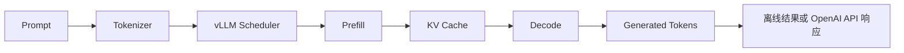
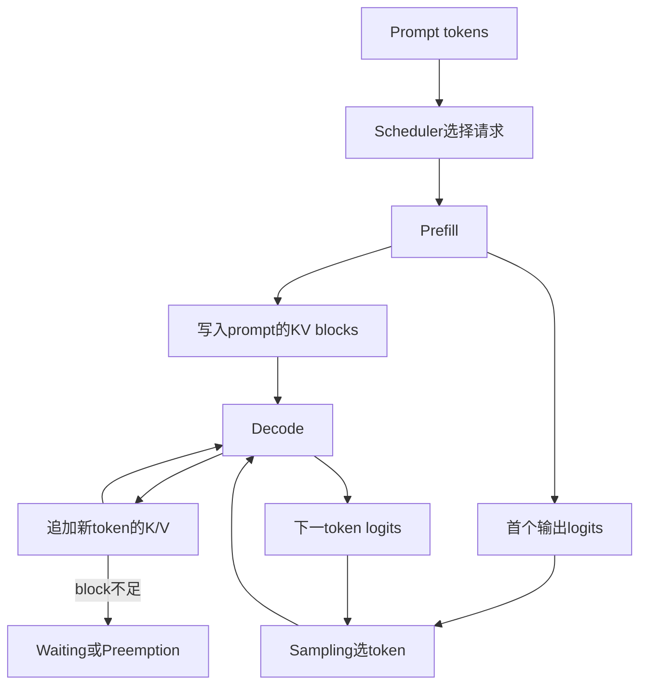
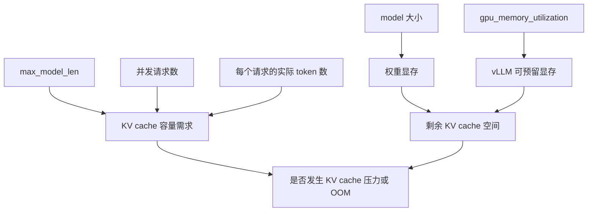
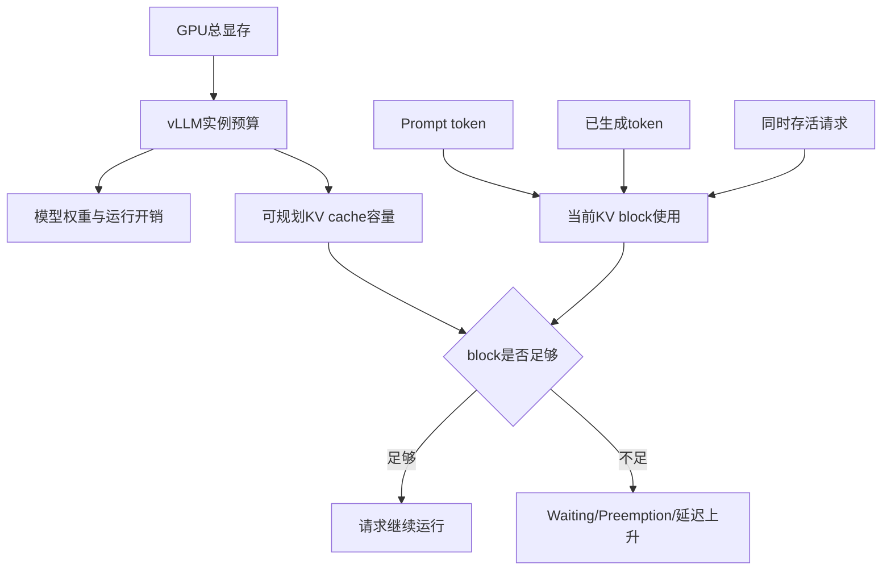
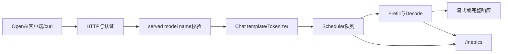

# vLLM 入门学习指导：从离线推理到 OpenAI 服务

本文配合本仓库的 `vllm_learning` 工程使用，面向第一次系统学习 vLLM、但已经有
基础 Python 和大语言模型概念的读者。

目标环境：

- GPU：RTX 4090 24GB
- 系统：Ubuntu 24.04
- CUDA：12.6
- Python：3.12
- vLLM：`0.10.0+cu126`
- 默认模型：`Qwen/Qwen2.5-1.5B-Instruct`

本文按两个维度组织学习：

1. **基础概念维度**：先回答每个名词“是什么、输入是什么、输出是什么、由谁负责”。
2. **概念关系维度**：再回答“上游结果怎样成为下游输入、一个参数变化会影响哪些资源和指标、发生故障时应沿哪条关系链定位”。

阅读每章时，不要求一次记住全部参数；先完成概念卡片，再画关系链，最后用工程命令取得证据。只会说名词但无法连接因果，或者只会运行命令但无法解释结果，都不算掌握。

## 1. 学完后应该掌握什么

### 1.1 基础概念维度

完成学习后，应当能独立解释以下五组概念：

| 概念组 | 必须掌握的基础概念 |
| :----- | :----------------- |
| 输入与输出 | prompt、token、tokenizer、logits、sampling、生成token |
| 执行流程 | request、scheduler、Prefill、Decode、continuous batching |
| 显存管理 | 模型权重、KV cache、KV block、PagedAttention、preemption |
| 使用接口 | `LLM`、`SamplingParams`、`generate`、`RequestOutput`、OpenAI兼容API |
| 配置与指标 | `max_model_len`、`gpu_memory_utilization`、TP、TTFT、TPOT、吞吐、running/waiting |

对每个概念至少能给出一句准确定义，并指出它不是什么。例如：KV cache保存历史token在各Attention层的K/V，不是模型权重，也不是全部中间激活。

### 1.2 概念关系维度

学习完成后，应当能解释下面五条关系链：

1. **请求关系链**：prompt如何变成token，Prefill如何产生首批KV和logits，采样器怎样选出token，Decode怎样继续生成。
2. **性能关系链**：请求长度与并发怎样改变Prefill/Decode工作量，scheduler合批怎样影响TTFT、TPOT与吞吐。
3. **显存关系链**：显存预算怎样被权重、执行开销和KV cache共同使用，当前token数怎样转化成KV block压力。
4. **接口关系链**：同一个引擎怎样通过离线`generate`或OpenAI服务接收请求，各自的生命周期与计时边界有什么不同。
5. **故障关系链**：Python环境、二进制兼容、GPU可见性、模型加载、服务API和运行期容量问题怎样分层定位。

这套工程的总主线是：



### 1.3 两个维度怎样验收

```text
概念掌握
  = 能定义 + 能说输入/输出 + 能指出边界

关系掌握
  = 能画因果链 + 能预测变量变化 + 能用日志/指标验证
```

例如，知道`gpu_memory_utilization`的定义属于概念维度；能解释“预算变化→KV容量变化→waiting/preemption变化→延迟变化”，并用固定负载验证，才属于关系维度。

## 2. 基础概念地图与请求主线

### 2.1 输入、模型输出与采样

| 概念 | 它是什么 | 与下一个概念的关系 |
| :--- | :------- | :----------------- |
| Prompt | 用户提供给模型的输入文本或已编码token | 由tokenizer编码 |
| Token | 模型处理文本的离散单位，用整数ID表示 | token ID进入模型前向 |
| Tokenizer | 文本与token ID之间的编码/解码规则 | 决定prompt token数和最终文本还原 |
| Logits | 模型对词表中每个候选token给出的未归一化分数 | 交给采样逻辑形成下一token选择 |
| Sampling | 根据temperature、top-k、top-p等规则从候选分布选token | 选中的token成为Decode下一轮输入 |

最容易混淆的一点是：模型前向产生的是logits；采样器根据logits选择token；detokenizer最后才把token ID还原成文本。模型前向不是直接“吐出一个汉字”。

### 2.2 引擎、请求与Scheduler

- **Engine/`LLM`**：持有模型执行器、KV cache与调度状态，是实际处理请求的长期对象。
- **Request**：一条prompt、采样参数和生成状态的组合；一个请求可配置`n>1`产生多个候选序列。
- **Scheduler**：在每个调度周期根据token预算、并发上限和KV block可用量，决定哪些请求进入本轮Prefill或Decode。
- **Batch**：某个执行时刻被组合在一起运行的一组token工作，不一定等于客户端最初提交的固定请求列表。

关系上，客户端负责提交请求，scheduler负责从待处理请求中组成当前执行批次，模型执行器负责前向，KV cache保存跨Decode步复用的状态。

### 2.3 Prefill

Prefill 是模型第一次读取整个输入 prompt 的阶段。

假设输入有 1,000 个 token，模型需要对这些 token 做一次前向计算，并为每一层保存
后续生成需要使用的 Key 和 Value。Prefill 通常计算量较大，也更容易利用 GPU 的并行
能力。

Prefill结束时，已经建立prompt对应的KV cache，并产生用于选择首个输出token的logits。它主要影响首token延迟（TTFT），但排队、tokenization和调度也会进入端到端TTFT。

### 2.4 Decode

Decode 是自回归生成阶段。模型每轮通常生成一个新 token，然后把这个 token 对应的
Key/Value 追加到 KV cache。

Decode 的特点是：

- 每一步计算规模相对较小。
- 步数多，串行依赖明显。
- 多请求合批对提高 GPU 利用率非常重要。

Decode每轮的因果链是：

```text
上一轮选中的token
  -> 模型读取历史KV并做一次前向
  -> 追加新token的K/V
  -> 产生下一token的logits
  -> 采样器选出下一token
```

Decode阶段常用每输出token时间（TPOT）或inter-token latency观察生成速度；它与端到端总延迟不是同一个指标。

### 2.5 KV cache

如果每生成一个 token 都重新计算此前所有 token 的注意力 Key/Value，推理会非常慢。
KV cache 保存历史 token 的 Key/Value，使下一步只需计算新 token。

它用显存换取速度。粗略估算公式为：

```text
单 token KV 字节数
≈ 2 × 层数 × KV heads × head_dim × 每个元素字节数
```

其中前面的 `2` 分别代表 Key 和 Value。总占用还要乘以当前存活请求的 token 总数。
采用 GQA/MQA 的模型应使用 KV heads，而不是普通 attention heads。

KV cache建立了一个关键交换关系：占用更多显存，换取Decode阶段少做历史K/V的重复计算。请求结束后，其占用的KV block可以回收给其他请求。

### 2.6 KV block、PagedAttention与Preemption

**KV block**是vLLM管理KV cache的固定粒度物理单元；逻辑上连续的一条序列，可以映射到物理上分散的多个block。

传统做法容易为每个请求预留一大片连续 KV cache，造成内部碎片和显存浪费。
PagedAttention 将 KV cache 切成固定大小的 block，再通过映射管理逻辑上连续、物理上
可以分散的 token。

可以把它类比成操作系统的虚拟内存分页：

```text
请求 A 的逻辑 token:  [0..15] [16..31] [32..47]
                          │        │        │
物理 KV block:         block 7  block 2  block 9
```

这使 vLLM 更容易：

- 减少 KV cache 碎片。
- 在多个请求之间灵活分配 block。
- 提高同一块 GPU 上可容纳的并发请求数量。

当活跃请求需要的block超过可用量时，请求可能等待，或发生preemption并在之后通过重算等方式恢复。PagedAttention减少管理浪费，但不会让每个token的K/V数据消失。

### 2.7 六个核心概念的完整关系



这张图同时回答两个维度：每个节点是基础概念；箭头表示数据依赖、调度依赖或资源约束。

### 2.8 性能指标怎样挂到主线上

| 指标 | 主要观察哪段关系 | 不能单独说明什么 |
| :--- | :--------------- | :--------------- |
| TTFT | 排队、tokenization、Prefill和首次采样 | 不能代表后续token生成速度 |
| TPOT/ITL | Decode阶段连续token生成 | 不能代表模型启动或首token等待 |
| 端到端延迟 | 从客户端提交到完整响应 | 在线与离线计时边界不同，不能直接混比 |
| Tokens/s | 固定负载下的整体吞吐 | 吞吐高不保证每个请求延迟低 |
| running/waiting | Scheduler当前运行与排队状态 | waiting升高不一定只由KV不足造成 |
| KV usage/preemption | KV block容量压力 | 使用率高但无排队时不一定是故障 |

## 3. 环境准备与第一次验收

### 3.1 基础概念：环境由哪些层组成

| 层次 | 基础概念 | 负责什么 |
| :--- | :------- | :------- |
| 硬件层 | RTX 4090、24GB显存 | 提供实际计算能力与容量上限 |
| 驱动层 | NVIDIA Driver | 让操作系统和CUDA程序访问GPU |
| Python计算层 | PyTorch CUDA build | 提供张量、CUDA runtime依赖和vLLM所依赖的算子接口 |
| 推理引擎层 | vLLM wheel | 提供模型执行、调度、KV cache与服务能力 |
| 隔离层 | Python 3.12虚拟环境 | 把本工程依赖与其他CUDA工程分开 |
| 模型层 | 权重、tokenizer、配置 | 决定网络结构、词表、上下文和对话格式 |

这里必须区分“系统安装了CUDA Toolkit”和“当前Python环境中的PyTorch/vLLM二进制能够协同工作”。`nvcc --version`正确，不足以证明当前wheel可以导入和运行。

### 3.2 各层之间的关系

```text
GPU硬件
  <- NVIDIA驱动访问
  <- PyTorch/vLLM原生二进制调用
  <- Python示例或服务脚本调用
  <- 模型权重与请求数据进入
```

排障时应从下往上验证：先证明设备可见，再证明PyTorch能用CUDA，再证明vLLM能导入，最后加载模型并运行请求。上层失败不能自动归因于下层CUDA。

进入工程目录：

```bash
cd ai_operator_4090_path/vllm_learning
```

上面的命令以`ai_operator`仓库根目录为起点；如果服务器上的仓库根目录不同，先用`pwd`确认当前位置，不要重复拼接路径。

先检查环境：

```bash
bash scripts/check_env.sh
```

重点确认：

- 能看到 RTX 4090。
- NVIDIA 驱动工作正常。
- 显存总量接近 24GB。
- Python 目标版本为 3.12。
- 没有其他进程占用大量显存。

安装独立环境：

```bash
bash scripts/setup_cuda.sh
source .venv/bin/activate
```

本工程固定使用官方 CUDA 12.6 wheel。不要直接在已有的 PyTorch 环境中叠加安装，
否则 PyTorch、CUDA 和 vLLM 的二进制版本可能不匹配。

完成安装后验证：

```bash
python -c "import vllm; print(vllm.__version__)"
python -c "import torch; print(torch.version.cuda)"
python -c "import torch; print(torch.cuda.get_device_name(0))"
bash scripts/verify.sh
```

预期应看到：

```text
vLLM: 0.10.0+cu126
PyTorch CUDA runtime: 12.6
GPU: NVIDIA GeForce RTX 4090
```

### 3.3 验收关系：每一步证明什么

| 验收动作 | 能证明 | 不能证明 |
| :------- | :----- | :------- |
| Python编译、纯Python单测 | 语法、配置和数据处理逻辑正确 | 不能证明CUDA/vLLM推理成功 |
| `import vllm` | 当前解释器能加载vLLM包及其必要二进制 | 不能证明模型能放入24GB显存 |
| `torch.cuda.is_available()` | PyTorch能访问CUDA设备 | 不能证明vLLM模型执行路径全部兼容 |
| 最小离线生成 | 模型、tokenizer、执行器和采样主线可运行 | 不能证明高并发稳定性 |
| 在线并发压测 | 服务、调度和KV容量在该负载下可运行 | 不能外推到所有长度和并发 |

## 4. 统一配置：为什么代码不把参数写死

### 4.1 基础概念：引擎配置与请求配置

- **引擎配置**在`LLM`或服务启动时确定模型、dtype、TP和显存规划，通常需要重建引擎才能改变。
- **请求配置**随每次生成提交，例如temperature、top-p、stop和`max_tokens`，通常不要求重新加载模型。
- **环境变量**是本工程向脚本统一传入引擎配置的接口；`LabConfig`负责解析、校验并生成vLLM参数。

不要把`max_model_len`与`max_tokens`混为一项：前者是引擎允许的单序列总长度边界，后者是一次请求最多新生成的token数。

所有离线示例都通过
[`LabConfig`](../src/vllm_lab/config.py) 读取相同的环境变量。

默认核心配置等价于：

```python
LabConfig(
    model="Qwen/Qwen2.5-1.5B-Instruct",
    dtype="auto",
    tensor_parallel_size=1,
    gpu_memory_utilization=0.85,
    max_model_len=4096,
    seed=42,
    trust_remote_code=False,
)
```

各参数的含义：

| 参数                     | 作用                            | 入门阶段建议         |
| ------------------------ | ------------------------------- | -------------------- |
| `model`                  | Hugging Face 模型 ID 或本地路径 | 先使用默认 1.5B 模型 |
| `dtype`                  | 模型权重和计算的数据类型        | 保持 `auto`          |
| `tensor_parallel_size`   | 模型切分到多少张 GPU            | 单张 4090 必须为 `1` |
| `gpu_memory_utilization` | vLLM 实例可使用的显存比例       | 从 `0.85` 开始       |
| `max_model_len`          | 允许的最大上下文长度            | 入门先用 `4096`      |
| `seed`                   | 随机采样种子                    | 固定后便于对比实验   |
| `trust_remote_code`      | 是否运行模型仓库自定义代码      | 默认关闭             |

修改配置时不需要改 Python 文件：

```bash
export VLLM_MODEL=/data/models/Qwen2.5-1.5B-Instruct
export VLLM_GPU_MEMORY_UTILIZATION=0.80
export VLLM_MAX_MODEL_LEN=2048
```

也可以复制统一模板：

```bash
cp .env.example .env
set -a
source .env
set +a
```

### 配置之间的关系



可用下面的近似关系帮助记忆，但不要把它当成精确显存公式：

```text
本实例显存预算 ≈ GPU总显存 × gpu_memory_utilization
可规划KV空间 ≈ 本实例预算 - 权重 - 峰值激活/工作区 - 其他运行时开销
当前KV压力    ≈ 所有存活请求当前token所需block + block粒度与调度开销
```

关系中的静态量和动态量要分开：模型、dtype、TP和`max_model_len`主要在启动时参与规划；实际prompt长度、已生成token和存活请求数在运行时持续改变block使用率。

需要区分两类问题：

- 初始化 OOM：模型权重、执行器或预留空间在启动时就放不下。
- 运行期 KV 压力：服务能启动，但长上下文和高并发导致 KV block 不足或 preemption。

因此，同一个`gpu_memory_utilization`调整对两类问题可能方向相反：启动缺少临时余量时可能需要降低；确认运行期KV不足且仍有安全余量时，才可能小步提高。

## 5. 第一课：基础离线推理

### 5.1 本课基础概念

| 概念 | 职责 | 生命周期 |
| :--- | :--- | :------- |
| `LLM` | 创建并持有离线引擎、模型执行器、KV cache和scheduler | 通常在进程内复用 |
| `SamplingParams` | 描述token选择和停止规则 | 可以按请求更换 |
| `generate` | 把prompt和采样参数提交给已有引擎 | 每批请求调用一次 |
| `RequestOutput` | 表示一条输入请求的状态和候选结果 | 与外层请求一一对应 |
| `CompletionOutput` | 表示某条请求的一个候选序列 | `n>1`时一条请求有多个 |

五个概念的关系是“引擎接收请求参数并返回分层结果”，不是五个彼此独立的API名。

对应代码：
[`examples/01_basic_inference.py`](../examples/01_basic_inference.py)

运行：

```bash
bash scripts/run_example.sh basic
```

自定义 prompt：

```bash
bash scripts/run_example.sh basic \
  --prompt "解释 vLLM 中 prefill 和 decode 的区别。" \
  --max-tokens 160
```

核心代码只有三步：

```python
llm = LLM(**config.llm_kwargs())
sampling = SamplingParams(temperature=0.2, top_p=0.9, max_tokens=128)
outputs = llm.generate([prompt], sampling)
```

### 第一步：创建 `LLM`

```python
llm = LLM(**config.llm_kwargs())
```

这一步不只是创建普通 Python 对象。它会完成模型配置读取、权重加载、GPU 显存规划、
KV cache 初始化以及执行器预热。因此第一次运行通常最慢。

观察终端日志时，重点找：

- 实际加载的模型和 dtype。
- 最大上下文长度。
- 可用 KV cache block 或 token 数。
- CUDA graph capture 或 eager 模式信息。
- 是否出现 OOM、驱动或算子兼容错误。

### 第二步：定义 `SamplingParams`

```python
sampling = SamplingParams(
    temperature=0.2,
    top_p=0.9,
    max_tokens=128,
)
```

它描述“怎样从模型给出的概率分布中选择下一个 token”，不负责加载模型。

### 第三步：调用 `generate`

```python
outputs = llm.generate([prompt], sampling)
```

即使只有一个 prompt，接口也接收列表。返回值同样是一个列表，每个输入对应一个
`RequestOutput`。

本例通过下面的路径取得文本：

```python
request_output = outputs[0]
candidate = request_output.outputs[0]
text = candidate.text
```

这里有两层索引：

1. `outputs[0]`：第一个请求。
2. `outputs[0].outputs[0]`：该请求的第一个候选答案。

当采样参数设置 `n > 1` 时，一个请求可以产生多个候选答案。

### 5.2 从代码对象回到请求主线

```text
LabConfig -> LLM(一次性初始化)
prompt + SamplingParams -> generate(提交请求)
generate -> list[RequestOutput]
RequestOutput -> list[CompletionOutput]
CompletionOutput -> text/token_ids/finish_reason
```

`LLM`初始化时间、首次请求预热时间和后续稳态生成时间必须分开记录。否则“模型下载很慢”会被错误地解释成“每条请求都很慢”。

### 第一课练习

1. 把 `max_tokens` 从 32、128 依次改到 256，观察耗时和输出长度。
2. 连续执行两次脚本，比较首次模型下载、首次加载和再次加载的时间。
3. 把 prompt 换成英文，观察模型语言选择。
4. 查看 `output.outputs[0].finish_reason`，区分 EOS 结束和长度截断。

## 6. 第二课：离线批量推理

### 6.1 本课基础概念

- **离线批量**：开始调用前，prompt集合已经准备好并一次交给本地引擎。
- **同步逐条调用**：复用同一个`LLM`，但每次只提交一条并等待完成后再提交下一条。
- **反复创建引擎**：每条prompt都重新执行`LLM(...)`，会重复加载和规划，通常不是合理对照。
- **吞吐**：固定时间内完成的请求数或token数。
- **单请求延迟**：某条请求从提交到完成的时间；它可能与总体吞吐形成取舍。

对应代码：
[`examples/02_offline_batch.py`](../examples/02_offline_batch.py)

运行：

```bash
bash scripts/run_example.sh batch
```

输入文件是 [`data/prompts.jsonl`](../data/prompts.jsonl)，每行一个独立 JSON 对象：

```json
{"id": "vllm-1", "prompt": "用一句话解释 vLLM 的 continuous batching。"}
```

程序流程：


核心批量调用：

```python
outputs = llm.generate(
    [record.prompt for record in records],
    sampling,
)
```

正确的关系要拆成两层：

- 无论列表提交还是同步逐条提交，都应先复用同一个`LLM`，从而避免重复加载权重。
- 在同一个`LLM`上，一次提交prompt列表能让scheduler同时看到更多待处理请求，获得跨请求合批机会；同步逐条调用同一时刻只能看到一条。

一次提交更多请求通常有利于总体吞吐，但不保证任何规模下都更快。调度仍受token预算、KV容量、`max_num_seqs`和请求长短分布影响。

### 离线 batch 不等于 continuous batching

这两个概念经常被混淆：

| 概念                | 请求何时到达                 | 调度特点                     |
| ------------------- | ---------------------------- | ---------------------------- |
| 离线批量推理        | 开始前已经准备好一批 prompt  | 一次提交给本地引擎           |
| 静态 batching       | 同一批通常一起开始、一起结束 | 容易被最长请求拖慢           |
| Continuous batching | 在线请求持续到达和结束       | 每个调度步动态加入或移出请求 |

OpenAI 服务模式更能体现 continuous batching：某个请求生成完后，它占用的位置可以
很快让给新请求，而不必等待同批所有请求结束。

三者之间的关系可记成：

```text
离线batch：描述请求在调用前已经收集好
静态batch：描述运行集合通常固定推进
continuous batching：描述运行集合可在调度周期之间动态变化
```

所以一次离线列表调用能证明引擎可以统一调度一批已知工作，但不能单独证明后到请求能在旧请求尚未全部结束时动态加入。

### 为什么单独写 `batch_io.py`

[`src/vllm_lab/batch_io.py`](../src/vllm_lab/batch_io.py) 不导入 vLLM，
只负责：

- 校验 JSONL 格式。
- 检查 `id` 和 `prompt`。
- 组合输入与输出。
- 写入结果文件。

这样设计可以在没有 GPU 的开发机上测试数据处理逻辑，把“数据错误”和“GPU 推理错误”
分开排查。

### 第二课练习

1. 把输入扩展到 20 条长短不同的 prompt。
2. 记录一次批量调用和循环 20 次单条调用的总时间。
3. 在结果中增加 `finish_reason` 和生成 token 数。
4. 故意写一行非法 JSON，观察程序在哪个阶段报错。

## 7. 第三课：理解采样参数

### 7.1 本课基础概念与关系主线

模型前向、采样和停止是三个连续但不同的阶段：

```text
模型前向产生logits
  -> temperature改变分布尺度
  -> top-k/top-p限制候选集合
  -> 使用seed驱动的随机过程或greedy选择token
  -> EOS/stop/max_tokens判断是否结束
```

采样参数改变的是“给定模型logits后怎样选token”，不会重新训练模型，也不负责GPU显存规划。一次实验应只改一个变量，否则无法说明输出变化由哪个参数造成。

对应代码：
[`examples/03_sampling_params.py`](../examples/03_sampling_params.py)

运行：

```bash
bash scripts/run_example.sh sampling
```

本例用同一个 prompt 对比三套参数：

```python
greedy = SamplingParams(temperature=0.0)

balanced = SamplingParams(
    temperature=0.7,
    top_p=0.9,
    seed=42,
)

creative = SamplingParams(
    temperature=1.0,
    top_p=0.95,
    top_k=50,
    seed=42,
)
```

### 7.2 `temperature`

`temperature` 调整概率分布的尖锐程度：

- `0`：直接选择最高概率 token，即 greedy。
- 小于 `1`：分布更集中，输出更稳定。
- 等于 `1`：保留原始分布尺度。
- 大于 `1`：分布更平，低概率 token 更容易被选中。

代码生成、抽取、分类等任务通常偏低；故事、文案等开放任务可以适当提高。

### 7.3 `top_k`

`top_k=50` 表示每一步最多保留概率最高的 50 个候选 token，其余直接丢弃。

`top_k` 控制“候选数量”，不关心这些候选累计占了多少概率。

### 7.4 `top_p`

`top_p=0.9` 表示按概率从高到低累加，只保留累计概率达到 0.9 所需的最小候选集合。

`top_p` 控制“累计概率质量”，所以候选数量会随模型当前的置信度变化。

### 7.5 `seed`

固定 seed 有利于复现实验，但它不意味着任何环境下都能逐 token 完全一致。模型版本、
vLLM 版本、GPU kernel 和并行策略变化都可能影响结果。

### 7.6 `max_tokens`、EOS与stop

- `max_tokens`限制单个候选最多新生成多少token，不包含prompt token。
- EOS表示模型生成了结束token，可以早于`max_tokens`停止。
- 自定义stop字符串或token给调用方增加业务停止条件。
- `finish_reason`用于判断是正常stop还是达到长度上限；不要仅凭文本末尾是否有句号判断。

它们与上下文长度的关系是：

```text
实际prompt token数 + 允许的新生成token数
  <= 引擎可接受的序列长度边界
```

### 7.7 推荐起点

| 任务            | temperature | top_p  | top_k         |
| --------------- | ----------: | -----: | ------------: |
| 确定性抽取/分类 | `0`         | `1.0`  | 不限制        |
| 普通问答        | `0.2–0.7`   | `0.9`  | 不限制或 `40` |
| 创意生成        | `0.8–1.1`   | `0.95` | `40–100`      |

这些不是固定标准。正确方法是准备代表性测试集，对准确性、重复率和多样性做对比。

### 7.8 第三课练习

1. 保持 seed 不变，将 temperature 从 0.1 调到 1.2。
2. 保持 temperature 不变，分别测试 `top_k=5/20/100`。
3. 删除 seed，重复运行三次并比较输出。
4. 增加 `n=3`，观察一个请求如何返回三个候选结果。
5. 分别制造`finish_reason=length`和正常stop，记录token数与结构化结束原因。

## 8. 第四课：观察 KV cache 和显存

### 8.1 本课基础概念

| 概念 | 观察对象 | 常见误解 |
| :--- | :------- | :------- |
| 进程显存 | 驱动看到该进程占用/保留的总体显存 | 它不等于当前已用KV block |
| 显存预算 | 当前vLLM实例计划使用的GPU显存范围 | `gpu_memory_utilization`不是KV独占比例 |
| KV容量 | 初始化后可供KV block使用的空间 | 容量大不等于当前已经用满 |
| KV usage | 当前KV block逻辑使用比例 | 使用率高不自动等于发生故障 |
| Waiting | 尚未进入当前运行集合的请求 | 排队不一定只由KV不足造成 |
| Preemption | 请求因调度/资源压力让出执行并稍后恢复 | 它不等同于进程CUDA OOM |

### 8.2 显存与请求负载的关系



上半部分描述启动时容量规划，下半部分描述运行时动态占用。把两部分混在一起，会产生“设置了4096长度，所以每条请求立即占4096 token KV”之类的错误结论。

对应代码：
[`examples/04_kv_cache_observe.py`](../examples/04_kv_cache_observe.py)

先在终端 A 持续观察：

```bash
watch -n 0.5 nvidia-smi
```

终端 B 运行：

```bash
bash scripts/run_example.sh kv-cache --hold-seconds 30
```

程序记录四个阶段：

1. 模型加载前。
2. 模型加载及 KV cache 预留后。
3. 一个短请求完成后。
4. 一批长请求完成后。

### 8.3 预期现象

模型加载后显存会一次性明显增加，因为 vLLM 会根据
`gpu_memory_utilization=0.85` 做显存规划和预留。

请求变长后，`nvidia-smi` 的“进程占用显存”不一定线性增加。这不代表 KV cache 没有被
使用，而是因为 vLLM 可能已经持有这块显存，只是在内部改变 block 的占用状态。

因此有两个观察层次：

- `nvidia-smi`：观察进程级显存总量。
- vLLM `/metrics`：观察引擎内部 KV block 使用率、等待请求和 preemption。

本工程固定的vLLM 0.10.0重点关注`vllm:gpu_cache_usage_perc`和`vllm:num_preemptions_total`，同时结合running、waiting与延迟。指标必须按时间线组合解释，不能只截一个高值。

### 8.4 参数实验

基线：

```bash
bash scripts/run_example.sh kv-cache \
  --batch-size 8 \
  --repeat 160 \
  --max-tokens 64
```

逐步加压：

```bash
bash scripts/run_example.sh kv-cache --batch-size 16 --repeat 160
bash scripts/run_example.sh kv-cache --batch-size 16 --repeat 240
```

每次只改变一个变量，并记录：

| 实验     | batch size | prompt 长度 | max tokens | 峰值显存 | 是否 OOM |
| -------- | ---------: | ----------: | ---------: | -------: | -------- |
| 基线     | 8          | 约 X token  | 64         |          |          |
| 增并发   | 16         | 约 X token  | 64         |          |          |
| 增上下文 | 16         | 约 Y token  | 64         |          |          |

建议再补充`KV usage峰值`、`waiting峰值`、`preemption增量`、TTFT和tokens/s五列。这样可以把“输入变量→资源变化→性能结果”连成证据链。

### 8.5 OOM与KV压力的分支排查

先问“服务是否曾经健康并成功处理请求”：

- 从未健康：优先按初始化OOM、模型/二进制或启动配置排查。
- 已经健康，随长请求/高并发恶化：优先按KV block压力、调度限制或运行时临时分配排查。

1. 用 `nvidia-smi` 检查是否有其他进程占用显存。
2. 初始化阶段缺少余量时，尝试减小 `VLLM_GPU_MEMORY_UTILIZATION`。
3. 核对模型、dtype、量化和`VLLM_MAX_MODEL_LEN`，必要时降低长度或图相关资源。
4. 运行期KV压力时，先减小输入长度、`max_tokens`、并发请求数或批调度上限。
5. 确认仍有安全余量后，才小步提高利用率以换取更多KV容量，并用相同负载复测。
6. 仍不足时换更小或量化后的模型；只有确实有多张GPU时才考虑并行。

不要把 `gpu_memory_utilization` 理解为“KV cache 独占比例”。它约束的是当前 vLLM
实例的整体 GPU 内存预算，模型权重、激活、CUDA graph 和 KV cache 都会参与显存规划。

## 9. 张量并行：单张 4090 应该怎样配置

### 9.1 本章基础概念

- **Tensor Parallel（TP）**：把同一模型层的张量与计算切分到多个GPU rank。
- **Rank**：一个并行参与者，常对应一张可见GPU；TP size描述rank数量。
- **Shard**：每个rank持有的权重/计算分片，不是完整模型的第二份副本。
- **Collective communication**：各rank为合并层内计算结果进行的集合通信。
- **NCCL**：NVIDIA GPU间通信常用的运行库。

### 9.2 容量、计算与通信的关系

```text
TP size增大
  -> 每卡主要权重分片可能减少
  -> 更大模型可运行或每卡可留更多KV空间
  -> 同时增加层内通信、同步和部署复杂度
```

TP是否值得使用取决于“单卡是否放得下”和实测性能；它不是免费把多张卡合成一张大卡。

本工程默认：

```bash
export VLLM_TENSOR_PARALLEL_SIZE=1
```

张量并行会把同一层中的矩阵权重切到多张 GPU 上。它主要用于：

- 单卡放不下模型权重。
- 多卡共同承担推理计算。
- 权重切分后为每张卡留出更多 KV cache 空间。

### 9.3 为什么单卡不能设置为 2

`tensor_parallel_size=2` 的含义是需要两个 GPU rank，不是让一张 GPU 内部开两个线程。
只有一张可见 GPU 时设置为 2，会导致设备数量、分布式初始化或 NCCL 相关错误。

### 9.4 多卡时还要满足什么

即使有两张 GPU，也要确认：

- `CUDA_VISIBLE_DEVICES` 确实暴露两张卡。
- 模型结构支持对应的切分数。
- 注意力头数等维度可以被 TP size 合理切分。
- 两张卡之间的通信开销可以接受。

对于默认 1.5B 模型，单张 4090 已经足够。为了“使用张量并行”而使用张量并行，通常
只会增加通信和启动复杂度。

## 10. 第五课：启动 OpenAI 兼容服务

### 10.1 本课基础概念

| 概念 | 作用 | 与其他概念的关系 |
| :--- | :--- | :--------------- |
| Server process | 长期持有模型和引擎 | 多个客户端共享它 |
| OpenAI兼容API | 定义请求/响应格式 | 把HTTP请求转成引擎请求 |
| Served model name | API对外暴露的逻辑模型名 | 可与权重路径不同 |
| API key | 最小访问认证 | 认证成功不代表模型名或模板正确 |
| Chat template | 把role/content消息渲染成模型token格式 | Instruct模型通常提供，base模型可能没有 |
| `/metrics` | 暴露调度、cache和preemption指标 | 用于解释负载与延迟 |

### 10.2 在线请求关系链



“端口打开”“`/health`成功”“`/v1/models`能看到模型”“一次生成成功”分别证明不同层，不能互相替代。

离线 `LLM.generate()` 适合脚本、评测和批处理；在线服务适合多个客户端持续提交请求。

终端 A：

```bash
source .venv/bin/activate
bash scripts/serve_openai.sh
```

服务脚本读取与离线推理一致的模型、显存和张量并行配置，并额外使用：

| 变量                     | 默认值        |
| ------------------------ | ------------- |
| `VLLM_HOST`              | `127.0.0.1`   |
| `VLLM_PORT`              | `8000`        |
| `VLLM_API_KEY`           | `local-token` |
| `VLLM_SERVED_MODEL_NAME` | `vllm-lab`    |

先检查健康状态和模型列表：

```bash
curl -fsS http://127.0.0.1:8000/health
curl -s http://127.0.0.1:8000/v1/models \
  -H "Authorization: Bearer local-token"
```

然后使用工程内置 curl 请求：

```bash
bash scripts/request_curl.sh
```

或运行
[`examples/05_openai_client.py`](../examples/05_openai_client.py)：

```bash
python examples/05_openai_client.py
```

Python 客户端的关键是把 `base_url` 指向本地 vLLM：

```python
client = OpenAI(
    base_url="http://127.0.0.1:8000/v1",
    api_key="local-token",
)
```

业务代码仍使用熟悉的 OpenAI 客户端接口：

```python
response = client.chat.completions.create(
    model="vllm-lab",
    messages=[{"role": "user", "content": "解释 PagedAttention。"}],
)
```

`model` 参数应填写 `--served-model-name` 暴露的名称，而不是必须填写原始 Hugging Face
路径。

### 10.3 `generation-config vllm` 的意义

服务脚本显式设置：

```bash
--generation-config vllm
```

一些模型仓库包含自己的 `generation_config.json`。如果加载它，模型作者设置的
temperature、top_p 等默认值可能覆盖你以为的服务默认值。学习阶段固定使用 vLLM
默认配置，有利于让参数实验更可控。

### 10.4 在线观察 Scheduler与KV cache

服务启动后：

```bash
curl -s http://127.0.0.1:8000/metrics \
  | grep -E 'vllm:(kv_cache_usage_perc|gpu_cache_usage_perc|num_preemptions|num_requests_running)'
```

不同引擎版本的 cache 指标名称可能不同，因此命令同时匹配新旧名称。

为了看到动态变化，可以：

1. 持续刷新 `/metrics`。
2. 从多个终端同时发长请求。
3. 观察 running、waiting、cache usage 和 preemption。

要验证continuous batching，应让请求错开到达：先发长请求，在它们尚未结束时再发短请求，并记录到达、首token、完成时间和同一时段metrics。一次同时发送同长度请求，只能说明发生了并发处理，证据不够完整。

## 11. 离线推理和在线服务怎样选择

### 11.1 两种模式的基础概念

| 场景                     | 推荐方式         | 原因                   |
| ------------------------ | ---------------- | ---------------------- |
| 一次性处理本地数据集     | `LLM.generate()` | 简单、没有服务管理成本 |
| 模型效果评测             | 离线批量         | 输入和结果容易固化     |
| 多个应用共享模型         | OpenAI 兼容服务  | 统一接口和调度         |
| 需要流式输出             | 在线服务         | 客户端接口更合适       |
| 学习采样参数             | 离线推理         | 易控制变量             |
| 学习 continuous batching | 在线并发请求     | 更接近真实调度         |

两种方式底层都使用 vLLM 引擎，区别主要在请求入口、生命周期和调度环境。

### 11.2 两种模式之间的关系

```text
相同部分：模型 + tokenizer + scheduler + Prefill/Decode + KV cache

离线入口：Python进程 -> LLM.generate -> 本地返回对象
在线入口：HTTP客户端 -> API/认证/排队 -> 长驻引擎 -> HTTP响应
```

选择时先回答三个问题：请求是否持续到达、是否有多个客户端共享模型、是否需要流式/鉴权/监控。如果都不需要，离线通常更简单；如果需要服务生命周期与动态并发，使用在线服务。

### 11.3 性能数据为什么不能直接混比

离线计时可以只覆盖`generate`，在线端到端计时还包含网络、HTTP解析、排队、序列化和客户端读取。比较两者时必须统一模型、prompt/output token、并发、预热与计时边界，并分别报告TTFT、TPOT、总延迟和吞吐。

## 12. 常见问题

### 12.1 先用“现象→层次→证据”定位

| 现象 | 优先定位层 | 第一批证据 |
| :--- | :--------- | :--------- |
| 模块不存在 | Python解释器/虚拟环境 | `which python`、`python -m pip -V` |
| CUDA不可用 | 驱动、设备映射、PyTorch build | `nvidia-smi`、`torch.cuda.is_available()` |
| Undefined symbol | PyTorch/vLLM/CUDA二进制兼容 | 精确版本、wheel来源、第一条动态加载错误 |
| 模型下载失败 | 网络、权限、磁盘、模型ID | HTTP错误、`HF_TOKEN`、磁盘空间 |
| 服务可用但请求失败 | 认证、模型名、chat template | 状态码、`/v1/models`、完整错误响应 |
| 高负载延迟恶化 | Scheduler、KV容量、计算/网络 | 负载、running/waiting、KV usage、preemption、TTFT |

关系链是：先判断故障发生在“导入前、GPU初始化、模型启动、API入口还是运行期负载”，再进入对应分支。不要一看到CUDA字样就重装全部环境。

### 12.2 `No module named vllm`

确认已激活环境：

```bash
source .venv/bin/activate
which python
python -c "import vllm"
```

### 12.3 `torch.cuda.is_available()` 为 `False`

依次检查：

```bash
nvidia-smi
python -c "import torch; print(torch.__version__, torch.version.cuda)"
echo "$CUDA_VISIBLE_DEVICES"
```

常见原因是驱动不可见、装到了 CPU 版 PyTorch，或者当前容器没有映射 GPU。

### 12.4 CUDA symbol、undefined symbol 或动态库错误

这类错误通常不是 Python 业务代码问题，而是 PyTorch、vLLM wheel 和 CUDA 运行时不匹配。
优先重新创建干净环境，并使用本工程固定的 cu126 安装脚本。

### 12.5 模型下载失败

检查：

- 服务器是否能访问 Hugging Face。
- 磁盘空间是否充足。
- 受限模型是否设置 `HF_TOKEN`。
- 是否可以提前下载模型并设置本地 `VLLM_MODEL` 路径。

### 12.6 服务启动成功但 Chat API 报模板错误

Chat Completions 需要模型 tokenizer 提供 chat template。默认 Qwen Instruct 模型具备模板。
如果换成 base 模型，可能需要改用 `/v1/completions`，或者显式提供 chat template。

### 12.7 输出每次不同

检查 temperature 是否大于 0、是否固定 seed，以及请求参数是否被模型仓库的 generation
config 覆盖。确定性实验先使用：

```python
SamplingParams(temperature=0.0, max_tokens=128)
```

### 12.8 服务能启动但高并发下变慢

先固定并记录请求负载，再组合判断：

1. waiting是否持续上升，而不是短暂波动。
2. GPU KV cache usage是否接近上限。
3. preemption累计值在压测区间是否继续增加。
4. TTFT、TPOT和tokens/s中究竟哪项恶化。

“waiting升高+KV高+preemption增长”支持KV压力；“waiting升高但KV不高、preemption不增”还应检查计算饱和、调度上限、长Prefill、CPU或网络。单个指标不能唯一定位根因。

## 13. 推荐学习路线

下面每个阶段同时给出“概念目标”和“关系目标”。概念目标不过关时先补定义；概念已会但不会分析实验时，优先补关系链和证据，不要继续扩充名词表。

### 13.1 第1阶段：跑通

**基础概念目标：** prompt、tokenizer、`LLM`、`SamplingParams`、`generate`、`RequestOutput`。

**关系目标：** 能从Python对象关系解释一次离线请求，区分初始化、首次生成和稳态生成。

1. 执行环境检查和安装。
2. 跑通基础推理。
3. 修改 prompt 和 `max_tokens`。
4. 能解释 `LLM`、`SamplingParams`、`generate` 的职责。

验收问题：

- 为什么创建 `LLM` 比调用一次 `generate` 更重？
- 返回值为什么有两层 `outputs`？

### 13.2 第2阶段：批量与采样

**基础概念目标：** 离线batch、静态batch、continuous batching、logits、temperature、top-k、top-p、seed、finish reason。

**关系目标：** 能解释scheduler为什么需要同时看到多个请求，以及“logits→过滤/采样→token→停止”的生成关系。

1. 扩展 JSONL 输入。
2. 对比批量和逐条调用。
3. 完成 temperature/top_p/top_k 控制变量实验。
4. 记录一张参数—输出对比表。

验收问题：

- 离线 batch 和 continuous batching 有什么区别？
- top_k 和 top_p 分别限制什么？

### 13.3 第3阶段：显存与KV cache

**基础概念目标：** K/V、KV block、PagedAttention、显存预算、running、waiting、preemption。

**关系目标：** 能解释“模型与预算→KV容量”和“当前token与并发→KV使用→排队/抢占→延迟”的两条链。

1. 观察模型加载前后的显存。
2. 改变 batch size 和 prompt 长度。
3. 用 `/metrics` 观察 KV cache 使用率。
4. 制造一次可控的显存压力，并记录解决过程。

验收问题：

- 为什么请求结束前需要保留 KV cache？
- 为什么 `nvidia-smi` 不一定反映 KV block 的实时占用变化？

### 13.4 第4阶段：服务化

**基础概念目标：** OpenAI兼容API、served model name、API key、chat template、health/models/metrics端点。

**关系目标：** 能从客户端沿API、tokenizer、scheduler、引擎走到响应，并用错开到达的请求验证continuous batching。

1. 启动 OpenAI 兼容服务。
2. 分别用 curl 和 Python 客户端请求。
3. 同时发起多个请求观察 continuous batching。
4. 修改 served model name、端口和 API key。

验收问题：

- 客户端的 `model` 为什么可以不等于 Hugging Face 模型路径？
- 离线推理和服务模式分别适合什么任务？

### 13.5 四阶段关系总表

| 阶段 | 必须画出的关系 | 最少工程证据 |
| :--- | :------------- | :----------- |
| 跑通 | 环境层次；`LLM`→`generate`→输出对象 | 环境输出、一次基础生成、冷/热时间 |
| 批量与采样 | 请求集合→scheduler；logits→token | 批量/逐条吞吐表、采样对照表 |
| 显存与KV | 预算→容量；token→block→压力 | 显存四阶段、metrics时间线 |
| 服务化 | HTTP→API→scheduler→响应 | health/models/生成响应、错峰并发记录 |

## 14. 最终验收清单

最终验收分为两个知识维度和一个工程证据维度。三个维度都通过，才算“掌握并能使用”。

### 14.1 基础概念验收

不看文档，为以下概念各写一张卡片，正面是概念名，背面只写四项：定义、输入、输出、边界。

```text
prompt / token / tokenizer / logits / sampling
scheduler / Prefill / Decode / continuous batching
KV cache / KV block / PagedAttention / preemption
LLM / SamplingParams / RequestOutput / served model name / chat template
gpu_memory_utilization / max_model_len / TP / TTFT / TPOT / throughput
```

通过线：随机抽取10个，至少8个能在60秒内说清四项，且KV cache、Prefill/Decode、scheduler和TP不能有结构性错误。

### 14.2 概念关系验收

不看文档画出并解释五张关系图：

1. prompt到输出文本的完整请求主线。
2. logits、temperature、top-k/top-p、seed与停止条件的关系。
3. 显存预算、权重、KV容量、当前token、并发与preemption的关系。
4. 离线批量、同步逐条调用和online continuous batching的关系。
5. 客户端、API认证、served model name、chat template、scheduler和响应的关系。

通过线：每张图至少包含正确方向的因果箭头、一个可改变变量、一个可观察指标和一个适用边界。

### 14.3 工程运行验收

在 RTX 4090 服务器上依次执行：

```bash
source .venv/bin/activate
bash scripts/check_env.sh
bash scripts/verify.sh
bash scripts/run_example.sh basic
bash scripts/run_example.sh batch
bash scripts/run_example.sh sampling
bash scripts/run_example.sh kv-cache
```

启动服务：

```bash
bash scripts/serve_openai.sh
```

另一个终端：

```bash
curl -fsS http://127.0.0.1:8000/health
bash scripts/request_curl.sh
python examples/05_openai_client.py
curl -s http://127.0.0.1:8000/metrics \
  | grep -E 'vllm:(kv_cache_usage_perc|gpu_cache_usage_perc)'
```

还应完成三组关系实验：

1. 固定模型和输出长度，对比单条、列表批量和在线并发的TTFT/吞吐。
2. 固定请求，逐项改变temperature、top-k或top-p，保存参数—输出—结束原因表。
3. 固定采样参数，逐项改变prompt长度、`max_tokens`和并发，保存KV usage、waiting、preemption与延迟时间线。

### 14.4 最终口述验收

最终不只是“命令能运行”，还应当能够用自己的话画出并解释：

```text
请求到达
  -> tokenizer
  -> scheduler 合批
  -> prefill 生成首批 KV
  -> decode 逐 token 生成
  -> KV block 动态占用/释放
  -> 离线结果或 OpenAI 响应
```

如果这条主线能够解释清楚，再学习 prefix caching、chunked prefill、量化、
speculative decoding 和性能 benchmark 会顺畅很多。

## 15. vLLM 阶段出口闭卷口试

这32道题既是学习导航，也是入门阶段的停止线。不要先顺序重读全文：先闭卷回答，答不出的题再回到对应章节和实验。

### 15.1 一道题怎样才算掌握

每道题按四级记录：

| 等级 | 表现                                             |
| :--: | :----------------------------------------------- |
| 0    | 不知道问题在问什么                               |
| 1    | 看正文能理解，但不能独立说明                     |
| 2    | 能脱离文档解释概念和因果，但缺少自己的运行证据   |
| 3    | 能闭卷解释，并能指向日志、输出、指标或故障记录   |

完整回答尽量包含：

```text
它是什么
  -> 为什么需要它
  -> vLLM中怎样发生
  -> 我用什么命令、日志或指标验证过
  -> 它的适用边界或常见误区是什么
```

API参数名可以查文档；核心流程、因果关系和自己的实验结论必须闭卷回答。

### 15.2 核心执行流程

1. 对一个普通的decoder-only文本生成请求，prompt从进入vLLM到返回文本，主线上依次经过哪些阶段？模型前向与采样器分别产生什么？
2. 对同一个普通自回归请求，Prefill和Decode分别处理哪些token？为什么两者的GPU计算形态不同？
3. 在不使用speculative decoding等额外技术时，为什么Decode通常每轮只确定一个新token？这会带来哪些性能问题？
4. 为什么单请求Decode难以充分利用GPU？多请求合批如何改变这一点，又会引入什么代价？
5. 对标准Attention层而言，KV cache保存什么？如果不保存它，每个Decode步骤会重复做什么？
6. 对“每层Attention结构一致”的标准decoder-only Transformer，怎样用层数、KV heads、head dimension和KV cache dtype估算单token的KV数据字节数？这个估算不包含什么？
7. 在GQA/MQA模型中，为什么估算KV cache必须使用`num_kv_heads`，而不是Query/attention heads？
8. PagedAttention主要解决KV cache的什么管理问题？它与操作系统分页的类比哪些部分成立，哪些部分不能照搬？

### 15.3 离线推理、批量与输出对象

9. 首次创建`LLM`实例时通常完成哪些重量级工作？为什么不能把这段时间当成稳态单请求延迟？
10. 在本工程的离线推理代码中，`LLM`、`SamplingParams`和`generate`的职责边界分别是什么？
11. `llm.generate()`返回值中，`outputs[request_index].outputs[candidate_index]`的两层索引分别代表什么？`n>1`时应如何读取全部结果？
12. 处理20条已知prompt时，为什么应首先复用同一个`LLM`实例？在“一次提交prompt列表”和“对同一`LLM`逐条调用`generate`”之间，前者通常多出什么调度机会？
13. 在本文的语境中，离线batch、传统静态batch和online continuous batching分别指什么？验证continuous batching为什么不能只做一次离线列表调用？
14. 为什么本工程把JSONL解析、校验和写盘放在不依赖vLLM的`batch_io.py`中？这对测试和故障定位有什么价值？

### 15.4 采样与可复现性

15. `temperature`如何改变logits对应的概率分布？在vLLM的`SamplingParams`中，为什么`temperature=0`适合确定性实验，但不代表答案一定正确？
16. `top_k`和`top_p`分别限制候选token集合的什么性质？为什么相同`top_p`在不同Decode步保留的token数量可以不同？
17. `max_tokens`限制的是输入、输出还是两者之和？EOS、自定义stop条件、`finish_reason`和`stop_reason`如何配合判断正常停止与长度截断？
18. 固定seed能控制哪些实验变量？为什么模型、vLLM版本、GPU kernel或并行策略改变后，仍不应承诺逐token完全一致？

### 15.5 显存、配置与调度

19. 模型加载并完成引擎初始化后，进程显存通常包含哪些大类？`gpu_memory_utilization`在vLLM 0.10.0中约束什么，为什么不能把它解释为“KV cache独占比例”？
20. `max_model_len`的最大长度边界、某请求的实际prompt长度、`max_tokens`和同时存活请求数，分别如何影响“可接受长度”和“当前KV block压力”？
21. 当请求变长或并发增加时，`nvidia-smi`显示的进程显存为什么可能几乎不变？应再结合什么引擎指标？
22. “服务尚未可用时的初始化OOM”和“服务已运行时的KV block压力”有什么区别？两者分别应查哪些日志、负载和指标？
23. 已确认是初始化OOM或运行期preemption后，两类问题分别应按什么顺序调整？为什么不能不分类就盲目增大`gpu_memory_utilization`？
24. 单张4090为什么必须`tensor_parallel_size=1`？设置2实际要求什么？
25. 多卡TP有什么收益和通信代价？为什么小模型不应为使用TP而使用TP？

### 15.6 在线服务、指标与排障

26. 离线`LLM.generate()`和长期运行的OpenAI兼容服务分别适合什么场景？为什么不能把两者测得的端到端时间直接混比？
27. `--served-model-name vllm-lab`定义了什么？为什么客户端请求中的`model="vllm-lab"`可以不等于Hugging Face ID或本地权重路径？
28. 在带API key的本地vLLM服务上，`/health`、`/v1/models`和`/metrics`各自用来确认哪一层状态？为什么“端口能连接”不等于“模型API可用”？
29. 在明确请求负载的前提下，running、waiting、KV cache usage和preemption如何组合判断“正常繁忙”、“KV压力”或“其他瓶颈”？
30. 怎样设计一个“长请求先到、短请求后到”的对照实验，用完成顺序、每请求延迟和指标变化为continuous batching与KV block动态占用提供证据？
31. 遇到模块缺失、CUDA不可用、undefined symbol时，怎样分层排查？
32. 服务已启动但Chat API提示模板错误，为什么base和instruct模型处理不同？

### 15.7 题目、教材与证据对应表

| 题目   | 回读章节   | 最少证据                                            |
| :----- | :--------- | :-------------------------------------------------- |
| 1～8   | 第2章      | 手画请求主线；一次KV容量手算                        |
| 9～14  | 第5～6章   | 基础/批量输出；时间记录；一条非法JSON故障           |
| 15～18 | 第7章      | 采样参数—输出表；finish reason记录                  |
| 19～23 | 第4、8章   | 显存四阶段记录；一次KV压力、OOM或preemption复盘     |
| 24～25 | 第9章      | 单卡TP配置和日志；多卡收益/代价推导                 |
| 26～32 | 第10～12章 | curl/Python请求；metrics快照；一次服务故障定位      |

### 15.8 通过线与停止线

vLLM入门阶段可以告一段落，需要同时满足：

- 32题中至少26题达到等级2以上。
- 第1～8、13、19～24、26～31题不能有结构性错误。
- 至少12题达到等级3，能给出自己的日志、输出或指标。
- 基础推理、离线batch、采样、KV观察和OpenAI服务全部实际跑通。
- 保留采样对照、显存/KV实验和故障复盘各一份。
- 一周后随机抽10题，至少8题仍能闭卷回答。

达到停止线后，不必把所有vLLM参数和源码细节学完。后续优先进行调试、性能实验和简历项目整理；prefix caching、chunked prefill、量化、speculative decoding等根据岗位或实际问题再补。

### 15.9 建议追踪模板

```text
题号：____
当前等级：0 / 1 / 2 / 3
一句话答案：
关键因果链：
代码/命令：
日志/指标证据：
仍然不会的追问：
下次复测日期：
```

每次只学习当前等级最低的3～5题。不要因为某个源码细节没扣完，就暂停整个vLLM学习和项目推进。

## 16. 32道闭卷口试详细答案

使用方式：先独立回答，再对照答案补缺。答案中的“验证”不是可选装饰；只有亲自取得对应日志、输出或指标，才能把该题标为等级3。

本章已经按“问题是否有唯一、明确的考察范围”重新审题。每题统一使用“问题—考察点—参考答案—验证方式—边界/误区”五段结构：问题负责限定场景，考察点说明判分目标，答案给出因果链，验证方式要求落到本工程证据，边界用于防止把条件性结论说成普遍规律。

### 16.1 请求主线：一个prompt经过哪些阶段

**问题：** 对一个普通的decoder-only文本生成请求，prompt从进入vLLM到返回文本，主线上依次经过哪些阶段？模型前向与采样器分别产生什么？

**考察点：** 能否把文本处理、调度、模型前向、KV cache、采样和返回对象连成一条正确因果链，并避免把“logits”和“已选中token”混为一步。

**参考答案：**

1. Tokenizer把prompt转成token ID，并形成请求输入。
2. vLLM引擎接收请求，scheduler根据token预算、并发限制和KV block可用量决定何时调度它。
3. Prefill前向处理prompt token，在各Attention层写入这些token的K/V，并产生可用于选择首个输出token的logits。
4. 采样器根据logits和`SamplingParams`选出一个token ID。因此是“模型前向产生logits，采样器选token”，不是模型前向直接返回最终文本。
5. 后续Decode迭代把最新选中的token作为新输入，读取历史KV，追加该新token的K/V，产生下一个token的logits，再采样。
6. 遇到EOS、stop条件、长度上限或其他终止条件后，detokenizer把输出token ID转回文本，最终通过`RequestOutput`或OpenAI响应返回。

**验证方式：** 运行`bash scripts/run_example.sh basic`，同时记录prompt token数、输出token数、`finish_reason`和初始化日志；再启动服务，对照running请求和KV cache指标。

**边界/误区：** 这是普通文本生成主线，未展开prefix cache命中、chunked prefill、speculative decoding和流式输出等分支；一次`generate`也不等于一个GPU Kernel。

### 16.2 Prefill与Decode的职责和计算形态

**问题：** 对同一个普通自回归请求，Prefill和Decode分别处理哪些token？为什么两者的GPU计算形态不同？

**考察点：** 能否从处理token数、数据依赖和资源瓶颈三个角度区分Prefill与Decode。

**参考答案：** Prefill处理该请求当前尚未缓存的prompt token；在最简单情况下就是整个prompt。它可以将多个token组成较大的矩阵计算，同时为各层写入初始K/V，因而通常计算并行度较高。

Decode每轮通常只处理每个活跃序列的一个最新token，需要读取该序列的历史KV，再追加新K/V。单序列每步工作小、步数多、前后依赖强，所以更容易受KV读取、Kernel启动、Host调度和批大小影响。在线服务可以在同一调度周期中混合不同阶段的请求，需在Prefill吞吐与Decode延迟之间取舍。

**验证方式：** 固定模型与采样，对比“长prompt+短输出”和“短prompt+长输出”，分别记录首token延迟、总时间和输出token数。

**边界/误区：** 启用chunked prefill后，长prompt可被切成多个Prefill片段，所以“Prefill永远一次处理完全部prompt”不是对所有配置都成立。

### 16.3 普通Decode为什么逐token进行

**问题：** 在不使用speculative decoding等额外技术时，为什么Decode通常每轮只确定一个新token？这会带来哪些性能问题？

**考察点：** 是否真正理解自回归条件依赖，而不只是记住“Decode很慢”。

**参考答案：** 自回归分解为：

```text
P(x1, x2, ..., xn) = Π P(xt | x1, ..., x(t-1))
```

第`t+1`个token的概率分布取决于已经真正选中的第`t`个token。在普通Decode中，不先选出`t`，就不能确定计算`t+1`时的完整上下文。因此单请求存在跨生成步的串行链。

性能后果是：单步矩阵通常较小，GPU难以被单请求填满；每步都有调度和Kernel启动开销；每步还要读取越来越长的历史KV。这也是多请求合批和speculative decoding有价值的原因。

**验证方式：** 固定prompt，逐步增大`max_tokens`，记录生成token数与总耗时；不要把模型首次加载时间混入。

**边界/误区：** Speculative decoding可以提议并一次验证多个token，但最终仍必须保持与目标自回归分布相容的接受逻辑；它不等于普通Decode原生地“并行确定任意多个未来token”。

### 16.4 多请求合批为什么能改善Decode

**问题：** 为什么单请求Decode难以充分利用GPU？多请求合批如何改变这一点，又会引入什么代价？

**考察点：** 能否同时说出合批的收益、continuous batching的动态性以及吞吐/延迟取舍。

**参考答案：** 单请求在一个Decode步通常只提供一个新token的工作，矩阵的batch维很小，GPU计算资源容易闲置。Scheduler把多个活跃请求的当前Decode token组成更大的批，可以提高并行度、摊薄启动与Host调度开销，提高整体tokens/s。

Continuous batching还允许已完成请求在调度周期之间移出，新请求动态加入，不必等固定批次中最慢的请求。但批内请求会竞争计算预算和KV block；更大批次可能提高总吞吐，也可能增加排队、单步时间或单请求延迟。

**验证方式：** 在相同prompt集合和输出上限下，对比单并发与多并发的总tokens/s、每请求延迟、running/waiting和KV usage。

**边界/误区：** “批越大越好”不成立；吞吐优化与交互延迟优化是不同目标。

### 16.5 KV cache保存的内容与价值

**问题：** 对标准Attention层而言，KV cache保存什么？如果不保存它，每个Decode步骤会重复做什么？

**考察点：** 是否理解KV cache的数据对象、时间换空间关系和生命周期。

**参考答案：** 每层自注意力会为已处理token产生Key和Value向量。之后的token需要用它的Query与历史Key计算注意力权重，再对历史Value加权求和，所以这些历史K/V在后续每步都会被重用。

有KV cache时，Decode只需为新输入token计算新K/V并追加。如果完全不缓存，为了得到正确的历史K/V，就需要重新计算已有上下文的相关前向中间结果，产生大量重复计算。KV cache因此是“用显存换Decode计算”。请求结束后，它占用的KV block可被回收。

**验证方式：** 运行KV观察实验，记录模型初始化后的cache容量日志，再通过长请求观察cache usage变化。

**边界/误区：** KV cache不是“所有中间激活”、不是最终文本，也不是模型权重；不同模型可能有混合Attention或状态空间结构，此答案以标准Attention为边界。

### 16.6 如何估算单token的KV数据量

**问题：** 对“每层Attention结构一致”的标准decoder-only Transformer，怎样用层数、KV heads、head dimension和KV cache dtype估算单token的KV数据字节数？这个估算不包含什么？

**考察点：** 是否会做容量数量级计算，并能说明公式前提与误差来源。

**参考答案：** 在每层KV形状一致的标准模型中：

```text
kv_data_bytes_per_token
= 2 × num_layers × num_kv_heads × head_dim
  × bytes_per_kv_element
```

`2`表示Key与Value两份数据。`bytes_per_kv_element`应取KV cache的实际dtype；在vLLM 0.10.0中，`kv_cache_dtype=auto`通常使用模型dtype，但若显式使用FP8 cache，就不能继续按BF16的2字节估算。

例如，32层、8个KV head、head dimension 128、BF16每元素2字节：

```text
2 × 32 × 8 × 128 × 2
= 131072 bytes
= 128 KiB/token
```

4096个同时存活token的纯KV数据约为512 MiB。

**验证方式：** 从模型`config.json`读出层数、KV head数和head dimension，写下手算过程，再与引擎启动日志给出的cache token/block容量做数量级核对。

**边界/误区：** 公式只估算主要KV张量数据，不包括block取整、对齐、block table/元数据、allocator保留、模型权重、激活和CUDA context；混合注意力模型应对各层的cache spec求和，不能盲目用统一层公式。

### 16.7 GQA/MQA为什么要用KV heads计算

**问题：** 在GQA/MQA模型中，为什么估算KV cache必须使用`num_kv_heads`，而不是Query/attention heads？

**考察点：** 是否理解MHA、GQA、MQA在Q头与KV头共享关系上的差异。

**参考答案：** MHA通常为每个Query head配置对应的K/V head；GQA让一组Query heads共享较少的K/V heads；MQA可进一步只使用一组或极少的K/V heads。KV cache存储的是Key与Value张量，实际元素数与`num_kv_heads`成正比，而不是与Query head数成正比。用attention heads代替KV heads会在GQA/MQA中高估cache容量。

共享KV heads的主要收益是减少KV显存和Decode读取带宽；Query heads并未消失，它们在Attention计算中映射到共享的KV heads。

**验证方式：** 查看默认模型配置中的`num_attention_heads`与`num_key_value_heads`，分别带入公式，说明误用前者会放大多少倍。

**边界/误区：** KV heads更少不等于所有Attention计算按相同比例减少；本题主要考察KV cache容量和读取量。

### 16.8 PagedAttention解决的内存管理问题

**问题：** PagedAttention主要解决KV cache的什么管理问题？它与操作系统分页的类比哪些部分成立，哪些部分不能照搬？

**考察点：** 能否从连续预留、碎片、block table和动态生命周期解释PagedAttention，而不只背“类似虚拟内存”。

**参考答案：** 请求的最终长度事先不确定。如果每个请求一开始就预留足以容纳最大长度的连续KV区域，会出现大量未使用预留和外部碎片。PagedAttention把KV cache分成固定粒度的物理block，用block table将逻辑token位置映射到物理block。请求变长时按需分配block，结束时回收block，从而减少浪费并提高可容纳并发数。

与操作系统分页类比成立的部分是：逻辑上连续、物理上可分散、通过表进行映射。不能直接照搬的部分是：PagedAttention管理GPU上的KV数据block与Attention访问，并不等价于CPU虚拟内存的缺页异常、权限保护、文件映射和完整换页系统。

**验证方式：** 用长短不一的并发请求观察KV usage与请求完成顺序，并画出“逻辑token block→物理KV block”映射图。

**边界/误区：** PagedAttention降低管理浪费，不会让KV数据本身消失；block粒度仍可能带来最后一个block的内部空闲，映射和元数据也有开销。

### 16.9 `LLM` 初始化为什么很重

**问题：** 首次创建`LLM`实例时通常完成哪些重量级工作？为什么不能把这段时间当成稳态单请求延迟？

**考察点：** 能否区分一次性初始化成本、首次请求预热成本和稳态请求成本。

**参考答案：** `LLM(...)`通常要读取模型与tokenizer配置、解析权重格式、从磁盘/网络加载权重、初始化模型执行器与必要的多进程/通信环境、做GPU内存profiling与KV cache规划，并可能包含Kernel编译/加载、预热和CUDA Graph capture。

`generate`是在已初始化的引擎上提交请求。如果把模型下载与初始化都计入“单请求延迟”，就无法表示长驻引擎处理后续请求的稳态性能。

**验证方式：** 分别记录“进程启动→`LLM`可用”、“第一次`generate`”和“后续同类`generate`”的时间，并标注本次是否包含模型下载、磁盘冷缓存或首次编译。

**边界/误区：** “第一次很慢”不足以证明引擎稳态慢；性能报告必须说明冷启动与热运行的边界。

### 16.10 `LLM`、`SamplingParams`和`generate`的边界

**问题：** 在本工程的离线推理代码中，`LLM`、`SamplingParams`和`generate`的职责边界分别是什么？

**考察点：** 是否能分开引擎级配置、请求级生成策略和提交操作。

**参考答案：**

- `LLM`：建立并持有离线推理引擎，管理模型/tokenizer、执行器、GPU预算、KV cache与调度。`model`、`dtype`、`tensor_parallel_size`、`gpu_memory_utilization`等是引擎级配置。
- `SamplingParams`：描述某次生成怎样选token以及何时停止，例如`temperature`、`top_p`、`top_k`、`n`、`stop`和`max_tokens`。
- `generate`：把prompt集合与采样参数提交到已初始化引擎，驱动调度/生成并返回`RequestOutput`列表。

同一个`LLM`可以处理不同prompt与不同采样参数，但更换模型、TP大小或核心内存规划通常不是单次请求参数变更。

**验证方式：** 对照`examples/01_basic_inference.py`，指出三者各自的代码行；保持同一`LLM`，只更换`SamplingParams`观察输出差异。

**边界/误区：** 采样参数不负责显存规划；`gpu_memory_utilization`也不是某次请求的采样参数。

### 16.11 两层`outputs`索引的含义

**问题：** `llm.generate()`返回值中，`outputs[request_index].outputs[candidate_index]`的两层索引分别代表什么？`n>1`时应如何读取全部结果？

**考察点：** 是否理解“多请求”和“单请求多候选”是两个独立维度。

**参考答案：** `llm.generate(prompts, params)`完成后返回`list[RequestOutput]`。外层索引`request_index`对应传入prompt列表中的某个请求；内层`RequestOutput.outputs`是该请求的`CompletionOutput`候选列表，`candidate_index`对应其中一个候选。

```text
outputs[request_index].outputs[candidate_index]
```

默认`n=1`时常用`outputs[0].outputs[0]`读第一个请求的第一个候选。当`n=3`时，应遍历每个`request_output.outputs`，读出三个候选的`text`、`token_ids`和`finish_reason`。

**验证方式：** 将采样参数改为`n=3`，传入两个prompt，并打印“外层长度”以及每个请求的“内层候选长度”。

**边界/误区：** 外层两项不等于一个请求的两个候选；只读`outputs[0].outputs[0]`会丢掉其他请求和其他候选。

### 16.12 复用引擎与一次提交多条prompt

**问题：** 处理20条已知prompt时，为什么应首先复用同一个`LLM`实例？在“一次提交prompt列表”和“对同一`LLM`逐条调用`generate`”之间，前者通常多出什么调度机会？

**考察点：** 能否区分“反复初始化引擎”和“对同一引擎的不同提交方式”，避免把两个性能差异混在一起。

**参考答案：** 首先必须复用同一`LLM`，因为循环创建20次`LLM`会重复加载权重、规划显存和预热引擎，这与正常批处理完全不同。

在同一`LLM`上，一次传入20条prompt列表能让引擎同时看到更多待调度工作，便于根据token预算和KV约束自动组批。若每次同步地只提交一条并等它完成，引擎同一时刻看不到其他19条，会丢失跨请求合批机会。

**验证方式：** 固定20条prompt、采样参数和输出上限，先创建一次`LLM`，分别测量列表提交与20次同步单条提交；比较稳态总时间和tokens/s，不再计初始化。

**边界/误区：** 一次提交更多任务不保证任何规模都更快；引擎仍受`max_num_seqs`、`max_num_batched_tokens`、KV容量和工作负载影响。

### 16.13 离线batch、静态batch与continuous batching

**问题：** 在本文的语境中，离线batch、传统静态batch和online continuous batching分别指什么？验证continuous batching为什么不能只做一次离线列表调用？

**考察点：** 是否能把“输入如何准备”与“运行集合是否在调度周期间动态变化”分开。

**参考答案：**

- 离线batch：请求在调用前已经收集完成，以prompt列表一次提交给本地引擎。它描述的是使用场景与提交方式。
- 传统静态batch：一组样本按固定批次共同推进，完成或形状往往受该批次中长序列影响；本文用它作为continuous batching的对照概念。
- Continuous batching：请求可以持续错开到达和完成，scheduler在调度周期间动态选择运行集合；完成请求移出后，其他请求可进入。

一次离线列表提交可以验证“引擎能合批”，但不能单独证明“在旧请求未全部结束时，新请求可动态加入”。后者需要错开到达的在线并发实验。

**验证方式：** 先启动多个长输出请求，在其Decode过程中再提交短请求，记录到达时间、首token时间、完成时间与running/waiting变化。

**边界/误区：** “离线batch”与“静态batch”并非所有资料都用完全相同的术语边界；回答时要先给出本文定义，再说差异。

### 16.14 为什么分离`batch_io`

**问题：** 为什么本工程把JSONL解析、校验和写盘放在不依赖vLLM的`batch_io.py`中？这对测试和故障定位有什么价值？

**考察点：** 是否理解CPU数据层与GPU推理层的关注点分离，以及可测试性的工程价值。

**参考答案：** JSONL解析、`id/prompt`字段校验、输入输出数量匹配和结果写盘都不需要GPU。将它们放到纯Python模块后，可在无GPU、未安装vLLM的开发机上快速单元测试，并让非法JSON、缺少prompt和结果数不匹配等错误在模型加载前就清晰失败。

这形成明确的排障顺序：先证明数据层正确，再查Python/vLLM安装，最后查模型与CUDA执行。

**验证方式：** 运行`python -m unittest discover -s tests -v`，再故意构造一行非法JSON和一条缺少`prompt`的记录，确认错误含文件与行号上下文。

**边界/误区：** 分离模块不会使GPU推理自动正确；它的价值是缩小故障范围与提高无GPU测试覆盖。

### 16.15 `temperature`改变什么

**问题：** `temperature`如何改变logits对应的概率分布？在vLLM的`SamplingParams`中，为什么`temperature=0`适合确定性实验，但不代表答案一定正确？

**考察点：** 能否区分概率分布尖锐程度、采样随机性与语义正确性。

**参考答案：** 对`T>0`的概念式为：

```text
p_i = softmax(logit_i / T)
```

`0<T<1`放大logit差异，概率分布更尖，高概率token更占优；`T>1`压缩logit差异，分布更平，低概率token更可能被选中。在vLLM `SamplingParams`中，`temperature=0`表示greedy decoding：直接选当前最高分token，不是真的做logit除以0。

Greedy去掉了常见采样随机性，适合作为控制变量基线。但它只是每步选择当前最高分token，不能保证模型知识正确、推理无误或全局序列最优。

**验证方式：** 固定模型/prompt/max_tokens，对比`temperature=0`和`0.2/0.7/1.0`的多次输出，分别记录重复性和答案质量。

**边界/误区：** 低temperature不等于低延迟；稳定不等于正确；跨版本/跨硬件的完全确定性还受数值和执行路径影响。

### 16.16 `top_k`与`top_p`的候选集过滤

**问题：** `top_k`和`top_p`分别限制候选token集合的什么性质？为什么相同`top_p`在不同Decode步保留的token数量可以不同？

**考察点：** 是否能用“固定数量”与“动态累计概率质量”准确区分两者。

**参考答案：** `top_k=k`只保留当前概率最高的最多`k`个token，它限制候选数量。`top_p=p`把token按概率从高到低排序，保留累计概率达到`p`所需的最小候选集，它限制累计概率质量。

某一步模型很自信时，前几个token就可以累计到0.9；分布平坦时，需要更多token才能累计到0.9，所以`top_p=0.9`的候选数不固定。两者同时启用时，候选集会受两项限制共同影响。

**验证方式：** 先固定temperature和seed，单独改`top_k`；再恢复`top_k`并单独改`top_p`。有条件时请求logprobs，直接观察各步候选概率差异。

**边界/误区：** 不要同时改temperature、top-k和top-p后就将输出差异归因于某一个参数；一次只改一个变量。

### 16.17 `max_tokens`、停止条件与结束原因

**问题：** `max_tokens`限制的是输入、输出还是两者之和？EOS、自定义stop条件、`finish_reason`和`stop_reason`如何配合判断正常停止与长度截断？

**考察点：** 是否能区分“最多新生成token数”、“上下文总长度约束”和“实际停止原因”，并会读取结构化返回字段。

**参考答案：** `max_tokens`限制单个候选序列最多新生成多少个token，不包含prompt token。但请求仍受模型/引擎上下文长度约束，所以“prompt token数+允许生成的token数”不能越过可接受边界。

生成可以在达到`max_tokens`之前停止，例如模型采到EOS，或命中请求给定的stop字符串/stop token。判断时应看：

- `finish_reason="length"`：先触及生成长度上限，输出可能被截断。
- `finish_reason="stop"`：因EOS或配置的停止条件结束。
- `stop_reason`：若命中显式stop字符串或token，可进一步指出具体原因；EOS等其他停止情形中它可能是`None`。

因此，文本末尾出现句号只说明表面上像完整句子，不能证明没有被长度截断。

**验证方式：** 固定prompt，分别做三组实验：很小的`max_tokens`触发`length`；允许模型生成EOS；配置自定义stop。打印`len(token_ids)`、`finish_reason`和`stop_reason`并比较。

**边界/误区：** 设置`ignore_eos=True`会改变EOS停止行为；OpenAI兼容响应与离线对象的字段承载形式可能不同，但都应优先使用结构化结束原因而不是猜测文本。

### 16.18 Seed为何不是跨环境一致性承诺

**问题：** 固定seed能控制哪些实验变量？为什么模型、vLLM版本、GPU kernel或并行策略改变后，仍不应承诺逐token完全一致？

**考察点：** 是否理解随机数种子、数值确定性和端到端可复现性不是同一件事。

**参考答案：** 在模型、输入、采样参数、软件栈、硬件和执行路径都相同的前提下，固定seed可控制采样随机数序列，使采样实验更容易复现。它不能固定浮点归约顺序、不同Kernel实现、并行调度或版本算法变化。

这些因素即使只造成很小的logit差异，也可能在概率接近的候选间改变一次采样；自回归生成随后把不同token写入上下文，差异会逐步放大。因此seed是必须记录的实验条件之一，不是跨GPU、跨版本逐token一致的保证。

**验证方式：** 在同一环境中用相同seed重复采样，再只改变seed；保存模型修订、vLLM/PyTorch/CUDA版本、GPU型号和完整采样参数。迁移环境后按token比较，并把差异作为实验结果而不是直接判为seed失效。

**边界/误区：** `temperature=0`可去掉常见采样随机性，但仍不应脱离执行环境承诺位级一致；“输出语义接近”和“token序列完全相同”也是两个复现标准。

### 16.19 引擎初始化后显存由什么组成

**问题：** 模型加载并完成引擎初始化后，进程显存通常包含哪些大类？`gpu_memory_utilization`在vLLM 0.10.0中约束什么，为什么不能把它解释为“KV cache独占比例”？

**考察点：** 是否会按模型、cache、执行临时量和运行时开销拆分显存，并准确理解显存预算参数。

**参考答案：** 进程显存通常至少包含：模型权重、KV cache、前向激活与临时workspace、CUDA context和库工作区、CUDA Graph/编译相关缓冲，以及框架分配器已经保留但当前未被张量实际使用的空间。

在本工程固定的vLLM 0.10.0语义中，`gpu_memory_utilization`是当前模型执行器实例可使用的GPU显存比例预算，并且每个实例独立设置。权重、峰值激活和非KV开销会先消耗预算，余量才可用于规划KV cache；因此它不是“总显存的这个比例全部给KV”。同卡上的其他进程和其他vLLM实例也不会自动被这个比例统一管理。

**验证方式：** 记录空闲卡、启动后和请求执行时的`nvidia-smi`；保存启动日志中的权重/峰值内存、GPU blocks或KV token容量信息。只改变`gpu_memory_utilization`，比较实际cache容量而不是只看总显存。

**边界/误区：** 更高预算通常可给KV留下更多空间，但也减少对CUDA临时分配和同卡其他进程的余量；仅凭一个比例不能推出可服务的并发数。

### 16.20 长度、输出上限与并发怎样影响KV压力

**问题：** `max_model_len`的最大长度边界、某请求的实际prompt长度、`max_tokens`和同时存活请求数，分别如何影响“可接受长度”和“当前KV block压力”？

**考察点：** 是否能区分静态上限、请求增长上限与此刻实际占用，避免把“允许的最大值”当成“已经分配的值”。

**参考答案：**

- `max_model_len`定义单条序列可接受的最大上下文长度边界，并参与引擎容量规划；它不表示每个请求一到达就占满该长度的KV block。
- 实际prompt长度决定Prefill后该请求已经写入多少token的KV。
- `max_tokens`限制Decode最多还能新增长多少token，描述潜在增长上限，不等于这些block已经全部占用。
- 同时存活请求数会叠加各请求当前已缓存token，因此直接影响总KV block压力。

在标准全Attention模型中，当前压力可先用“所有存活请求当前缓存token数之和”理解，再考虑block粒度取整、共享前缀、调度与实现细节。

**验证方式：** 做四组单变量实验：改变`max_model_len`后重启；改变实际prompt长度；改变`max_tokens`；改变并发数。分别记录启动cache容量、请求期KV usage、waiting与preemption。

**边界/误区：** 不要用“并发数×`max_model_len`”冒充当前实际使用量；prefix caching等机制会改变物理block是否共享，混合模型也可能不是每层都按标准KV公式增长。

### 16.21 为什么`nvidia-smi`显存不随请求线性增长

**问题：** 当请求变长或并发增加时，`nvidia-smi`显示的进程显存为什么可能几乎不变？应再结合什么引擎指标？

**考察点：** 是否能区分驱动看到的进程级保留显存与引擎内部KV block的逻辑使用率。

**参考答案：** vLLM会在初始化时依据预算建立KV cache空间。后续请求主要是在这片已建立的cache中占用和释放block，所以内部“已用block比例”可以明显变化，而驱动看到的进程显存几乎不变。框架分配器也常保留释放后的显存供复用，不立即归还驱动。

因此还应结合本版本`/metrics`中的`vllm:gpu_cache_usage_perc`、running/waiting请求数和`vllm:num_preemptions_total`。例如总显存稳定、cache usage从低位升到高位，恰好说明请求正在消耗预先规划的KV空间。

**验证方式：** 服务空闲时记录一次`nvidia-smi`和`/metrics`，并发长请求期间每秒采样，再在请求结束后继续采样；对比进程显存与cache usage的不同变化轨迹。

**边界/误区：** `nvidia-smi`仍适合发现其他进程抢占和进程总体OOM风险，只是不适合单独衡量KV block内部使用率；指标名可能随vLLM版本变化，本工程应以0.10.0实际暴露结果为准。

### 16.22 初始化OOM与运行期KV压力的区别

**问题：** “服务尚未可用时的初始化OOM”和“服务已运行时的KV block压力”有什么区别？两者分别应查哪些日志、负载和指标？

**考察点：** 是否先按故障生命周期分类，再选择证据，避免把所有显存问题都当成同一种OOM。

**参考答案：** 初始化OOM发生在服务可用之前，常位于加载权重、内存profiling、建立KV cache、分配workspace或CUDA Graph capture阶段。应查第一条根因异常、启动阶段、模型/dtype/TP/长度配置、启动前空闲显存和其他进程。

运行期KV压力发生在服务已经健康并可处理请求之后。长prompt、高并发或长输出逐渐消耗cache block，可能表现为waiting上升、preemption/recompute增加、TTFT/端到端延迟恶化；它不一定触发底层CUDA OOM。此时应查请求到达率、各请求长度、KV usage、running/waiting、preemption和延迟时间线。

**验证方式：** 保存两张证据表：一张按启动时间线记录OOM位置；另一张按请求负载时间线记录cache和调度指标。先回答“服务是否曾经健康”，再进入对应排障分支。

**边界/误区：** 服务运行后仍可能因非KV临时分配产生真正CUDA OOM，所以“运行期”不自动等于“只有KV不足”；仍须以异常栈和指标共同判断。

### 16.23 初始化OOM与Preemption分别怎样调整

**问题：** 已确认是初始化OOM或运行期preemption后，两类问题分别应按什么顺序调整？为什么不能不分类就盲目增大`gpu_memory_utilization`？

**考察点：** 是否能给出可执行、一次只改一个变量的排障顺序，并说明同一参数对两类问题可能方向相反。

**参考答案：** 共同的第一步是检查`nvidia-smi`、其他进程、实际可见GPU，以及模型、dtype、量化、TP和长度配置是否符合目标卡。

若是初始化OOM：先释放无关进程；确认没有错载大模型或错误精度；降低`gpu_memory_utilization`给临时分配留余量；必要时降低`max_model_len`、图相关资源，或换更小/量化模型。每次重启只改一个变量并记录首次失败阶段。

若服务已运行但preemption因KV不足增长：先减少并发、prompt/输出长度或相关批调度上限；检查是否有异常超长请求；在确认GPU仍有安全余量后，才小步提高`gpu_memory_utilization`以增加KV容量；仍不足再考虑量化/小模型或真实多GPU并行。

盲目提高该比例可能缓解KV不足，却会压缩运行时余量并诱发初始化或执行期OOM；盲目降低则可能让KV更少、preemption更严重。

**验证方式：** 每次调参前后保存启动是否成功、GPU blocks/KV容量、固定压测下的preemption增量、waiting、TTFT和吞吐；用同一负载比较。

**边界/误区：** Preemption也可能由调度和负载组合触发，不能只凭一次累计计数下结论；优化目标应同时包含稳定性、延迟和吞吐。

### 16.24 单卡为什么`tensor_parallel_size`必须为1

**问题：** 单张4090为什么必须`tensor_parallel_size=1`？设置2实际要求什么？

**考察点：** 是否理解TP size表示GPU rank数量，而不是CPU线程数、CUDA stream数或“把一张卡逻辑切成两份”。

**参考答案：** Tensor Parallel把同一模型层中的张量分片到多个并行rank上计算。通常一个TP rank需要一个可见GPU设备；`tensor_parallel_size=2`意味着引擎要建立两个rank、在两个GPU上放置分片，并通过NCCL等机制进行层内集合通信。

单张RTX 4090只有一个可用GPU rank，因此应设为1。设为2不会让单卡获得双倍并行度，而会在设备数校验、worker创建或分布式通信初始化阶段失败。

**验证方式：** 记录`CUDA_VISIBLE_DEVICES`、`torch.cuda.device_count()`和vLLM启动日志。在单卡服务器保持TP=1；只在确有两张可见GPU的独立实验中验证TP=2。

**边界/误区：** 多进程不等于多GPU TP；MIG等特殊部署也必须以vLLM实际可见、可建立rank的设备为准，不能只看物理卡名称。

### 16.25 多卡TP的收益与代价

**问题：** 多卡TP有什么收益和通信代价？为什么小模型不应为使用TP而使用TP？

**考察点：** 是否能从容量、计算并行、通信与模型规模判断TP，而不是把“卡更多”直接等同于“必然更快”。

**参考答案：** TP把层内的大矩阵权重和计算切分到多个GPU rank。它能降低每张卡承担的主要权重分片，使单卡放不下的模型有机会运行，或为KV cache留出更多空间；当计算量足够大且互联合适时，也可能提高吞吐。

代价是许多层需要集合通信和同步，还增加NCCL初始化、跨卡互联、worker协调、分片维度约束与故障面。小模型若已能在单张4090上完整放下并高效执行，分片后节省的计算可能小于通信和同步开销，延迟甚至会变差。

**验证方式：** 只有在两张同类GPU可用时，才用同一模型、prompt分布、并发和采样参数比较TP=1与TP=2，记录单卡显存、吞吐、TTFT、每token延迟和通信相关日志。

**边界/误区：** TP不会把多卡显存变成一个毫无开销的统一大池；部分状态可能复制，模型维度还需满足分片要求。是否采用TP应由“单卡是否放得下”和基准数据决定。

### 16.26 离线和在线服务怎样选

**问题：** 离线`LLM.generate()`和长期运行的OpenAI兼容服务分别适合什么场景？为什么不能把两者测得的端到端时间直接混比？

**考察点：** 是否理解两种入口的生命周期、请求到达方式和计时边界。

**参考答案：** 离线`LLM.generate()`适合本地脚本、固定数据集、评测和批处理。调用方直接控制引擎生命周期，prompt可一次收集后提交，结果也容易写入文件，不经过HTTP协议层。

OpenAI兼容服务适合多个客户端持续到达、共享一个长驻模型、流式输出、鉴权、监控和在线continuous batching。它还涉及服务器排队、网络传输、JSON序列化和客户端读取。

两者都使用vLLM执行能力，但“离线函数调用耗时”和“在线端到端请求耗时”包含的阶段不同。若要比较引擎性能，应统一模型、输入/输出token、并发、预热与计时边界，并把HTTP和排队时间单列。

**验证方式：** 先用离线脚本记录初始化时间与稳态生成时间；再用服务请求记录客户端端到端延迟、服务端排队和token吞吐。报告中明确哪些阶段被计入。

**边界/误区：** 在线接口更适合服务化不等于任何负载下都更快；离线一次提交列表也不能替代错开到达的在线调度实验。

### 16.27 Served model name是什么

**问题：** `--served-model-name vllm-lab`定义了什么？为什么客户端请求中的`model="vllm-lab"`可以不等于Hugging Face ID或本地权重路径？

**考察点：** 是否能区分模型权重来源标识与API对外暴露的逻辑名称。

**参考答案：** 服务启动命令中的模型参数告诉服务器从哪个Hugging Face仓库或本地目录加载权重；`--served-model-name`则定义客户端通过OpenAI兼容API选择模型时使用的逻辑名称。

因此，服务器可以从一个很长的仓库ID或版本化目录加载权重，却稳定地对外提供`vllm-lab`。客户端传`model="vllm-lab"`是在当前服务器已注册模型中做选择，不是在客户端再次指定下载路径。名称不匹配时，请求应被拒绝，而不是静默加载另一个模型。

**验证方式：** 启动服务后通过带认证的`GET /v1/models`读取实际暴露的ID；用正确名称和故意错误名称各发一次请求，保存成功响应与错误响应。

**边界/误区：** 逻辑名称解耦了接口与路径，但不会改变底层已经加载的权重；同名服务部署不同权重时，运维侧仍须记录模型版本和修订号。

### 16.28 三个端点分别检查什么

**问题：** 在带API key的本地vLLM服务上，`/health`、`/v1/models`和`/metrics`各自用来确认哪一层状态？为什么“端口能连接”不等于“模型API可用”？

**考察点：** 是否会用分层探针区分进程/引擎健康、API鉴权与模型注册、运行指标。

**参考答案：**

- `/health`：检查服务和引擎是否报告健康，适合健康探测；具体是否要求认证应以本次启动配置和实际响应为准。
- `/v1/models`：经过API层确认认证是否正确，并读取客户端可用的served model name。
- `/metrics`：读取请求调度、KV cache、preemption等运行期时间序列指标，用于观察负载和容量。

TCP端口能连接只证明某个进程正在监听。该进程可能仍在加载模型、引擎已经失效、API key不对，或客户端请求的模型名未注册，所以还必须完成健康、模型列表和一次最小生成请求。

**验证方式：** 按“端口→`/health`→带key的`/v1/models`→最小Completions请求→`/metrics`”逐层验证，并为每一层保留状态码和关键响应。

**边界/误区：** `/metrics`可访问不等于某个生成请求语义正确；`/health`成功也不能替代chat template或模型名验证。

### 16.29 怎样组合解释服务指标

**问题：** 在明确请求负载的前提下，running、waiting、KV cache usage和preemption如何组合判断“正常繁忙”、“KV压力”或“其他瓶颈”？

**考察点：** 是否会基于时间线和指标组合提出假设，而不是看到单个高值就直接判故障。

**参考答案：** running表示当前由引擎处理的请求数量；waiting表示尚未进入运行集合的请求；`vllm:gpu_cache_usage_perc`表示GPU KV cache使用比例，值1代表100%；`vllm:num_preemptions_total`是累计preemption计数，应观察一段负载期间的增量。

- running较高、waiting短暂出现后回落、preemption不增长、延迟满足目标：可以是正常繁忙。
- KV usage持续接近上限，waiting增长，preemption也持续增加：强烈支持KV容量压力假设。
- waiting增长但KV usage不高、preemption不增：应继续查计算饱和、`max_num_seqs`/token调度上限、超长Prefill、CPU或网络等其他限制。
- KV usage高但没有排队或preemption：说明余量小，不等于已经发生故障，仍需结合到达率和延迟。

**验证方式：** 固定请求生成器，按秒同时记录到达率、prompt/output token、running、waiting、KV usage、preemption累计值、TTFT和吞吐，画在同一时间线上解释。

**边界/误区：** 累计counter值很大不代表当前仍在恶化，要看压测区间增量；指标名和含义需匹配本工程vLLM版本，不能直接套用其他版本仪表盘。

### 16.30 怎样验证Continuous Batching

**问题：** 怎样设计一个“长请求先到、短请求后到”的对照实验，用完成顺序、每请求延迟和指标变化为continuous batching与KV block动态占用提供证据？

**考察点：** 是否能把“请求错开到达、运行集合动态变化”转化为可重复实验，而不是只背调度概念。

**参考答案：** 先启动服务并持续采集metrics。T0时并发发送若干长输出请求，让它们进入Decode；确认尚未全部结束后，在T1发送一组短请求，必要时再加入长prompt请求作为Prefill干扰。每个请求记录到达、首token、结束时间、输入/输出token数和结束原因。

若后到短请求能在先到长请求全部结束之前开始生成或完成，同时running集合、waiting与KV usage随请求加入/退出而变化，就为“调度周期中动态加入和移出请求”提供了证据。对照组可改成串行请求，或限制并发/调度预算，比较短请求TTFT和总体吞吐。

**验证方式：** 使用本工程服务启动与请求脚本，固定模型、temperature、seed和长度上限，输出一张按时间排序的请求表，并保存同一时段的metrics快照。

**边界/误区：** 仅凭返回顺序不同不足以证明continuous batching，因为输出长度本身就不同；必须同时证明到达时间错开、旧请求未全部结束和运行/指标状态发生变化。

### 16.31 三类环境错误怎样分层

**问题：** 遇到模块缺失、CUDA不可用、undefined symbol时，怎样分层排查？

**考察点：** 是否能先识别故障所在层，再收集最小证据，而不是一遇到错误就重装所有依赖。

**参考答案：**

1. `No module named vllm`属于Python环境/路径层。检查当前解释器、虚拟环境、`python -m pip -V`和`python -m pip show vllm`是否指向同一环境。
2. CUDA不可用属于驱动、设备映射或PyTorch构建层。依次检查`nvidia-smi`、容器是否映射GPU、`CUDA_VISIBLE_DEVICES`、`torch.cuda.is_available()`、PyTorch所带CUDA版本和设备数。
3. `undefined symbol`发生在包已找到但原生动态库加载失败，通常指向vLLM、PyTorch、CUDA runtime或C++ ABI的二进制兼容问题。应保存第一条动态加载错误，核对安装来源和精确版本，优先在干净环境按本工程固定依赖重装验证。

**验证方式：** 运行工程环境检查脚本并保存输出；人为用未安装vLLM的解释器做一次import失败，确认能从`sys.executable`和pip路径定位问题。服务器端再补GPU/PyTorch/vLLM三层检查。

**边界/误区：** 系统安装CUDA 12.6不自动证明当前PyTorch/vLLM二进制组合兼容；错误栈末尾可能只是连锁异常，应从第一条根因错误开始。

### 16.32 Chat template为什么会失败

**问题：** 服务已启动但Chat API提示模板错误，为什么base和instruct模型处理不同？

**考察点：** 是否理解Chat Completions的消息对象必须先渲染成模型实际训练格式，以及服务健康与chat格式可用是两层状态。

**参考答案：** Chat Completions接收`role/content`消息，但语言模型真正输入的是token序列。服务必须借助tokenizer的chat template把system/user/assistant消息渲染成模型训练时使用的文本结构和特殊token。

Instruct/chat模型通常随tokenizer提供与其训练格式匹配的模板；base模型主要面向普通文本续写，可能没有chat template。于是模型权重能加载、`/health`也正常，但Chat API仍会因无法格式化消息而失败。

Base模型可改用Completions接口直接发送普通prompt；若确实要提供模板，必须依据该模型官方格式和特殊token配置，而不是随意复制其他模型模板。

**验证方式：** 查看tokenizer配置中是否存在chat template；对同一服务分别调用`/v1/completions`和`/v1/chat/completions`，记录响应。换用本工程默认instruct模型后再验证Chat API。

**边界/误区：** “请求不报错”不代表模板语义正确；错误模板可能悄悄降低输出质量。服务健康、Completions可用、Chat Completions可用应分别验收。

### 16.33 答案复测方法（附录）

第一次对照答案后，把每题压缩成一张卡片：正面只写题目，背面写“3句核心答案+自己的证据路径”。隔一天、隔一周分别复测。

等级3的答案至少满足：

```text
概念没有结构性错误
+ 能讲清因果而非只背名词
+ 能给一个本工程命令或代码位置
+ 能给自己的日志/输出/指标
+ 能说明一个边界或误区
```

如果只能复述本章文字而没有运行证据，仍按等级2记录。

### 16.34 版本相关内容的官方核对入口（附录）

本工程固定vLLM `0.10.0+cu126`。当参数或日志与本文不一致时，优先核对同版本资料：

- [vLLM 0.10.0离线推理基础示例](https://docs.vllm.ai/en/v0.10.0/examples/offline_inference/basic.html)
- [vLLM 0.10.0 Python API与LLM说明](https://docs.vllm.ai/en/v0.10.0/api/vllm/)
- [vLLM 0.10.0 SamplingParams参数说明](https://docs.vllm.ai/en/v0.10.0/api/vllm/sampling_params.html)
- [vLLM 0.10.0 Engine Arguments与显存预算](https://docs.vllm.ai/en/v0.10.0/configuration/engine_args.html)
- [vLLM 0.10.0 Metrics指标定义](https://docs.vllm.ai/en/v0.10.0/api/vllm/engine/metrics.html)
- [vLLM 0.10.0优化、Preemption与并行策略](https://docs.vllm.ai/en/v0.10.0/configuration/optimization.html)
- [vLLM 0.10.0分布式推理与Tensor Parallel](https://docs.vllm.ai/en/v0.10.0/serving/distributed_serving.html)

不要用其他版本的指标名或默认参数直接覆盖本工程结论；先确认版本，再记录差异。
