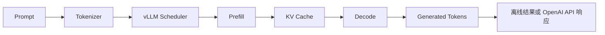
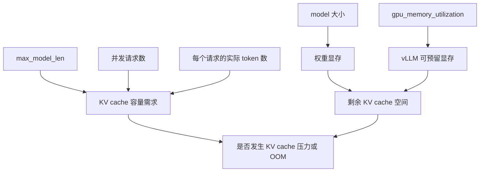
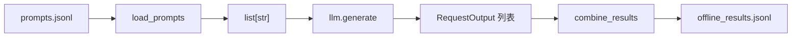

# vLLM 入门学习指导：从离线推理到 OpenAI 服务

本文配合本仓库的 `vllm_learning` 工程使用，面向第一次系统学习 vLLM、但已经有
基础 Python 和大语言模型概念的读者。

目标环境：

- GPU：RTX 4090 24GB
- 系统：Ubuntu 24.04
- CUDA：12.6
- Python：3.12
- vLLM：`0.10.0+cu126`
- 默认模型：`Qwen/Qwen2.5-1.5B-Instruct`

## 1. 学完后应该掌握什么

完成这套学习工程后，应当能够：

1. 使用 `LLM` 和 `SamplingParams` 完成最小离线推理。
2. 理解单条推理、离线批量推理和在线 continuous batching 的区别。
3. 解释 `temperature`、`top_p`、`top_k` 和 `max_tokens` 的作用。
4. 解释 KV cache 为什么消耗显存，以及 PagedAttention 解决的核心问题。
5. 知道 `gpu_memory_utilization`、`max_model_len` 和并发量如何影响显存。
6. 在单张 4090 上正确设置张量并行参数。
7. 启动 OpenAI 兼容服务，并使用 curl 或 OpenAI Python 客户端请求。
8. 根据日志、`nvidia-smi` 和 `/metrics` 初步判断服务状态。

这套工程的重点不是背 API，而是建立下面这条完整链路：



## 2. 先建立四个核心概念

### 2.1 Prefill

Prefill 是模型第一次读取整个输入 prompt 的阶段。

假设输入有 1,000 个 token，模型需要对这些 token 做一次前向计算，并为每一层保存
后续生成需要使用的 Key 和 Value。Prefill 通常计算量较大，也更容易利用 GPU 的并行
能力。

### 2.2 Decode

Decode 是自回归生成阶段。模型每轮通常生成一个新 token，然后把这个 token 对应的
Key/Value 追加到 KV cache。

Decode 的特点是：

- 每一步计算规模相对较小。
- 步数多，串行依赖明显。
- 多请求合批对提高 GPU 利用率非常重要。

### 2.3 KV cache

如果每生成一个 token 都重新计算此前所有 token 的注意力 Key/Value，推理会非常慢。
KV cache 保存历史 token 的 Key/Value，使下一步只需计算新 token。

它用显存换取速度。粗略估算公式为：

```text
单 token KV 字节数
≈ 2 × 层数 × KV heads × head_dim × 每个元素字节数
```

其中前面的 `2` 分别代表 Key 和 Value。总占用还要乘以当前存活请求的 token 总数。
采用 GQA/MQA 的模型应使用 KV heads，而不是普通 attention heads。

### 2.4 PagedAttention

传统做法容易为每个请求预留一大片连续 KV cache，造成内部碎片和显存浪费。
PagedAttention 将 KV cache 切成固定大小的 block，再通过映射管理逻辑上连续、物理上
可以分散的 token。

可以把它类比成操作系统的虚拟内存分页：

```text
请求 A 的逻辑 token:  [0..15] [16..31] [32..47]
                          │        │        │
物理 KV block:         block 7  block 2  block 9
```

这使 vLLM 更容易：

- 减少 KV cache 碎片。
- 在多个请求之间灵活分配 block。
- 提高同一块 GPU 上可容纳的并发请求数量。

## 3. 环境准备与第一次验收

进入工程目录：

```bash
cd vllm_learning
```

先检查环境：

```bash
bash scripts/check_env.sh
```

重点确认：

- 能看到 RTX 4090。
- NVIDIA 驱动工作正常。
- 显存总量接近 24GB。
- Python 目标版本为 3.12。
- 没有其他进程占用大量显存。

安装独立环境：

```bash
bash scripts/setup_cuda.sh
source .venv/bin/activate
```

本工程固定使用官方 CUDA 12.6 wheel。不要直接在已有的 PyTorch 环境中叠加安装，
否则 PyTorch、CUDA 和 vLLM 的二进制版本可能不匹配。

完成安装后验证：

```bash
python -c "import vllm; print(vllm.__version__)"
python -c "import torch; print(torch.version.cuda)"
python -c "import torch; print(torch.cuda.get_device_name(0))"
bash scripts/verify.sh
```

预期应看到：

```text
vLLM: 0.10.0+cu126
PyTorch CUDA runtime: 12.6
GPU: NVIDIA GeForce RTX 4090
```

## 4. 统一配置：为什么代码不把参数写死

所有离线示例都通过
[`LabConfig`](../src/vllm_lab/config.py) 读取相同的环境变量。

默认核心配置等价于：

```python
LabConfig(
    model="Qwen/Qwen2.5-1.5B-Instruct",
    dtype="auto",
    tensor_parallel_size=1,
    gpu_memory_utilization=0.85,
    max_model_len=4096,
    seed=42,
    trust_remote_code=False,
)
```

各参数的含义：

| 参数 | 作用 | 入门阶段建议 |
| --- | --- | --- |
| `model` | Hugging Face 模型 ID 或本地路径 | 先使用默认 1.5B 模型 |
| `dtype` | 模型权重和计算的数据类型 | 保持 `auto` |
| `tensor_parallel_size` | 模型切分到多少张 GPU | 单张 4090 必须为 `1` |
| `gpu_memory_utilization` | vLLM 实例可使用的显存比例 | 从 `0.85` 开始 |
| `max_model_len` | 允许的最大上下文长度 | 入门先用 `4096` |
| `seed` | 随机采样种子 | 固定后便于对比实验 |
| `trust_remote_code` | 是否运行模型仓库自定义代码 | 默认关闭 |

修改配置时不需要改 Python 文件：

```bash
export VLLM_MODEL=/data/models/Qwen2.5-1.5B-Instruct
export VLLM_GPU_MEMORY_UTILIZATION=0.80
export VLLM_MAX_MODEL_LEN=2048
```

也可以复制统一模板：

```bash
cp .env.example .env
set -a
source .env
set +a
```

### 配置之间的关系



需要区分两类问题：

- 初始化 OOM：模型权重、执行器或预留空间在启动时就放不下。
- 运行期 KV 压力：服务能启动，但长上下文和高并发导致 KV block 不足或 preemption。

## 5. 第一课：基础离线推理

对应代码：
[`examples/01_basic_inference.py`](../examples/01_basic_inference.py)

运行：

```bash
bash scripts/run_example.sh basic
```

自定义 prompt：

```bash
bash scripts/run_example.sh basic \
  --prompt "解释 vLLM 中 prefill 和 decode 的区别。" \
  --max-tokens 160
```

核心代码只有三步：

```python
llm = LLM(**config.llm_kwargs())
sampling = SamplingParams(temperature=0.2, top_p=0.9, max_tokens=128)
outputs = llm.generate([prompt], sampling)
```

### 第一步：创建 `LLM`

```python
llm = LLM(**config.llm_kwargs())
```

这一步不只是创建普通 Python 对象。它会完成模型配置读取、权重加载、GPU 显存规划、
KV cache 初始化以及执行器预热。因此第一次运行通常最慢。

观察终端日志时，重点找：

- 实际加载的模型和 dtype。
- 最大上下文长度。
- 可用 KV cache block 或 token 数。
- CUDA graph capture 或 eager 模式信息。
- 是否出现 OOM、驱动或算子兼容错误。

### 第二步：定义 `SamplingParams`

```python
sampling = SamplingParams(
    temperature=0.2,
    top_p=0.9,
    max_tokens=128,
)
```

它描述“怎样从模型给出的概率分布中选择下一个 token”，不负责加载模型。

### 第三步：调用 `generate`

```python
outputs = llm.generate([prompt], sampling)
```

即使只有一个 prompt，接口也接收列表。返回值同样是一个列表，每个输入对应一个
`RequestOutput`。

本例通过下面的路径取得文本：

```python
request_output = outputs[0]
candidate = request_output.outputs[0]
text = candidate.text
```

这里有两层索引：

1. `outputs[0]`：第一个请求。
2. `outputs[0].outputs[0]`：该请求的第一个候选答案。

当采样参数设置 `n > 1` 时，一个请求可以产生多个候选答案。

### 第一课练习

1. 把 `max_tokens` 从 32、128 依次改到 256，观察耗时和输出长度。
2. 连续执行两次脚本，比较首次模型下载、首次加载和再次加载的时间。
3. 把 prompt 换成英文，观察模型语言选择。
4. 查看 `output.outputs[0].finish_reason`，区分 EOS 结束和长度截断。

## 6. 第二课：离线批量推理

对应代码：
[`examples/02_offline_batch.py`](../examples/02_offline_batch.py)

运行：

```bash
bash scripts/run_example.sh batch
```

输入文件是 [`data/prompts.jsonl`](../data/prompts.jsonl)，每行一个独立 JSON 对象：

```json
{"id": "vllm-1", "prompt": "用一句话解释 vLLM 的 continuous batching。"}
```

程序流程：



核心批量调用：

```python
outputs = llm.generate(
    [record.prompt for record in records],
    sampling,
)
```

与循环逐条调用相比，把所有 prompt 一次交给引擎有两个好处：

- vLLM 可以统一调度这些请求。
- 模型只初始化一次，避免重复加载权重。

### 离线 batch 不等于 continuous batching

这两个概念经常被混淆：

| 概念 | 请求何时到达 | 调度特点 |
| --- | --- | --- |
| 离线批量推理 | 开始前已经准备好一批 prompt | 一次提交给本地引擎 |
| 静态 batching | 同一批通常一起开始、一起结束 | 容易被最长请求拖慢 |
| Continuous batching | 在线请求持续到达和结束 | 每个调度步动态加入或移出请求 |

OpenAI 服务模式更能体现 continuous batching：某个请求生成完后，它占用的位置可以
很快让给新请求，而不必等待同批所有请求结束。

### 为什么单独写 `batch_io.py`

[`src/vllm_lab/batch_io.py`](../src/vllm_lab/batch_io.py) 不导入 vLLM，
只负责：

- 校验 JSONL 格式。
- 检查 `id` 和 `prompt`。
- 组合输入与输出。
- 写入结果文件。

这样设计可以在没有 GPU 的开发机上测试数据处理逻辑，把“数据错误”和“GPU 推理错误”
分开排查。

### 第二课练习

1. 把输入扩展到 20 条长短不同的 prompt。
2. 记录一次批量调用和循环 20 次单条调用的总时间。
3. 在结果中增加 `finish_reason` 和生成 token 数。
4. 故意写一行非法 JSON，观察程序在哪个阶段报错。

## 7. 第三课：理解采样参数

对应代码：
[`examples/03_sampling_params.py`](../examples/03_sampling_params.py)

运行：

```bash
bash scripts/run_example.sh sampling
```

本例用同一个 prompt 对比三套参数：

```python
greedy = SamplingParams(temperature=0.0)

balanced = SamplingParams(
    temperature=0.7,
    top_p=0.9,
    seed=42,
)

creative = SamplingParams(
    temperature=1.0,
    top_p=0.95,
    top_k=50,
    seed=42,
)
```

### 7.1 `temperature`

`temperature` 调整概率分布的尖锐程度：

- `0`：直接选择最高概率 token，即 greedy。
- 小于 `1`：分布更集中，输出更稳定。
- 等于 `1`：保留原始分布尺度。
- 大于 `1`：分布更平，低概率 token 更容易被选中。

代码生成、抽取、分类等任务通常偏低；故事、文案等开放任务可以适当提高。

### 7.2 `top_k`

`top_k=50` 表示每一步最多保留概率最高的 50 个候选 token，其余直接丢弃。

`top_k` 控制“候选数量”，不关心这些候选累计占了多少概率。

### 7.3 `top_p`

`top_p=0.9` 表示按概率从高到低累加，只保留累计概率达到 0.9 所需的最小候选集合。

`top_p` 控制“累计概率质量”，所以候选数量会随模型当前的置信度变化。

### 7.4 `seed`

固定 seed 有利于复现实验，但它不意味着任何环境下都能逐 token 完全一致。模型版本、
vLLM 版本、GPU kernel 和并行策略变化都可能影响结果。

### 推荐起点

| 任务 | temperature | top_p | top_k |
| --- | ---: | ---: | ---: |
| 确定性抽取/分类 | `0` | `1.0` | 不限制 |
| 普通问答 | `0.2–0.7` | `0.9` | 不限制或 `40` |
| 创意生成 | `0.8–1.1` | `0.95` | `40–100` |

这些不是固定标准。正确方法是准备代表性测试集，对准确性、重复率和多样性做对比。

### 第三课练习

1. 保持 seed 不变，将 temperature 从 0.1 调到 1.2。
2. 保持 temperature 不变，分别测试 `top_k=5/20/100`。
3. 删除 seed，重复运行三次并比较输出。
4. 增加 `n=3`，观察一个请求如何返回三个候选结果。

## 8. 第四课：观察 KV cache 和显存

对应代码：
[`examples/04_kv_cache_observe.py`](../examples/04_kv_cache_observe.py)

先在终端 A 持续观察：

```bash
watch -n 0.5 nvidia-smi
```

终端 B 运行：

```bash
bash scripts/run_example.sh kv-cache --hold-seconds 30
```

程序记录四个阶段：

1. 模型加载前。
2. 模型加载及 KV cache 预留后。
3. 一个短请求完成后。
4. 一批长请求完成后。

### 预期现象

模型加载后显存会一次性明显增加，因为 vLLM 会根据
`gpu_memory_utilization=0.85` 做显存规划和预留。

请求变长后，`nvidia-smi` 的“已分配显存”不一定线性增加。这不代表 KV cache 没有被
使用，而是因为 vLLM 可能已经持有这块显存，只是在内部改变 block 的占用状态。

因此有两个观察层次：

- `nvidia-smi`：观察进程级显存总量。
- vLLM `/metrics`：观察引擎内部 KV block 使用率、等待请求和 preemption。

### 参数实验

基线：

```bash
bash scripts/run_example.sh kv-cache \
  --batch-size 8 \
  --repeat 160 \
  --max-tokens 64
```

逐步加压：

```bash
bash scripts/run_example.sh kv-cache --batch-size 16 --repeat 160
bash scripts/run_example.sh kv-cache --batch-size 16 --repeat 240
```

每次只改变一个变量，并记录：

| 实验 | batch size | prompt 长度 | max tokens | 峰值显存 | 是否 OOM |
| --- | ---: | ---: | ---: | ---: | --- |
| 基线 | 8 | 约 X token | 64 |  |  |
| 增并发 | 16 | 约 X token | 64 |  |  |
| 增上下文 | 16 | 约 Y token | 64 |  |  |

### OOM 时的排查顺序

1. 用 `nvidia-smi` 检查是否有其他进程占用显存。
2. 减小 `VLLM_GPU_MEMORY_UTILIZATION`，解决启动时余量不足。
3. 减小 `VLLM_MAX_MODEL_LEN`，减少最大上下文相关的规划压力。
4. 减小输入长度、`max_tokens` 或并发请求数。
5. 换更小或量化后的模型。
6. 只有确实有多张 GPU 时，才考虑增大张量并行。

不要把 `gpu_memory_utilization` 理解为“KV cache 独占比例”。它约束的是当前 vLLM
实例的整体 GPU 内存预算，模型权重、激活、CUDA graph 和 KV cache 都会参与显存规划。

## 9. 张量并行：单张 4090 应该怎样配置

本工程默认：

```bash
export VLLM_TENSOR_PARALLEL_SIZE=1
```

张量并行会把同一层中的矩阵权重切到多张 GPU 上。它主要用于：

- 单卡放不下模型权重。
- 多卡共同承担推理计算。
- 权重切分后为每张卡留出更多 KV cache 空间。

### 为什么单卡不能设置为 2

`tensor_parallel_size=2` 的含义是需要两个 GPU rank，不是让一张 GPU 内部开两个线程。
只有一张可见 GPU 时设置为 2，会导致设备数量、分布式初始化或 NCCL 相关错误。

### 多卡时还要满足什么

即使有两张 GPU，也要确认：

- `CUDA_VISIBLE_DEVICES` 确实暴露两张卡。
- 模型结构支持对应的切分数。
- 注意力头数等维度可以被 TP size 合理切分。
- 两张卡之间的通信开销可以接受。

对于默认 1.5B 模型，单张 4090 已经足够。为了“使用张量并行”而使用张量并行，通常
只会增加通信和启动复杂度。

## 10. 第五课：启动 OpenAI 兼容服务

离线 `LLM.generate()` 适合脚本、评测和批处理；在线服务适合多个客户端持续提交请求。

终端 A：

```bash
source .venv/bin/activate
bash scripts/serve_openai.sh
```

服务脚本读取与离线推理一致的模型、显存和张量并行配置，并额外使用：

| 变量 | 默认值 |
| --- | --- |
| `VLLM_HOST` | `127.0.0.1` |
| `VLLM_PORT` | `8000` |
| `VLLM_API_KEY` | `local-token` |
| `VLLM_SERVED_MODEL_NAME` | `vllm-lab` |

先检查健康状态和模型列表：

```bash
curl -fsS http://127.0.0.1:8000/health
curl -s http://127.0.0.1:8000/v1/models \
  -H "Authorization: Bearer local-token"
```

然后使用工程内置 curl 请求：

```bash
bash scripts/request_curl.sh
```

或运行
[`examples/05_openai_client.py`](../examples/05_openai_client.py)：

```bash
python examples/05_openai_client.py
```

Python 客户端的关键是把 `base_url` 指向本地 vLLM：

```python
client = OpenAI(
    base_url="http://127.0.0.1:8000/v1",
    api_key="local-token",
)
```

业务代码仍使用熟悉的 OpenAI 客户端接口：

```python
response = client.chat.completions.create(
    model="vllm-lab",
    messages=[{"role": "user", "content": "解释 PagedAttention。"}],
)
```

`model` 参数应填写 `--served-model-name` 暴露的名称，而不是必须填写原始 Hugging Face
路径。

### `generation-config vllm` 的意义

服务脚本显式设置：

```bash
--generation-config vllm
```

一些模型仓库包含自己的 `generation_config.json`。如果加载它，模型作者设置的
temperature、top_p 等默认值可能覆盖你以为的服务默认值。学习阶段固定使用 vLLM
默认配置，有利于让参数实验更可控。

### 在线观察 KV cache

服务启动后：

```bash
curl -s http://127.0.0.1:8000/metrics \
  | grep -E 'vllm:(kv_cache_usage_perc|gpu_cache_usage_perc|num_preemptions|num_requests_running)'
```

不同引擎版本的 cache 指标名称可能不同，因此命令同时匹配新旧名称。

为了看到动态变化，可以：

1. 持续刷新 `/metrics`。
2. 从多个终端同时发长请求。
3. 观察 running、waiting、cache usage 和 preemption。

## 11. 离线推理和在线服务怎样选择

| 场景 | 推荐方式 | 原因 |
| --- | --- | --- |
| 一次性处理本地数据集 | `LLM.generate()` | 简单、没有服务管理成本 |
| 模型效果评测 | 离线批量 | 输入和结果容易固化 |
| 多个应用共享模型 | OpenAI 兼容服务 | 统一接口和调度 |
| 需要流式输出 | 在线服务 | 客户端接口更合适 |
| 学习采样参数 | 离线推理 | 易控制变量 |
| 学习 continuous batching | 在线并发请求 | 更接近真实调度 |

两种方式底层都使用 vLLM 引擎，区别主要在请求入口、生命周期和调度环境。

## 12. 常见问题

### 12.1 `No module named vllm`

确认已激活环境：

```bash
source .venv/bin/activate
which python
python -c "import vllm"
```

### 12.2 `torch.cuda.is_available()` 为 `False`

依次检查：

```bash
nvidia-smi
python -c "import torch; print(torch.__version__, torch.version.cuda)"
echo "$CUDA_VISIBLE_DEVICES"
```

常见原因是驱动不可见、装到了 CPU 版 PyTorch，或者当前容器没有映射 GPU。

### 12.3 CUDA symbol、undefined symbol 或动态库错误

这类错误通常不是 Python 业务代码问题，而是 PyTorch、vLLM wheel 和 CUDA 运行时不匹配。
优先重新创建干净环境，并使用本工程固定的 cu126 安装脚本。

### 12.4 模型下载失败

检查：

- 服务器是否能访问 Hugging Face。
- 磁盘空间是否充足。
- 受限模型是否设置 `HF_TOKEN`。
- 是否可以提前下载模型并设置本地 `VLLM_MODEL` 路径。

### 12.5 服务启动成功但 Chat API 报模板错误

Chat Completions 需要模型 tokenizer 提供 chat template。默认 Qwen Instruct 模型具备模板。
如果换成 base 模型，可能需要改用 `/v1/completions`，或者显式提供 chat template。

### 12.6 输出每次不同

检查 temperature 是否大于 0、是否固定 seed，以及请求参数是否被模型仓库的 generation
config 覆盖。确定性实验先使用：

```python
SamplingParams(temperature=0.0, max_tokens=128)
```

## 13. 推荐学习路线

### 第 1 阶段：跑通

1. 执行环境检查和安装。
2. 跑通基础推理。
3. 修改 prompt 和 `max_tokens`。
4. 能解释 `LLM`、`SamplingParams`、`generate` 的职责。

验收问题：

- 为什么创建 `LLM` 比调用一次 `generate` 更重？
- 返回值为什么有两层 `outputs`？

### 第 2 阶段：批量与采样

1. 扩展 JSONL 输入。
2. 对比批量和逐条调用。
3. 完成 temperature/top_p/top_k 控制变量实验。
4. 记录一张参数—输出对比表。

验收问题：

- 离线 batch 和 continuous batching 有什么区别？
- top_k 和 top_p 分别限制什么？

### 第 3 阶段：显存与 KV cache

1. 观察模型加载前后的显存。
2. 改变 batch size 和 prompt 长度。
3. 用 `/metrics` 观察 KV cache 使用率。
4. 制造一次可控的显存压力，并记录解决过程。

验收问题：

- 为什么请求结束前需要保留 KV cache？
- 为什么 `nvidia-smi` 不一定反映 KV block 的实时占用变化？

### 第 4 阶段：服务化

1. 启动 OpenAI 兼容服务。
2. 分别用 curl 和 Python 客户端请求。
3. 同时发起多个请求观察 continuous batching。
4. 修改 served model name、端口和 API key。

验收问题：

- 客户端的 `model` 为什么可以不等于 Hugging Face 模型路径？
- 离线推理和服务模式分别适合什么任务？

## 14. 最终验收清单

在 RTX 4090 服务器上依次执行：

```bash
source .venv/bin/activate
bash scripts/check_env.sh
bash scripts/verify.sh
bash scripts/run_example.sh basic
bash scripts/run_example.sh batch
bash scripts/run_example.sh sampling
bash scripts/run_example.sh kv-cache
```

启动服务：

```bash
bash scripts/serve_openai.sh
```

另一个终端：

```bash
curl -fsS http://127.0.0.1:8000/health
bash scripts/request_curl.sh
python examples/05_openai_client.py
curl -s http://127.0.0.1:8000/metrics \
  | grep -E 'vllm:(kv_cache_usage_perc|gpu_cache_usage_perc)'
```

最终不只是“命令能运行”，还应当能够用自己的话画出并解释：

```text
请求到达
  -> tokenizer
  -> scheduler 合批
  -> prefill 生成首批 KV
  -> decode 逐 token 生成
  -> KV block 动态占用/释放
  -> 离线结果或 OpenAI 响应
```

如果这条主线能够解释清楚，再学习 prefix caching、chunked prefill、量化、
speculative decoding 和性能 benchmark 会顺畅很多。
