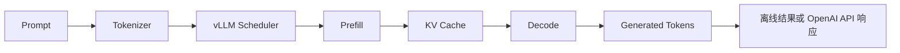
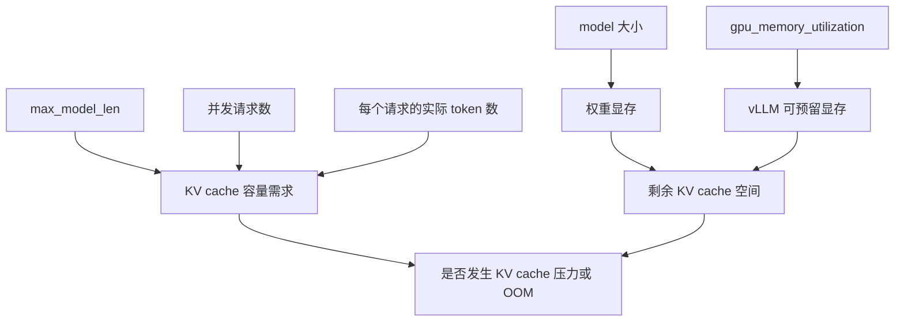
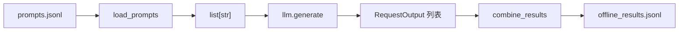

# vLLM 入门学习指导：从离线推理到 OpenAI 服务

本文配合本仓库的 `vllm_learning` 工程使用，面向第一次系统学习 vLLM、但已经有
基础 Python 和大语言模型概念的读者。

目标环境：

- GPU：RTX 4090 24GB
- 系统：Ubuntu 24.04
- CUDA：12.6
- Python：3.12
- vLLM：`0.10.0+cu126`
- 默认模型：`Qwen/Qwen2.5-1.5B-Instruct`

## 1. 学完后应该掌握什么

完成这套学习工程后，应当能够：

1. 使用 `LLM` 和 `SamplingParams` 完成最小离线推理。
2. 理解单条推理、离线批量推理和在线 continuous batching 的区别。
3. 解释 `temperature`、`top_p`、`top_k` 和 `max_tokens` 的作用。
4. 解释 KV cache 为什么消耗显存，以及 PagedAttention 解决的核心问题。
5. 知道 `gpu_memory_utilization`、`max_model_len` 和并发量如何影响显存。
6. 在单张 4090 上正确设置张量并行参数。
7. 启动 OpenAI 兼容服务，并使用 curl 或 OpenAI Python 客户端请求。
8. 根据日志、`nvidia-smi` 和 `/metrics` 初步判断服务状态。

这套工程的重点不是背 API，而是建立下面这条完整链路：



## 2. 先建立四个核心概念

### 2.1 Prefill

Prefill 是模型第一次读取整个输入 prompt 的阶段。

假设输入有 1,000 个 token，模型需要对这些 token 做一次前向计算，并为每一层保存
后续生成需要使用的 Key 和 Value。Prefill 通常计算量较大，也更容易利用 GPU 的并行
能力。

### 2.2 Decode

Decode 是自回归生成阶段。模型每轮通常生成一个新 token，然后把这个 token 对应的
Key/Value 追加到 KV cache。

Decode 的特点是：

- 每一步计算规模相对较小。
- 步数多，串行依赖明显。
- 多请求合批对提高 GPU 利用率非常重要。

### 2.3 KV cache

如果每生成一个 token 都重新计算此前所有 token 的注意力 Key/Value，推理会非常慢。
KV cache 保存历史 token 的 Key/Value，使下一步只需计算新 token。

它用显存换取速度。粗略估算公式为：

```text
单 token KV 字节数
≈ 2 × 层数 × KV heads × head_dim × 每个元素字节数
```

其中前面的 `2` 分别代表 Key 和 Value。总占用还要乘以当前存活请求的 token 总数。
采用 GQA/MQA 的模型应使用 KV heads，而不是普通 attention heads。

### 2.4 PagedAttention

传统做法容易为每个请求预留一大片连续 KV cache，造成内部碎片和显存浪费。
PagedAttention 将 KV cache 切成固定大小的 block，再通过映射管理逻辑上连续、物理上
可以分散的 token。

可以把它类比成操作系统的虚拟内存分页：

```text
请求 A 的逻辑 token:  [0..15] [16..31] [32..47]
                          │        │        │
物理 KV block:         block 7  block 2  block 9
```

这使 vLLM 更容易：

- 减少 KV cache 碎片。
- 在多个请求之间灵活分配 block。
- 提高同一块 GPU 上可容纳的并发请求数量。

## 3. 环境准备与第一次验收

进入工程目录：

```bash
cd vllm_learning
```

先检查环境：

```bash
bash scripts/check_env.sh
```

重点确认：

- 能看到 RTX 4090。
- NVIDIA 驱动工作正常。
- 显存总量接近 24GB。
- Python 目标版本为 3.12。
- 没有其他进程占用大量显存。

安装独立环境：

```bash
bash scripts/setup_cuda.sh
source .venv/bin/activate
```

本工程固定使用官方 CUDA 12.6 wheel。不要直接在已有的 PyTorch 环境中叠加安装，
否则 PyTorch、CUDA 和 vLLM 的二进制版本可能不匹配。

完成安装后验证：

```bash
python -c "import vllm; print(vllm.__version__)"
python -c "import torch; print(torch.version.cuda)"
python -c "import torch; print(torch.cuda.get_device_name(0))"
bash scripts/verify.sh
```

预期应看到：

```text
vLLM: 0.10.0+cu126
PyTorch CUDA runtime: 12.6
GPU: NVIDIA GeForce RTX 4090
```

## 4. 统一配置：为什么代码不把参数写死

所有离线示例都通过
[`LabConfig`](../src/vllm_lab/config.py) 读取相同的环境变量。

默认核心配置等价于：

```python
LabConfig(
    model="Qwen/Qwen2.5-1.5B-Instruct",
    dtype="auto",
    tensor_parallel_size=1,
    gpu_memory_utilization=0.85,
    max_model_len=4096,
    seed=42,
    trust_remote_code=False,
)
```

各参数的含义：

| 参数                     | 作用                            | 入门阶段建议         |
| ------------------------ | ------------------------------- | -------------------- |
| `model`                  | Hugging Face 模型 ID 或本地路径 | 先使用默认 1.5B 模型 |
| `dtype`                  | 模型权重和计算的数据类型        | 保持 `auto`          |
| `tensor_parallel_size`   | 模型切分到多少张 GPU            | 单张 4090 必须为 `1` |
| `gpu_memory_utilization` | vLLM 实例可使用的显存比例       | 从 `0.85` 开始       |
| `max_model_len`          | 允许的最大上下文长度            | 入门先用 `4096`      |
| `seed`                   | 随机采样种子                    | 固定后便于对比实验   |
| `trust_remote_code`      | 是否运行模型仓库自定义代码      | 默认关闭             |

修改配置时不需要改 Python 文件：

```bash
export VLLM_MODEL=/data/models/Qwen2.5-1.5B-Instruct
export VLLM_GPU_MEMORY_UTILIZATION=0.80
export VLLM_MAX_MODEL_LEN=2048
```

也可以复制统一模板：

```bash
cp .env.example .env
set -a
source .env
set +a
```

### 配置之间的关系



需要区分两类问题：

- 初始化 OOM：模型权重、执行器或预留空间在启动时就放不下。
- 运行期 KV 压力：服务能启动，但长上下文和高并发导致 KV block 不足或 preemption。

## 5. 第一课：基础离线推理

对应代码：
[`examples/01_basic_inference.py`](../examples/01_basic_inference.py)

运行：

```bash
bash scripts/run_example.sh basic
```

自定义 prompt：

```bash
bash scripts/run_example.sh basic \
  --prompt "解释 vLLM 中 prefill 和 decode 的区别。" \
  --max-tokens 160
```

核心代码只有三步：

```python
llm = LLM(**config.llm_kwargs())
sampling = SamplingParams(temperature=0.2, top_p=0.9, max_tokens=128)
outputs = llm.generate([prompt], sampling)
```

### 第一步：创建 `LLM`

```python
llm = LLM(**config.llm_kwargs())
```

这一步不只是创建普通 Python 对象。它会完成模型配置读取、权重加载、GPU 显存规划、
KV cache 初始化以及执行器预热。因此第一次运行通常最慢。

观察终端日志时，重点找：

- 实际加载的模型和 dtype。
- 最大上下文长度。
- 可用 KV cache block 或 token 数。
- CUDA graph capture 或 eager 模式信息。
- 是否出现 OOM、驱动或算子兼容错误。

### 第二步：定义 `SamplingParams`

```python
sampling = SamplingParams(
    temperature=0.2,
    top_p=0.9,
    max_tokens=128,
)
```

它描述“怎样从模型给出的概率分布中选择下一个 token”，不负责加载模型。

### 第三步：调用 `generate`

```python
outputs = llm.generate([prompt], sampling)
```

即使只有一个 prompt，接口也接收列表。返回值同样是一个列表，每个输入对应一个
`RequestOutput`。

本例通过下面的路径取得文本：

```python
request_output = outputs[0]
candidate = request_output.outputs[0]
text = candidate.text
```

这里有两层索引：

1. `outputs[0]`：第一个请求。
2. `outputs[0].outputs[0]`：该请求的第一个候选答案。

当采样参数设置 `n > 1` 时，一个请求可以产生多个候选答案。

### 第一课练习

1. 把 `max_tokens` 从 32、128 依次改到 256，观察耗时和输出长度。
2. 连续执行两次脚本，比较首次模型下载、首次加载和再次加载的时间。
3. 把 prompt 换成英文，观察模型语言选择。
4. 查看 `output.outputs[0].finish_reason`，区分 EOS 结束和长度截断。

## 6. 第二课：离线批量推理

对应代码：
[`examples/02_offline_batch.py`](../examples/02_offline_batch.py)

运行：

```bash
bash scripts/run_example.sh batch
```

输入文件是 [`data/prompts.jsonl`](../data/prompts.jsonl)，每行一个独立 JSON 对象：

```json
{"id": "vllm-1", "prompt": "用一句话解释 vLLM 的 continuous batching。"}
```

程序流程：



核心批量调用：

```python
outputs = llm.generate(
    [record.prompt for record in records],
    sampling,
)
```

与循环逐条调用相比，把所有 prompt 一次交给引擎有两个好处：

- vLLM 可以统一调度这些请求。
- 模型只初始化一次，避免重复加载权重。

### 离线 batch 不等于 continuous batching

这两个概念经常被混淆：

| 概念                | 请求何时到达                 | 调度特点                     |
| ------------------- | ---------------------------- | ---------------------------- |
| 离线批量推理        | 开始前已经准备好一批 prompt  | 一次提交给本地引擎           |
| 静态 batching       | 同一批通常一起开始、一起结束 | 容易被最长请求拖慢           |
| Continuous batching | 在线请求持续到达和结束       | 每个调度步动态加入或移出请求 |

OpenAI 服务模式更能体现 continuous batching：某个请求生成完后，它占用的位置可以
很快让给新请求，而不必等待同批所有请求结束。

### 为什么单独写 `batch_io.py`

[`src/vllm_lab/batch_io.py`](../src/vllm_lab/batch_io.py) 不导入 vLLM，
只负责：

- 校验 JSONL 格式。
- 检查 `id` 和 `prompt`。
- 组合输入与输出。
- 写入结果文件。

这样设计可以在没有 GPU 的开发机上测试数据处理逻辑，把“数据错误”和“GPU 推理错误”
分开排查。

### 第二课练习

1. 把输入扩展到 20 条长短不同的 prompt。
2. 记录一次批量调用和循环 20 次单条调用的总时间。
3. 在结果中增加 `finish_reason` 和生成 token 数。
4. 故意写一行非法 JSON，观察程序在哪个阶段报错。

## 7. 第三课：理解采样参数

对应代码：
[`examples/03_sampling_params.py`](../examples/03_sampling_params.py)

运行：

```bash
bash scripts/run_example.sh sampling
```

本例用同一个 prompt 对比三套参数：

```python
greedy = SamplingParams(temperature=0.0)

balanced = SamplingParams(
    temperature=0.7,
    top_p=0.9,
    seed=42,
)

creative = SamplingParams(
    temperature=1.0,
    top_p=0.95,
    top_k=50,
    seed=42,
)
```

### 7.1 `temperature`

`temperature` 调整概率分布的尖锐程度：

- `0`：直接选择最高概率 token，即 greedy。
- 小于 `1`：分布更集中，输出更稳定。
- 等于 `1`：保留原始分布尺度。
- 大于 `1`：分布更平，低概率 token 更容易被选中。

代码生成、抽取、分类等任务通常偏低；故事、文案等开放任务可以适当提高。

### 7.2 `top_k`

`top_k=50` 表示每一步最多保留概率最高的 50 个候选 token，其余直接丢弃。

`top_k` 控制“候选数量”，不关心这些候选累计占了多少概率。

### 7.3 `top_p`

`top_p=0.9` 表示按概率从高到低累加，只保留累计概率达到 0.9 所需的最小候选集合。

`top_p` 控制“累计概率质量”，所以候选数量会随模型当前的置信度变化。

### 7.4 `seed`

固定 seed 有利于复现实验，但它不意味着任何环境下都能逐 token 完全一致。模型版本、
vLLM 版本、GPU kernel 和并行策略变化都可能影响结果。

### 推荐起点

| 任务            | temperature | top_p  | top_k         |
| --------------- | ----------: | -----: | ------------: |
| 确定性抽取/分类 | `0`         | `1.0`  | 不限制        |
| 普通问答        | `0.2–0.7`   | `0.9`  | 不限制或 `40` |
| 创意生成        | `0.8–1.1`   | `0.95` | `40–100`      |

这些不是固定标准。正确方法是准备代表性测试集，对准确性、重复率和多样性做对比。

### 第三课练习

1. 保持 seed 不变，将 temperature 从 0.1 调到 1.2。
2. 保持 temperature 不变，分别测试 `top_k=5/20/100`。
3. 删除 seed，重复运行三次并比较输出。
4. 增加 `n=3`，观察一个请求如何返回三个候选结果。

## 8. 第四课：观察 KV cache 和显存

对应代码：
[`examples/04_kv_cache_observe.py`](../examples/04_kv_cache_observe.py)

先在终端 A 持续观察：

```bash
watch -n 0.5 nvidia-smi
```

终端 B 运行：

```bash
bash scripts/run_example.sh kv-cache --hold-seconds 30
```

程序记录四个阶段：

1. 模型加载前。
2. 模型加载及 KV cache 预留后。
3. 一个短请求完成后。
4. 一批长请求完成后。

### 预期现象

模型加载后显存会一次性明显增加，因为 vLLM 会根据
`gpu_memory_utilization=0.85` 做显存规划和预留。

请求变长后，`nvidia-smi` 的“已分配显存”不一定线性增加。这不代表 KV cache 没有被
使用，而是因为 vLLM 可能已经持有这块显存，只是在内部改变 block 的占用状态。

因此有两个观察层次：

- `nvidia-smi`：观察进程级显存总量。
- vLLM `/metrics`：观察引擎内部 KV block 使用率、等待请求和 preemption。

### 参数实验

基线：

```bash
bash scripts/run_example.sh kv-cache \
  --batch-size 8 \
  --repeat 160 \
  --max-tokens 64
```

逐步加压：

```bash
bash scripts/run_example.sh kv-cache --batch-size 16 --repeat 160
bash scripts/run_example.sh kv-cache --batch-size 16 --repeat 240
```

每次只改变一个变量，并记录：

| 实验     | batch size | prompt 长度 | max tokens | 峰值显存 | 是否 OOM |
| -------- | ---------: | ----------: | ---------: | -------: | -------- |
| 基线     | 8          | 约 X token  | 64         |          |          |
| 增并发   | 16         | 约 X token  | 64         |          |          |
| 增上下文 | 16         | 约 Y token  | 64         |          |          |

### OOM 时的排查顺序

1. 用 `nvidia-smi` 检查是否有其他进程占用显存。
2. 减小 `VLLM_GPU_MEMORY_UTILIZATION`，解决启动时余量不足。
3. 减小 `VLLM_MAX_MODEL_LEN`，减少最大上下文相关的规划压力。
4. 减小输入长度、`max_tokens` 或并发请求数。
5. 换更小或量化后的模型。
6. 只有确实有多张 GPU 时，才考虑增大张量并行。

不要把 `gpu_memory_utilization` 理解为“KV cache 独占比例”。它约束的是当前 vLLM
实例的整体 GPU 内存预算，模型权重、激活、CUDA graph 和 KV cache 都会参与显存规划。

## 9. 张量并行：单张 4090 应该怎样配置

本工程默认：

```bash
export VLLM_TENSOR_PARALLEL_SIZE=1
```

张量并行会把同一层中的矩阵权重切到多张 GPU 上。它主要用于：

- 单卡放不下模型权重。
- 多卡共同承担推理计算。
- 权重切分后为每张卡留出更多 KV cache 空间。

### 为什么单卡不能设置为 2

`tensor_parallel_size=2` 的含义是需要两个 GPU rank，不是让一张 GPU 内部开两个线程。
只有一张可见 GPU 时设置为 2，会导致设备数量、分布式初始化或 NCCL 相关错误。

### 多卡时还要满足什么

即使有两张 GPU，也要确认：

- `CUDA_VISIBLE_DEVICES` 确实暴露两张卡。
- 模型结构支持对应的切分数。
- 注意力头数等维度可以被 TP size 合理切分。
- 两张卡之间的通信开销可以接受。

对于默认 1.5B 模型，单张 4090 已经足够。为了“使用张量并行”而使用张量并行，通常
只会增加通信和启动复杂度。

## 10. 第五课：启动 OpenAI 兼容服务

离线 `LLM.generate()` 适合脚本、评测和批处理；在线服务适合多个客户端持续提交请求。

终端 A：

```bash
source .venv/bin/activate
bash scripts/serve_openai.sh
```

服务脚本读取与离线推理一致的模型、显存和张量并行配置，并额外使用：

| 变量                     | 默认值        |
| ------------------------ | ------------- |
| `VLLM_HOST`              | `127.0.0.1`   |
| `VLLM_PORT`              | `8000`        |
| `VLLM_API_KEY`           | `local-token` |
| `VLLM_SERVED_MODEL_NAME` | `vllm-lab`    |

先检查健康状态和模型列表：

```bash
curl -fsS http://127.0.0.1:8000/health
curl -s http://127.0.0.1:8000/v1/models \
  -H "Authorization: Bearer local-token"
```

然后使用工程内置 curl 请求：

```bash
bash scripts/request_curl.sh
```

或运行
[`examples/05_openai_client.py`](../examples/05_openai_client.py)：

```bash
python examples/05_openai_client.py
```

Python 客户端的关键是把 `base_url` 指向本地 vLLM：

```python
client = OpenAI(
    base_url="http://127.0.0.1:8000/v1",
    api_key="local-token",
)
```

业务代码仍使用熟悉的 OpenAI 客户端接口：

```python
response = client.chat.completions.create(
    model="vllm-lab",
    messages=[{"role": "user", "content": "解释 PagedAttention。"}],
)
```

`model` 参数应填写 `--served-model-name` 暴露的名称，而不是必须填写原始 Hugging Face
路径。

### `generation-config vllm` 的意义

服务脚本显式设置：

```bash
--generation-config vllm
```

一些模型仓库包含自己的 `generation_config.json`。如果加载它，模型作者设置的
temperature、top_p 等默认值可能覆盖你以为的服务默认值。学习阶段固定使用 vLLM
默认配置，有利于让参数实验更可控。

### 在线观察 KV cache

服务启动后：

```bash
curl -s http://127.0.0.1:8000/metrics \
  | grep -E 'vllm:(kv_cache_usage_perc|gpu_cache_usage_perc|num_preemptions|num_requests_running)'
```

不同引擎版本的 cache 指标名称可能不同，因此命令同时匹配新旧名称。

为了看到动态变化，可以：

1. 持续刷新 `/metrics`。
2. 从多个终端同时发长请求。
3. 观察 running、waiting、cache usage 和 preemption。

## 11. 离线推理和在线服务怎样选择

| 场景                     | 推荐方式         | 原因                   |
| ------------------------ | ---------------- | ---------------------- |
| 一次性处理本地数据集     | `LLM.generate()` | 简单、没有服务管理成本 |
| 模型效果评测             | 离线批量         | 输入和结果容易固化     |
| 多个应用共享模型         | OpenAI 兼容服务  | 统一接口和调度         |
| 需要流式输出             | 在线服务         | 客户端接口更合适       |
| 学习采样参数             | 离线推理         | 易控制变量             |
| 学习 continuous batching | 在线并发请求     | 更接近真实调度         |

两种方式底层都使用 vLLM 引擎，区别主要在请求入口、生命周期和调度环境。

## 12. 常见问题

### 12.1 `No module named vllm`

确认已激活环境：

```bash
source .venv/bin/activate
which python
python -c "import vllm"
```

### 12.2 `torch.cuda.is_available()` 为 `False`

依次检查：

```bash
nvidia-smi
python -c "import torch; print(torch.__version__, torch.version.cuda)"
echo "$CUDA_VISIBLE_DEVICES"
```

常见原因是驱动不可见、装到了 CPU 版 PyTorch，或者当前容器没有映射 GPU。

### 12.3 CUDA symbol、undefined symbol 或动态库错误

这类错误通常不是 Python 业务代码问题，而是 PyTorch、vLLM wheel 和 CUDA 运行时不匹配。
优先重新创建干净环境，并使用本工程固定的 cu126 安装脚本。

### 12.4 模型下载失败

检查：

- 服务器是否能访问 Hugging Face。
- 磁盘空间是否充足。
- 受限模型是否设置 `HF_TOKEN`。
- 是否可以提前下载模型并设置本地 `VLLM_MODEL` 路径。

### 12.5 服务启动成功但 Chat API 报模板错误

Chat Completions 需要模型 tokenizer 提供 chat template。默认 Qwen Instruct 模型具备模板。
如果换成 base 模型，可能需要改用 `/v1/completions`，或者显式提供 chat template。

### 12.6 输出每次不同

检查 temperature 是否大于 0、是否固定 seed，以及请求参数是否被模型仓库的 generation
config 覆盖。确定性实验先使用：

```python
SamplingParams(temperature=0.0, max_tokens=128)
```

## 13. 推荐学习路线

### 第 1 阶段：跑通

1. 执行环境检查和安装。
2. 跑通基础推理。
3. 修改 prompt 和 `max_tokens`。
4. 能解释 `LLM`、`SamplingParams`、`generate` 的职责。

验收问题：

- 为什么创建 `LLM` 比调用一次 `generate` 更重？
- 返回值为什么有两层 `outputs`？

### 第 2 阶段：批量与采样

1. 扩展 JSONL 输入。
2. 对比批量和逐条调用。
3. 完成 temperature/top_p/top_k 控制变量实验。
4. 记录一张参数—输出对比表。

验收问题：

- 离线 batch 和 continuous batching 有什么区别？
- top_k 和 top_p 分别限制什么？

### 第 3 阶段：显存与 KV cache

1. 观察模型加载前后的显存。
2. 改变 batch size 和 prompt 长度。
3. 用 `/metrics` 观察 KV cache 使用率。
4. 制造一次可控的显存压力，并记录解决过程。

验收问题：

- 为什么请求结束前需要保留 KV cache？
- 为什么 `nvidia-smi` 不一定反映 KV block 的实时占用变化？

### 第 4 阶段：服务化

1. 启动 OpenAI 兼容服务。
2. 分别用 curl 和 Python 客户端请求。
3. 同时发起多个请求观察 continuous batching。
4. 修改 served model name、端口和 API key。

验收问题：

- 客户端的 `model` 为什么可以不等于 Hugging Face 模型路径？
- 离线推理和服务模式分别适合什么任务？

## 14. 最终验收清单

在 RTX 4090 服务器上依次执行：

```bash
source .venv/bin/activate
bash scripts/check_env.sh
bash scripts/verify.sh
bash scripts/run_example.sh basic
bash scripts/run_example.sh batch
bash scripts/run_example.sh sampling
bash scripts/run_example.sh kv-cache
```

启动服务：

```bash
bash scripts/serve_openai.sh
```

另一个终端：

```bash
curl -fsS http://127.0.0.1:8000/health
bash scripts/request_curl.sh
python examples/05_openai_client.py
curl -s http://127.0.0.1:8000/metrics \
  | grep -E 'vllm:(kv_cache_usage_perc|gpu_cache_usage_perc)'
```

最终不只是“命令能运行”，还应当能够用自己的话画出并解释：

```text
请求到达
  -> tokenizer
  -> scheduler 合批
  -> prefill 生成首批 KV
  -> decode 逐 token 生成
  -> KV block 动态占用/释放
  -> 离线结果或 OpenAI 响应
```

如果这条主线能够解释清楚，再学习 prefix caching、chunked prefill、量化、
speculative decoding 和性能 benchmark 会顺畅很多。

## 15. vLLM 阶段出口闭卷口试

这32道题既是学习导航，也是入门阶段的停止线。不要先顺序重读全文：先闭卷回答，答不出的题再回到对应章节和实验。

### 15.1 一道题怎样才算掌握

每道题按四级记录：

| 等级 | 表现                                             |
| :--: | :----------------------------------------------- |
| 0    | 不知道问题在问什么                               |
| 1    | 看正文能理解，但不能独立说明                     |
| 2    | 能脱离文档解释概念和因果，但缺少自己的运行证据   |
| 3    | 能闭卷解释，并能指向日志、输出、指标或故障记录   |

完整回答尽量包含：

```text
它是什么
  -> 为什么需要它
  -> vLLM中怎样发生
  -> 我用什么命令、日志或指标验证过
  -> 它的适用边界或常见误区是什么
```

API参数名可以查文档；核心流程、因果关系和自己的实验结论必须闭卷回答。

### 15.2 核心执行流程

1. 一个prompt从进入vLLM到返回文本，依次经过哪些主要阶段？
2. Prefill和Decode分别处理什么工作？为什么计算形态不同？
3. 为什么Decode通常每轮只生成一个token？这会带来什么性能问题？
4. 为什么多请求合批对Decode的GPU利用率特别重要？
5. KV cache保存什么？如果没有它，每生成一个token会多做什么？
6. 怎样根据层数、KV heads、head dimension和dtype估算单token KV字节数？
7. 为什么GQA/MQA模型必须使用KV heads而不是attention heads估算？
8. PagedAttention解决什么问题？与操作系统分页的类比在哪里成立？

### 15.3 离线推理、批量与输出对象

9. 创建`LLM`时完成哪些重量级工作？为什么比单次`generate`更重？
10. `LLM`、`SamplingParams`和`generate`的职责分别是什么？
11. `outputs[0].outputs[0]`两层索引分别代表什么？`n>1`后怎样变化？
12. 为什么把20条prompt一次交给引擎比循环创建引擎或逐条调用更合理？
13. 离线batch、静态batch和continuous batching有什么区别？
14. 为什么JSONL读写放在不依赖vLLM的`batch_io.py`中？

### 15.4 采样与可复现性

15. `temperature`改变概率分布的什么？为什么0常用于确定性实验？
16. `top_k`和`top_p`分别限制什么？为什么同一`top_p`保留数量会变？
17. `max_tokens`、EOS和`finish_reason`有什么关系？怎样判断长度截断？
18. 固定seed为什么有利于对照？为什么更换版本或并行策略后仍可能不完全一致？

### 15.5 显存、配置与调度

19. 模型加载后显存由哪些部分占用？`gpu_memory_utilization`为何不是KV独占比例？
20. `max_model_len`、实际prompt、`max_tokens`和并发量怎样影响KV压力？
21. 请求变长后，`nvidia-smi`中的进程显存为什么不一定线性增长？
22. 初始化OOM和运行期KV压力有什么区别？分别看什么现象？
23. OOM或preemption时应按什么顺序调整？为什么不能先随意增大显存比例？
24. 单张4090为什么必须`tensor_parallel_size=1`？设置2实际要求什么？
25. 多卡TP有什么收益和通信代价？为什么小模型不应为使用TP而使用TP？

### 15.6 在线服务、指标与排障

26. 离线`LLM.generate()`和OpenAI服务分别适合什么场景？
27. 请求中的`model="vllm-lab"`为何可以不等于Hugging Face模型路径？
28. `/health`、`/v1/models`和`/metrics`分别回答什么问题？
29. running、waiting、KV usage和preemption组合起来说明什么调度状态？
30. 怎样用并发长请求验证continuous batching和KV block动态占用？
31. 遇到模块缺失、CUDA不可用、undefined symbol时，怎样分层排查？
32. 服务已启动但Chat API提示模板错误，为什么base和instruct模型处理不同？

### 15.7 题目、教材与证据对应表

| 题目   | 回读章节   | 最少证据                                            |
| :----- | :--------- | :-------------------------------------------------- |
| 1～8   | 第2章      | 手画请求主线；一次KV容量手算                        |
| 9～14  | 第5～6章   | 基础/批量输出；时间记录；一条非法JSON故障           |
| 15～18 | 第7章      | 采样参数—输出表；finish reason记录                  |
| 19～23 | 第4、8章   | 显存四阶段记录；一次KV压力、OOM或preemption复盘     |
| 24～25 | 第9章      | 单卡TP配置和日志；多卡收益/代价推导                 |
| 26～32 | 第10～12章 | curl/Python请求；metrics快照；一次服务故障定位      |

### 15.8 通过线与停止线

vLLM入门阶段可以告一段落，需要同时满足：

- 32题中至少26题达到等级2以上。
- 第1～8、13、19～24、26～31题不能有结构性错误。
- 至少12题达到等级3，能给出自己的日志、输出或指标。
- 基础推理、离线batch、采样、KV观察和OpenAI服务全部实际跑通。
- 保留采样对照、显存/KV实验和故障复盘各一份。
- 一周后随机抽10题，至少8题仍能闭卷回答。

达到停止线后，不必把所有vLLM参数和源码细节学完。后续优先进行调试、性能实验和简历项目整理；prefix caching、chunked prefill、量化、speculative decoding等根据岗位或实际问题再补。

### 15.9 建议追踪模板

```text
题号：____
当前等级：0 / 1 / 2 / 3
一句话答案：
关键因果链：
代码/命令：
日志/指标证据：
仍然不会的追问：
下次复测日期：
```

每次只学习当前等级最低的3～5题。不要因为某个源码细节没扣完，就暂停整个vLLM学习和项目推进。

## 16. 32道闭卷口试详细答案

使用方式：先独立回答，再对照答案补缺。答案中的“验证”不是可选装饰；只有亲自取得对应日志、输出或指标，才能把该题标为等级3。

### 16.1 一个prompt经过哪些阶段

**标准回答：** 请求首先被tokenizer转换为token ID；引擎接收请求并由scheduler决定何时进入批次；Prefill一次处理输入token并为各层产生初始KV cache；随后Decode按自回归方式逐步生成新token，每一步读取历史KV并追加新KV；采样器根据logits和采样参数选择下一个token；最后detokenizer把token ID转换成文本，由离线对象或OpenAI响应返回。

**为什么这样设计：** Tokenizer负责文本和模型输入之间的转换；scheduler负责共享GPU；Prefill和Decode的工作形态不同；KV cache避免重复计算历史K/V；采样器把概率分布变成实际token。

**怎样验证：** 画出第1章主线；运行基础离线推理，记录模型初始化日志、prompt token数、生成token数和`finish_reason`；再启动服务观察running请求与KV指标。

**常见误区：** 把tokenizer当作GPU模型的一部分；认为`generate`一次调用只对应一个Kernel；忽略scheduler、采样和detokenize的Host工作。

### 16.2 Prefill和Decode有什么不同

**标准回答：** Prefill处理当前请求的全部输入token，通常可以形成较大的矩阵计算，并为每层写入这些token的K/V。Decode依赖前一步结果，每轮通常只处理最新token，读取已有KV并产生下一个token及其K/V。

**性能含义：** Prefill并行度通常更高、计算量更集中；Decode单步工作小、迭代多、串行依赖强，容易受启动开销、KV读取和并行度限制。同一个服务可能同时存在Prefill请求和Decode请求，调度策略需要在吞吐与交互延迟之间取舍。

**验证：** 对比长prompt短输出与短prompt长输出。前者增加Prefill工作，后者增加Decode步数；记录总生成时间、输出token数和服务指标。

### 16.3 为什么Decode通常一次生成一个token

自回归模型把概率写成：

```text
P(x1, x2, ..., xn) = Π P(xt | x1, ..., x(t-1))
```

第`t`个token依赖此前已选择的token，因此普通Decode必须先得到`t`，才能计算`t+1`。这造成跨token串行依赖：单请求无法简单同时生成很多未知token。

性能问题包括单步矩阵较小、Kernel launch频繁、每步都要读取历史KV，以及单请求难以填满GPU。Speculative decoding等方法尝试一次验证多个候选token，但不改变普通自回归依赖的基本事实。

### 16.4 为什么多请求合批对Decode重要

一个请求的Decode可能只有一行或很小的矩阵，GPU有大量执行资源闲置。Scheduler把多个请求当前步的token放入同一批，可以把许多“小工作”组合成更大的GPU工作，提高并行度和吞吐。

Continuous batching允许请求完成后立即移出、新请求进入，不必等待原批次最慢请求。这比固定静态batch更适合长短输出混合的在线流量。

代价是请求之间共享资源：批次越大，单步计算可能更高效，但排队、KV容量和单请求延迟也可能增加。因此吞吐最大与延迟最小不是同一个目标。

### 16.5 KV cache保存什么

每一层Attention会把历史token投影成Key和Value。后续token仍需要与所有历史Key计算注意力，并用对应Value求输出。KV cache保存这些历史K/V。

没有KV cache时，第`t`步必须重新对前`t-1`个token计算K/V；有cache后，只计算新token的K/V并追加。它用显存换取大量重复计算的消除。

KV cache不保存所有中间激活，也不直接保存最终生成文本。请求结束后，其KV block可以被回收给其他请求。

### 16.6 怎样估算单token KV字节数

通用估算：

```text
bytes_per_token
= 2 × num_layers × num_kv_heads × head_dim × bytes_per_element
```

`2`代表Key和Value。例：32层、8个KV head、head dimension 128、BF16/FP16每元素2字节：

```text
2 × 32 × 8 × 128 × 2
= 131072 bytes
= 128 KiB/token
```

4096个存活token约需要512 MiB KV数据。实际引擎还存在block粒度、对齐、元数据和其他内存，因此公式用于数量级估算，不等于`nvidia-smi`增量。

### 16.7 为什么使用KV heads估算GQA/MQA

MHA通常每个Query head拥有独立K/V head；GQA让一组Query heads共享一个K/V head；MQA进一步让大量Query heads共享很少的K/V heads。

KV cache实际存储的是K/V，因此容量与`num_kv_heads`成正比，而不是与Query/attention heads成正比。误用Query head数会高估GQA/MQA的KV容量。

共享减少显存与Decode读取量，但Query head仍需映射到对应KV head，Kernel布局和广播方式也会改变。

### 16.8 PagedAttention解决什么问题

如果每个请求都要求一段足以覆盖最大长度的连续KV空间，会产生预留浪费和碎片。PagedAttention把KV cache切成固定大小物理block，通过block table把逻辑token位置映射到物理block。

类比操作系统分页的部分是“逻辑连续、物理可分散、通过映射访问”；不同之处是这里管理的是GPU上的KV块和Attention访问，不等于CPU虚拟内存的完整缺页、换页和权限系统。

收益是更灵活地增长/回收请求KV、降低碎片并提高并发容量；代价是block table、地址映射和边界管理。PagedAttention减少浪费，不代表KV cache不占显存。

### 16.9 创建LLM为什么很重

`LLM(...)`通常需要读取模型/tokenizer配置、加载权重、初始化执行器和通信环境、规划GPU内存、建立KV cache、选择/编译或预热Kernel，并可能进行CUDA Graph capture。

`generate`是在已初始化引擎上提交请求。若把模型初始化时间混入每条请求，就无法评价稳态推理性能。

验证时分别记录进程启动到LLM可用、第一次generate、后续generate。模型下载、磁盘缓存和首次JIT还应单独标注。

### 16.10 LLM、SamplingParams和generate的职责

- `LLM`：持有tokenizer、模型执行器、GPU内存/KV cache和调度能力。
- `SamplingParams`：描述输出token选择规则，例如temperature、top_p、top_k、max_tokens和候选数。
- `generate`：把一个或多个prompt及采样参数提交给已经初始化的引擎，并返回请求结果。

采样参数不负责加载模型；`LLM`配置也不等于某次请求的采样策略。把两类参数分开，有利于同一引擎服务不同请求。

### 16.11 两层outputs索引是什么

`llm.generate([...])`返回`list[RequestOutput]`：外层每项对应一个输入请求。每个`RequestOutput.outputs`又是候选答案列表。

```text
outputs[request_index].outputs[candidate_index]
```

默认常只有一个候选，所以使用`[0].outputs[0]`。当`n=3`时，一个请求可有三个候选，应遍历候选列表，不能只读取第一个后声称得到全部结果。

### 16.12 为什么一次提交多条prompt

官方接口会根据内存约束自动批处理传入的prompts。一次提交列表让引擎看到更多可调度工作，并复用同一模型实例。

循环重新创建`LLM`最差，因为反复加载模型和规划显存。循环对同一`LLM`逐条`generate`虽然仍复用模型，但每次可见工作少，调度和并行机会通常低于一次批量提交。

公平比较必须固定prompt集合、采样参数和输出上限，并把模型初始化排除在稳态推理之外。

### 16.13 三种batch有什么区别

- 离线batch：调用前已准备好一组输入，一次提交给本地引擎。
- 静态batch：一批任务通常一起组成固定批次；长短不一时，资源可能被最长任务拖住。
- Continuous batching：在线请求持续到达/完成，scheduler每个调度周期动态选择运行集合。

离线一次提交可能内部得到高效批处理，但它不等于真实在线到达、等待和动态替换。验证continuous batching要让请求错开到达并观察running/waiting变化。

### 16.14 为什么分离batch_io

JSON解析、字段校验和结果写盘不需要GPU，也不应该与模型错误混在一起。独立模块可以在无GPU机器上单元测试，并让非法JSON、缺少prompt、结果数量不匹配等问题在进入推理前失败。

这体现“分层调试”：先证明数据层正确，再判断模型/引擎/GPU。否则一次批处理失败时，很难知道是输入格式还是CUDA环境。

### 16.15 Temperature是什么

常见概念式：

```text
p_i = softmax(logit_i / T)
```

`T<1`使分布更尖，最高概率token更占优势；`T>1`使分布更平，低概率token更容易被选中。`temperature=0`在接口中通常表示greedy选择，不是直接计算除以0。

Greedy适合确定性抽取和控制变量实验，但“输出稳定”不等于“答案一定正确”。开放创作可使用更高temperature，并通过代表性数据评估。

### 16.16 Top-k和Top-p有什么不同

Top-k只保留概率最高的固定`k`个token；Top-p按概率从高到低累计，保留累计概率达到`p`的最小集合。

如果模型很自信，少数token就能达到`top_p=0.9`；如果分布平坦，需要更多token，因此Top-p候选数量动态变化。二者可以同时使用，最终候选是过滤规则共同作用后的集合。

对照实验一次只改变一个参数，否则无法判断多样性变化来自哪项过滤。

### 16.17 Max tokens、EOS和finish reason

`max_tokens`限制最多生成多少新token，不是输入+输出总长度。模型生成EOS等停止token时可以提前结束；若先达到输出上限，则通常表现为长度原因结束。

应记录`finish_reason`和实际生成token数：EOS结束表示模型认为输出完成；length表示被上限截断。文本看起来“句子结束”不能代替结构化结束原因。

同时还要满足引擎允许的上下文长度：输入token与可能生成token的总量不能违反相关长度约束。

### 16.18 Seed为何不是绝对保证

固定seed让同一环境、同一输入和同一采样路径更容易复现，适合控制变量。但浮点归约顺序、GPU Kernel、并行调度、模型/vLLM版本变化都可能改变很小的logit差异，采样后可能放大成不同token序列。

确定性实验优先使用`temperature=0`；采样实验记录seed和完整环境。Seed是实验条件，不是跨硬件跨版本逐token一致承诺。

### 16.19 模型加载后显存由什么组成

主要包括模型权重、KV cache、运行时激活/临时workspace、CUDA context、编译/图相关缓冲和框架分配器保留内存。

`gpu_memory_utilization`描述当前vLLM实例可使用/预留的整体GPU内存预算，权重、激活和KV cache都在预算关系中；它不是“把该比例全部给KV cache”。权重越大，剩给KV的空间越少。

因此只看一个比例无法推导KV容量，必须结合启动日志中模型、dtype、最大长度和cache信息。

### 16.20 四个长度/并发参数怎样影响KV

- `max_model_len`影响引擎允许和规划的最大序列长度边界。
- 实际prompt长度决定请求进入Decode前已有多少KV token。
- `max_tokens`决定该请求最多还能增长多少KV token。
- 并发请求数决定同时存活序列的token总量。

粗略压力与“所有存活请求的当前token总数”相关。最大长度高不代表每个请求立即占满同等实际KV block，但会影响容量规划、可接受请求和某些初始化资源。

### 16.21 为什么nvidia-smi不线性增长

vLLM可能在初始化时根据预算预留或建立一大片GPU cache，后续请求只是改变内部KV block的已用/空闲状态。框架分配器也可能保留释放后的内存，不立刻归还给驱动。

`nvidia-smi`看到进程级已占显存，不能显示每个KV block的逻辑使用率。因此要结合`/metrics`中的cache usage、running/waiting和preemption。

“显存数字没变”不能推出“KV cache没增长”。

### 16.22 初始化OOM和运行期KV压力

初始化OOM发生在权重加载、内存规划、workspace或图捕获阶段，服务还没正常接收请求。常见现象是启动直接失败、CUDA OOM或无法建立足够cache。

运行期KV压力发生在服务已经启动后，随着长上下文/高并发，cache block不足，请求等待或被preempt/recompute，延迟和吞吐恶化；不一定立即CUDA OOM。

前者看启动日志和其他进程显存；后者看请求负载、cache usage、waiting、preemption和延迟。

### 16.23 OOM或Preemption怎样排查

先确认是哪一类问题：

1. `nvidia-smi`检查其他进程和真实可用显存。
2. 确认模型/dtype/TP和最大长度是否符合单卡容量。
3. 启动期因预算过激或缺少余量时，可降低`gpu_memory_utilization`、长度或图相关资源。
4. 运行期KV不足时，先降低并发、prompt/输出长度或批调度上限；有安全余量时才考虑提高利用率。
5. 仍不足时换小模型/量化，或在确有多GPU时使用并行。

提高利用率可能增加KV空间、减少preemption，但也可能挤压其他CUDA内存并造成启动/运行OOM，所以不能不分类直接调整。

### 16.24 单卡为什么TP必须为1

`tensor_parallel_size`表示同一模型层跨多少个GPU rank切分，不是单卡内部开几个线程。设置2要求两个可见GPU和两个rank，并需要分布式/NCCL通信。

单卡只有一个设备，设置2会在设备数校验或分布式初始化阶段失败。验证时同时看`CUDA_VISIBLE_DEVICES`、`torch.cuda.device_count()`和启动日志。

### 16.25 多卡TP的收益与代价

TP把大矩阵权重切到多卡，使单卡权重占用下降、可运行更大模型或给KV留下更多空间，并行计算还可能提高吞吐。

代价是层内频繁通信、同步、NCCL初始化、跨卡互联限制和更复杂故障面。模型很小时，单卡已能高效执行，通信可能抵消计算收益。

TP size还要与模型结构的相关维度合理匹配。决策依据应是容量或性能数据，不是“多卡看起来更高级”。

### 16.26 离线和在线服务怎样选

离线`LLM.generate()`适合本地脚本、固定数据集、评测和批处理：生命周期由脚本控制，输入结果容易固化，没有HTTP服务管理成本。

OpenAI服务适合多个客户端持续到达、共享模型、流式输出和观察continuous batching：模型进程长期驻留，存在网络、队列、认证、监控和服务生命周期。

二者底层都使用vLLM引擎，但端到端性能不能直接混比；在线延迟包含HTTP、排队和序列化。

### 16.27 Served model name是什么

`--served-model-name`定义API对外暴露的逻辑模型名。客户端`model="vllm-lab"`是在已启动服务中选择这个逻辑名，不要求等于权重来源路径。

实际权重可以来自Hugging Face ID或本地目录；对外名可以保持稳定，从而把业务接口与部署路径解耦。客户端名称不匹配时，服务应返回模型不存在等错误。

### 16.28 三个端点分别检查什么

- `/health`：服务进程是否达到健康状态，适合存活/就绪检查。
- `/v1/models`：API是否可访问、认证是否正确、对外模型名是什么。
- `/metrics`：引擎运行状态和时间序列指标，例如请求、cache和preemption。

端口打开只说明有进程监听；它可能仍在加载、模型未注册、API key错误或引擎内部异常，因此不能替代上述检查。

### 16.29 怎样组合解释服务指标

- running高：当前正在引擎中执行的请求多。
- waiting升高：请求到达速度超过可调度能力，或受token/KV/批次限制。
- KV usage高：可用cache余量小。
- preemption增长：引擎因KV不足让请求让出并可能重算，影响延迟。

例如“waiting上升+KV高+preemption增长”支持KV压力假设；“waiting上升但KV不高”还要检查计算饱和、调度上限或Host/网络。指标要结合请求负载和延迟，不能单独下结论。

### 16.30 怎样验证Continuous Batching

不要一次性发同长度请求后只看返回。更好的实验：

1. 启动服务并持续采集metrics。
2. 先发几个长输出请求，使它们进入Decode。
3. 在这些请求未结束时，再发短请求和长prompt请求。
4. 观察running/waiting、KV usage、完成顺序和每请求延迟。
5. 记录新请求是否在旧请求全部结束前进入运行/完成。

这能显示动态加入/移出。还应固定模型和采样上限，避免随机输出长度破坏对照。

### 16.31 三类环境错误怎样分层

1. `No module named vllm`：先看`which python`、虚拟环境和`python -m pip -V`，属于Python包/路径层。
2. CUDA不可用：先看`nvidia-smi`、容器GPU映射、`CUDA_VISIBLE_DEVICES`和PyTorch是否CUDA构建，属于驱动/设备可见性或wheel层。
3. Undefined symbol/CUDA symbol：包能导入到加载二进制时失败，通常是PyTorch、vLLM、CUDA runtime或C++ ABI不匹配。

使用干净环境和工程固定cu126安装脚本，比在旧环境继续叠加包更可靠。故障记录要保留完整命令、版本和第一条根因错误。

### 16.32 Chat template为什么会失败

Chat Completions接收`role/content`消息，服务必须用chat template把消息序列格式化成模型训练时需要的文本和特殊token。Instruct/chat模型通常在tokenizer配置中提供合适模板；base模型可能没有。

因此服务能加载模型、`/health`正常，并不保证Chat API有可用模板。Base模型可使用Completions接口传入普通prompt，或在理解模型格式后显式提供正确模板。

不能随便复制另一模型模板：特殊token和对话格式不匹配会降低输出质量，即使请求不报错。

### 16.33 答案复测方法

第一次对照答案后，把每题压缩成一张卡片：正面只写题目，背面写“3句核心答案+自己的证据路径”。隔一天、隔一周分别复测。

等级3的答案至少满足：

```text
概念没有结构性错误
+ 能讲清因果而非只背名词
+ 能给一个本工程命令或代码位置
+ 能给自己的日志/输出/指标
+ 能说明一个边界或误区
```

如果只能复述本章文字而没有运行证据，仍按等级2记录。

### 16.34 版本相关内容的官方核对入口

本工程固定vLLM `0.10.0+cu126`。当参数或日志与本文不一致时，优先核对同版本资料：

- [vLLM 0.10.0离线推理基础示例](https://docs.vllm.ai/en/v0.10.0/examples/offline_inference/basic.html)
- [vLLM 0.10.0 Python API与LLM说明](https://docs.vllm.ai/en/v0.10.0/api/vllm/)
- [vLLM 0.10.0优化、Preemption与并行策略](https://docs.vllm.ai/en/v0.10.0/configuration/optimization.html)
- [vLLM 0.10.0分布式推理与Tensor Parallel](https://docs.vllm.ai/en/v0.10.0/serving/distributed_serving.html)

不要用其他版本的指标名或默认参数直接覆盖本工程结论；先确认版本，再记录差异。
