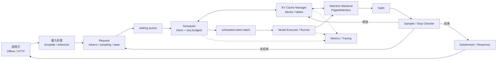
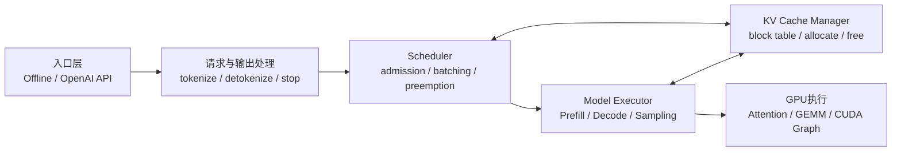

# vLLM 技术深潜学习指南：从执行循环到调度、PagedAttention 与性能工程

本文是一份独立于入门指导的技术进阶文档。它不重复“怎样调用一次 API”，而是回答以下问题：

- 一个请求进入 vLLM 后，控制面和数据面分别做了什么？
- Prefill、Decode 为什么具有不同的计算与访存特征？
- Scheduler 怎样在 token budget、sequence budget 和 KV block 容量之间做决策？
- PagedAttention 怎样把逻辑 token 位置映射到非连续物理 KV block？
- `gpu_memory_utilization`、`max_model_len`、并发和模型结构怎样共同决定容量？
- Continuous batching、chunked prefill、prefix caching、preemption 分别优化哪一段？
- 怎样用 TTFT、ITL/TPOT、吞吐、waiting、KV usage 和 preemption 建立性能证据链？

配套工程固定基线：

| 项目       | 基线                         |
| :--------- | :--------------------------- |
| GPU        | RTX 4090 24GB，单卡          |
| OS         | Ubuntu 24.04                 |
| Python     | 3.12                         |
| CUDA wheel | CUDA 12.6 变体               |
| vLLM       | `0.10.0+cu126`               |
| 默认模型   | `Qwen/Qwen2.5-1.5B-Instruct` |
| 默认 TP    | `tensor_parallel_size=1`     |

> 版本边界：推理数学、KV cache 和调度约束属于相对稳定的原理；类路径、默认引擎、指标名称和参数默认值属于版本实现。本文涉及具体实现时以 vLLM 0.10.0 为边界，并要求在实际服务的启动日志与 `/metrics` 中再次确认。

---

## 1. 先建立系统级心智模型

### 1.1 两个维度：先认清构成，再理解关系

学习 vLLM 可以拆成两个互补维度：

```text
维度一：基本概念
  -> 系统由哪些组件构成？
  -> 每个组件负责什么、不负责什么？
  -> 它持有什么状态，输入和输出是什么？

维度二：概念关系
  -> 谁创建、拥有或调用谁？
  -> 数据怎样在组件之间流动？
  -> 请求怎样改变状态？
  -> 显存、token budget和并发怎样形成约束？
  -> 哪个指标能观察关系链的结果？
```

只掌握第一个维度，会变成孤立地背`Scheduler`、KV cache、PagedAttention等名词；只掌握第二个维度而没有准确定义，则容易画出看似完整但对象边界错误的流程图。技术掌握要求能够把每个概念放进关系链，并为箭头给出代码或指标证据。

### 1.2 基本概念维度：vLLM由什么构成

下面的“组件”是稳定的职责划分，不承诺所有版本都使用完全相同的类名或进程结构。vLLM 0.10.0实际运行V0还是V1路径，应以启动日志和安装包源码为准。

| 概念组    | 核心概念                                             | 主要职责                                            | 不负责什么               |
| :-------- | :--------------------------------------------------- | :-------------------------------------------------- | :----------------------- |
| 接口层    | Offline `LLM`、OpenAI兼容API                         | 接收本地调用或HTTP请求，返回同步、异步或流式结果    | 不直接决定GPU物理KV地址  |
| 输入处理  | Chat template、Tokenizer、Input Processor            | 把消息/文本转换成模型可接受的prompt token和附加输入 | 不执行Transformer层计算  |
| 请求模型  | Request、SamplingParams、Sequence/Candidate          | 保存输入、生成参数、当前token、候选和停止状态       | 不拥有全局GPU执行资源    |
| 引擎      | Engine、Async Engine                                 | 组织请求生命周期，连接调度、执行、输出和指标        | 不是单纯的模型权重对象   |
| 调度层    | Scheduler、waiting/running队列、budgets              | 决定本轮哪些请求推进、推进多少token以及何时preempt  | 不计算Attention数值结果  |
| KV管理    | KV Cache Manager、Block Allocator、Block Table       | 分配、映射、复用和释放物理KV blocks                 | 不选择下一个输出token    |
| 执行层    | Model Executor、Worker、Model Runner                 | 准备执行batch，调用模型前向和设备执行路径           | 不负责HTTP鉴权和业务路由 |
| Attention | Attention Backend、PagedAttention、KV写入Kernel      | 写入新K/V，并按block table读取历史K/V完成Attention  | 不决定请求调度优先级     |
| 输出处理  | Logits Processor、Sampler、Stop Checker、Detokenizer | 从logits选择token，判断停止并还原文本               | 不规划模型权重和KV容量   |
| 可观测性  | Logs、Metrics、Tracing、Profiler                     | 暴露请求、调度、cache、延迟和Kernel证据             | 指标本身不自动给出根因   |

#### 1.2.1 接口层概念定义

| 核心概念      | 定义                                                                                                                                             |
| :------------ | :----------------------------------------------------------------------------------------------------------------------------------------------- |
| Offline `LLM` | 面向本地Python程序的高层同步入口。它负责根据引擎配置创建推理引擎，通过`generate`等方法提交一组离线请求，并把引擎输出整理成`RequestOutput`列表。  |
| OpenAI兼容API | 把HTTP请求、鉴权、模型逻辑名称和OpenAI风格的Completions/Chat Completions协议适配为内部生成请求，再把内部输出转换成普通或流式HTTP响应的服务入口。 |

#### 1.2.2 输入处理概念定义

| 核心概念        | 定义                                                                                                                           |
| :-------------- | :----------------------------------------------------------------------------------------------------------------------------- |
| Chat template   | 与模型训练格式匹配的消息渲染规则。它把`system/user/assistant`等结构化消息转换成带有正确角色标记和特殊token的文本或token序列。  |
| Tokenizer       | 模型词表和编码/解码规则的实现。编码阶段把文本转换成token IDs，解码阶段把生成token IDs还原为文本，并定义BOS、EOS等特殊token。   |
| Input Processor | 对不同prompt表示进行归一化、校验和模型相关预处理的组件。它形成引擎能够接收的token输入及必要附加信息，但不执行Transformer前向。 |

#### 1.2.3 请求模型概念定义

| 核心概念       | 定义                                                                                                                                   |
| :------------- | :------------------------------------------------------------------------------------------------------------------------------------- |
| Request        | 一次生成任务的生命周期对象，通常关联唯一request ID、prompt、生成参数、到达时间、当前阶段、输出进度和结束状态。                         |
| SamplingParams | 请求级生成策略配置，描述如何从logits选择token以及何时停止，例如temperature、top-k、top-p、seed、`max_tokens`和stop条件。               |
| Sequence       | 一条具体token路径及其生成状态，包含当前token IDs、已计算位置、对应KV映射和完成状态；同一请求在多候选或beam场景中可能关联多条sequence。 |
| Candidate      | 同一请求产生的一条候选输出。它通常对应一个`CompletionOutput`，具有自己的token序列、文本、累计概率和结束原因。                          |

#### 1.2.4 引擎概念定义

| 核心概念     | 定义                                                                                                                     |
| :----------- | :----------------------------------------------------------------------------------------------------------------------- |
| Engine       | vLLM推理系统的核心协调者。它接纳请求，驱动调度迭代，协调KV管理与模型执行，更新请求状态，并将生成结果交给输出处理。       |
| Async Engine | 为并发和流式服务提供异步接口及后台执行循环的引擎封装。它允许多个调用方在已有请求运行时继续加入、取消或异步消费请求输出。 |

#### 1.2.5 调度层概念定义

| 核心概念          | 定义                                                                                                                  |
| :---------------- | :-------------------------------------------------------------------------------------------------------------------- |
| Scheduler         | 在每个调度迭代中，根据请求顺序、token预算、sequence预算和KV容量选择本轮工作，并处理等待、继续运行、完成或preemption。 |
| Waiting queue     | 已被引擎接纳但当前尚未获得执行机会的请求集合。请求可能因为到达顺序、调度预算或KV容量限制而停留其中。                  |
| Running set/queue | 当前已进入执行生命周期、可在本轮或后续迭代继续Prefill/Decode的活跃请求集合；具体数据结构和命名随引擎版本而变化。      |
| Token budget      | 单个Scheduler迭代允许安排的最大token工作量，常由`max_num_batched_tokens`等配置约束。                                  |
| Sequence budget   | 单个Scheduler迭代允许同时处理的最大sequence数量，常由`max_num_seqs`等配置约束。                                       |
| Preemption        | 资源压力下让某个活跃请求暂时退出当前运行集合并释放相关资源的调度动作；请求之后可通过recompute或相应恢复路径继续。     |

#### 1.2.6 KV管理概念定义

| 核心概念         | 定义                                                                                                             |
| :--------------- | :--------------------------------------------------------------------------------------------------------------- |
| KV Cache         | 各Attention层为已处理token保存的Key和Value张量数据，使Decode无需为全部历史token重复计算K/V。                     |
| KV Cache Manager | 统筹KV cache容量和请求映射的管理组件，负责查询可用空间、为请求分配/追加block、复用缓存并在完成或抢占时回收资源。 |
| Block Allocator  | 管理物理KV block ID及其空闲、占用、引用或缓存状态的分配器；它回答“有哪些block可以分配”，但不执行Attention。      |
| Logical block    | 某条sequence按固定token粒度划分得到的逻辑KV分块，用于表达序列位置，不直接代表GPU上的物理地址。                   |
| Physical block   | KV cache pool中真实存放一组token K/V数据的固定大小存储块，可被不同请求在不同时刻分配、释放或复用。               |
| Block Table      | 按请求/sequence维护logical block到physical block的映射表，使逻辑连续的token可以存放在不连续物理块中。            |

#### 1.2.7 执行层概念定义

| 核心概念       | 定义                                                                                                              |
| :------------- | :---------------------------------------------------------------------------------------------------------------- |
| Model Executor | 面向引擎的模型执行抽象，负责把一次scheduled work分派到本地或分布式worker，并汇总执行结果。                        |
| Worker         | 一个具体执行参与者，通常绑定某个设备或并行rank，负责设备初始化、模型加载、cache建立以及调用本rank的Model Runner。 |
| Model Runner   | 把Scheduler输出转换成模型前向所需的设备输入和元数据，执行Prefill/Decode模型计算，并产生logits或后续处理所需结果。 |

#### 1.2.8 Attention概念定义

| 核心概念          | 定义                                                                                                                        |
| :---------------- | :-------------------------------------------------------------------------------------------------------------------------- |
| Attention Backend | 为特定设备、dtype和模型特征选择并封装Attention实现、KV cache布局及相关元数据接口的后端抽象。                                |
| PagedAttention    | 能依据block table在非连续物理KV blocks上完成Attention读取的算法与Kernel路径，是分页式KV管理能够参与实际模型计算的执行基础。 |
| Slot mapping      | 描述当前batch中每个新token的K/V应写入哪个物理KV slot的映射元数据，由执行输入准备阶段提供给KV写入路径。                      |
| KV写入Kernel      | 把本轮新计算得到的K/V按照slot mapping重排并写入paged KV cache正确物理位置的设备Kernel。                                     |

#### 1.2.9 输出处理概念定义

| 核心概念         | 定义                                                                                                      |
| :--------------- | :-------------------------------------------------------------------------------------------------------- |
| Logits Processor | 在采样前按照请求约束对原始logits进行变换、惩罚或掩码处理，例如重复惩罚、允许token集合或结构化输出限制。   |
| Sampler          | 对处理后的logits应用temperature和top-k/top-p等策略，执行greedy或随机选择并产出下一token ID。              |
| Stop Checker     | 根据EOS、stop字符串/token、`max_tokens`、上下文边界或取消状态判断sequence是否结束，并记录结构化结束原因。 |
| Detokenizer      | 把生成token IDs按tokenizer规则还原为文本，并在流式输出中维护增量解码边界，避免错误重复或截断字符片段。    |

#### 1.2.10 可观测性概念定义

| 核心概念 | 定义                                                                                                                   |
| :------- | :--------------------------------------------------------------------------------------------------------------------- |
| Logs     | 面向单次启动、请求或异常的离散事件记录，用于确认配置、引擎路径、模型加载、preemption和第一条根因错误。                 |
| Metrics  | 随时间聚合的Gauge、Counter或Histogram，例如running、waiting、KV usage、preemption、TTFT和ITL，用于观察容量与性能趋势。 |
| Tracing  | 把一次请求跨API、排队、调度、模型执行和输出等阶段连接成带时间关系的span，用于定位端到端耗时归属。                      |
| Profiler | 采集CPU/GPU执行细节的分析工具或机制，用于观察Kernel timeline、CUDA launch、显存带宽和算子耗时等底层证据。              |

每个概念应按“四问”掌握：

```text
它是什么？
它持有什么状态？
它接收什么、产出什么？
它的责任边界在哪里？
```

例如，Scheduler持有或读取请求队列与调度预算，产出本轮scheduled work；它不计算logits。PagedAttention按映射读取K/V并计算Attention；它不决定哪个请求先运行。

### 1.3 概念关系维度：六类关系

#### 1.3.1 组合与归属关系

```text
Offline LLM / API Server
  -> 使用 Engine

Engine
  -> 协调 Scheduler
  -> 协调 KV Cache Manager
  -> 驱动 Model Executor
  -> 收集 Output Processor 与 Metrics

Model Executor
  -> 管理一个或多个 Worker / Model Runner
  -> 调用 Attention Backend 与其他GPU Kernel
```

“Engine包含模型”只是粗略说法。更准确地说，Engine管理模型执行生命周期；实际权重和设备执行由executor/worker/runner等执行组件承载，具体进程边界随版本和并行配置变化。

#### 1.3.2 数据流关系

```text
messages/text
  -> chat template / tokenizer
  -> prompt token IDs
  -> Request
  -> scheduled token batch
  -> Model Executor
  -> logits + newly computed K/V
  -> Sampler selects token ID
  -> Request state更新
  -> Detokenizer
  -> text/output object/API response
```

其中K/V不沿普通输出路径返回客户端，而是写入引擎管理的KV cache，供同一请求后续Decode或符合条件的prefix复用。

#### 1.3.3 状态转换关系

```text
new request
  -> waiting
  -> running Prefill
  -> running Decode
  -> finished / aborted
  -> release KV blocks
```

容量不足时，请求还可能被preempt并在后续恢复。状态转换由请求进度、调度预算、KV block容量和停止条件共同触发，不是只由HTTP连接状态决定。

#### 1.3.4 资源约束关系

```text
模型结构 + dtype + TP
  -> 权重与每token KV成本

gpu_memory_utilization - 权重 - 峰值执行开销
  -> 可规划KV cache容量

当前prompt token + 已生成token + 活跃请求数
  -> 当前KV block需求

max_num_batched_tokens + max_num_seqs + 可用KV blocks
  -> 本轮可调度工作
```

Scheduler不是只按先来后到排序；即使请求排在前面，也必须同时满足token、sequence与KV容量约束。

#### 1.3.5 时间与性能关系

```text
排队 + tokenization + Prefill + 首次采样
  -> TTFT

多轮 Decode + 调度/Kernels + 输出传输
  -> ITL/TPOT

运行集合动态变化 + batch形状 + KV容量
  -> 吞吐与尾延迟
```

Prefill、Decode共享GPU执行资源，chunked prefill调整二者在调度迭代中的组合方式；continuous batching调整相邻迭代的运行请求集合。

#### 1.3.6 观测与诊断关系

```text
请求状态     -> running / waiting
KV管理状态   -> KV cache usage / prefix-cache metrics
调度回退     -> preemption counter
阶段耗时     -> queue time / TTFT / ITL / E2E latency
GPU执行结果  -> Kernel duration / bandwidth / utilization
```

一个指标只观察关系链的一部分。例如KV usage高只说明cache余量较少；必须与waiting、preemption和延迟同时变化，才能更有力地支持“KV容量是主要瓶颈”。

### 1.4 两个维度合并后的总关系图



读图时区分三种箭头：

- 实线正向箭头表示主要数据或控制流。
- 双向箭头表示执行与状态管理之间的读写协作。
- 虚线表示观测关系，Metrics读取状态但不应反向决定业务正确性。

### 1.5 五个容易混淆的边界

1. **模型不等于引擎**：模型负责神经网络前向；引擎还管理请求、调度、KV和输出。
2. **请求不等于执行batch**：请求是长期状态对象；batch是某次迭代被选中的token工作集合。
3. **KV cache不等于KV Cache Manager**：前者是K/V数据；后者负责block生命周期与映射。
4. **PagedAttention不等于Scheduler**：前者解决非连续KV访问；后者决定哪些请求本轮执行。
5. **API Server不等于推理核心**：API层处理HTTP、认证和协议；核心引擎也可通过Offline API使用。

掌握检查：任选一个概念，能说明它的上游、下游、持有状态、资源约束和对应指标，才算同时掌握两个维度。

### 1.6 vLLM 不是“更快的 `model.generate`”这么简单

可以把 vLLM 看成五个互相约束的子系统：



五个子系统回答不同问题：

| 子系统           | 核心问题                                     |
| :--------------- | :------------------------------------------- |
| 入口层           | 请求从哪里到达，结果怎样返回？               |
| 请求处理         | 文本怎样变成 token，何时停止，怎样流式输出？ |
| Scheduler        | 本轮让哪些请求运行，分配多少 token 工作？    |
| KV Cache Manager | 每条序列的历史 K/V 放在哪些物理 block？      |
| Model Executor   | 本轮执行哪些模型层、Kernel 和采样操作？      |

“吞吐为什么上不去”不能只看 GPU 利用率；可能是入口到达率不足、Scheduler 的 batch 太小、KV block 不足、Decode 访存受限，或 CPU 调度/输出处理成为瓶颈。

### 1.7 控制面与数据面

- **控制面**：请求状态、waiting/running 队列、调度预算、block 分配、停止判断、输出路由。
- **数据面**：token ID、hidden states、Q/K/V、KV cache、logits、采样结果，以及 GPU Kernel 执行。

Scheduler 决定“谁运行”；Model Executor 决定“怎样算”；KV Cache Manager 决定“历史状态放在哪里”。这是后续阅读源码时最重要的边界。

### 1.8 一次请求的完整生命周期

```text
文本/消息
  -> chat template（仅 chat 输入需要）
  -> tokenizer 得到 prompt token IDs
  -> 校验上下文和请求参数
  -> 加入 waiting
  -> Scheduler 分配 token budget 与 KV blocks
  -> Prefill 计算 prompt，写入首批 K/V，产生首个 logits
  -> Sampling 选出第一个输出 token
  -> 多轮 Decode：读历史 K/V、追加新 K/V、产生 logits、采样
  -> 命中 EOS / stop / max_tokens / abort
  -> 释放请求占用的 KV blocks
  -> detokenize 并返回最终或流式结果
```

这条链中有三类状态：

1. **请求状态**：waiting、running、finished，特定实现还可能表现出 preempted 等状态。
2. **序列状态**：当前 token IDs、已生成数量、停止原因、候选序列。
3. **存储状态**：逻辑 token block 到物理 KV block 的映射。

---

## 2. 从 Transformer 推理数学理解 Prefill 与 Decode

### 2.1 Causal self-attention 的最小公式

对某一层输入 `X`：

```text
Q = X Wq
K = X Wk
V = X Wv

Attention(Q, K, V)
= softmax((Q Kᵀ) / sqrt(d_head) + causal_mask) V
```

因果 mask 只允许位置 `i` 关注 `0..i`。自回归生成第 `t` 个输出 token 时，模型条件依赖于 prompt 与之前所有输出：

```text
P(y_t | prompt, y_0, y_1, ..., y_{t-1})
```

因此普通 Decode 不能在不知道 `y_t` 时直接确定 `y_{t+1}`。Speculative decoding 可以并行提出并验证多个候选，但没有消除目标模型的自回归正确性约束。

### 2.2 Prefill：一次处理多个尚未缓存的 token

设 prompt 长度为 `L`。普通 Prefill 会为这些 token 计算各层 Q/K/V 和 MLP，并把 K/V 写入 cache。

从 Attention 的矩阵形状看：

```text
Q: [L, Hq, D]
K: [L, Hkv, D]
V: [L, Hkv, D]
```

Prefill 能把多个 token 组织成较大的矩阵运算，通常更容易利用 GPU 计算单元。标准全 Attention 的注意力计算量随 prompt 长度呈二次增长数量级，但实际耗时还受 FlashAttention、融合 Kernel、模型 MLP、batch 和硬件影响。

Prefill 的主要用户可感知结果是首个输出 token，因此常与 TTFT 关联；但端到端 TTFT 还包含排队、tokenization、调度和采样。

### 2.3 Decode：每条活跃序列每步通常推进一个 token

有 KV cache 时，一条序列在 Decode 步只需计算新 token 的 Q/K/V，把新 K/V 追加到 cache，再让新 Q 读取全部历史 K/V。

```text
new Q:      [1, Hq, D]
history K:  [T, Hkv, D]
history V:  [T, Hkv, D]
```

单序列每步矩阵规模小，并且每一步都要读取随上下文增长的历史 KV。它通常比 Prefill 更容易受显存带宽、Kernel 启动和调度开销影响。vLLM 的关键策略是把多个活跃序列的 Decode token 放进同一轮执行，扩大有效 batch。

### 2.4 为什么“Prefill 计算密集、Decode 访存密集”只是常见结论

这是一条有用的工程近似，不是对所有模型、长度和 batch 的定理：

- 很短 prompt 的 Prefill 也可能规模不足。
- 很大的 Decode batch 会提高算术强度。
- MoE、滑动窗口、量化和不同 Attention backend 会改变瓶颈。
- CPU 调度、tokenization 或网络可能遮盖 GPU 特征。

正确做法是用 prompt 长度、输出长度和并发构造控制变量，再结合 GPU trace/profiler 和端到端指标判断。

---

## 3. KV cache：从张量形状推导真实容量

### 3.1 为什么缓存 K/V，而不是 Q

历史 token 的 K/V 会被所有后续 token 重复使用；历史 Q 完成当时位置的 Attention 后，后续位置不再需要它。于是标准 Decode cache 的核心是每层历史 K 与 V。

对于每层结构一致的 decoder-only Transformer，单 token 的主要 KV 数据量为：

```text
B_token
= 2 × N_layers × N_kv_heads × D_head × B_element
```

其中：

- `2`：Key 和 Value 两份。
- `N_layers`：需要 KV cache 的 Attention 层数。
- `N_kv_heads`：KV head 数，不是 Query head 数。
- `D_head`：每个 head 的维度，通常为 `hidden_size / num_attention_heads`。
- `B_element`：KV cache 实际 dtype 的每元素字节数。

总主要数据量：

```text
B_kv_data ≈ B_token × 所有存活序列当前缓存的 token 总数
```

### 3.2 GQA/MQA 为什么显著减少 KV 容量

MHA 中通常 `Hq = Hkv`。GQA 让多个 Query heads 共享较少的 KV heads；MQA 可进一步把 KV heads 降到一组。

KV cache 与 `Hkv` 成正比，所以不能用 `num_attention_heads` 代替 `num_key_value_heads`。Query heads 仍参与 Attention 计算，只是共享 K/V；“KV cache 降低几倍”不等于“整层计算量降低几倍”。

### 3.3 默认 Qwen2.5-1.5B 的手算

默认模型配置给出：

```text
hidden_size             = 1536
num_attention_heads     = 12
num_key_value_heads     = 2
num_hidden_layers       = 28
torch_dtype             = bfloat16
```

因此：

```text
D_head = 1536 / 12 = 128

B_token
= 2 × 28 × 2 × 128 × 2 bytes
= 28672 bytes
= 28 KiB / token
```

若一条序列缓存 4096 token：

```text
28 KiB × 4096 = 112 MiB
```

若所有活跃序列合计缓存 100000 token，纯 KV 张量数据约为：

```text
28 KiB × 100000 ≈ 2.67 GiB
```

这些数字不包含 block 尾部空闲、对齐、block table、元数据、模型权重、激活、CUDA Graph、通信 buffer 和 allocator 保留空间，因此只能用于数量级与日志交叉核对。

### 3.4 从可用 KV 空间反推理论 token 容量

若启动日志表明可用于 KV cache 的空间近似为 `M_kv`：

```text
理论 KV token 容量 ≈ floor(M_kv / B_token)
```

若每条请求的平均活跃长度为 `L_avg`：

```text
仅按 KV 容量估算的并发上限 ≈ floor(KV_token_capacity / L_avg)
```

这不是可承诺并发，因为还要满足 scheduler sequence budget、token budget、延迟目标、峰值工作区和请求长度分布。容量上限与性能上限必须分开。

---

## 4. PagedAttention：数据结构、地址映射与碎片

### 4.1 连续分配为什么不适合生成请求

请求的最终输出长度事先未知。如果一开始按最大长度为每条序列预留连续 KV：

- 实际生成短时，预留而未使用的空间浪费严重。
- 不同请求持续到达和结束，产生外部碎片。
- 并行采样/beam 的共享前缀可能被重复存储。

PagedAttention 把一条序列的逻辑 KV 切成固定 token 粒度的 block，并允许逻辑相邻 block 映射到不连续的物理 block。

### 4.2 三个核心对象

```text
logical block number
  = token_position // block_size

offset in block
  = token_position % block_size

physical block number
  = block_table[request_id][logical_block_number]
```

假设 `block_size=16`：

```text
Request A logical blocks:  L0    L1    L2
                           |     |     |
Block table:              P7    P2    P9

token position 37
  -> logical block = 37 // 16 = 2
  -> offset        = 37 % 16  = 5
  -> physical slot = block_table[A][2] × 16 + 5
```

执行器使用 slot mapping 把本轮新产生的 K/V 写入正确物理位置；Decode Attention 使用 block table 与 sequence length 查找历史 K/V。

### 4.3 PagedAttention Kernel 接收什么

从 vLLM 0.10.0 的 PagedAttention 接口可以看到典型 Decode 输入：

- 当前 `query`。
- 分块存储的 `key_cache`、`value_cache`。
- 每条序列的 `block_tables`。
- 每条序列的 `seq_lens`。
- `block_size`、`num_kv_heads`、缩放因子和 KV dtype。

这说明 PagedAttention 不只是 Python 侧的内存分配器；Attention Kernel 本身必须能够沿 block table 访问非连续物理 KV。

### 4.4 内部碎片与外部碎片

- 固定大小物理 block 可以消除不同大小连续区间造成的外部碎片。
- 每条序列最后一个未填满 block 仍有内部空闲。

若 block size 为 `S`，单序列最后一个 block 的未使用 token 槽在 `0..S-1` 之间。block 越小，尾部浪费通常越少，但 block table、元数据和映射管理开销会增加；block 越大则相反。

### 4.5 OS 分页类比的边界

成立的部分：逻辑连续、物理离散、固定粒度、通过映射表寻址、按需分配。

不能照搬的部分：它不是 CPU 虚拟内存的权限系统、缺页异常或通用磁盘换页机制；vLLM 管理的是模型 Attention 使用的 GPU KV 数据结构。

---

## 5. Scheduler 与 Continuous Batching

### 5.1 调度单位不是“原始请求列表”

Offline `llm.generate(prompts, ...)` 接收一个列表，但 Scheduler 真正关心的是当前迭代可推进的 token 工作。在线场景中，请求错开到达和结束，运行集合会在迭代边界变化。

Continuous batching 的关键不是“同时有多个请求”，而是：

```text
每个调度迭代重新选择运行集合
  -> 已完成请求退出并释放 block
  -> 等待请求在满足预算后进入
  -> 活跃 Decode 请求继续推进
```

### 5.2 两类核心预算

可以用两个约束理解 Scheduler：

```text
本轮已调度 token 数 <= max_num_batched_tokens
本轮活跃 sequence 数 <= max_num_seqs
```

此外还必须满足可用 KV block、模型长度、LoRA/多模态等功能约束。

- `max_num_batched_tokens`约束一次迭代处理的 token 工作量。
- `max_num_seqs`约束同一迭代可容纳的序列数。
- `max_model_len`约束单条序列允许的总长度，不是本轮 batch token 数。

### 5.3 一个抽象调度循环

```python
while unfinished_requests:
    reclaim_blocks_from_finished_requests()
    budget = new_token_and_sequence_budget()

    batch = []
    for request in scheduling_order:
        work = request.next_prefill_chunk_or_decode_token()
        if fits_budget(work) and kv_blocks_available(work):
            allocate_or_extend_kv_blocks(request, work)
            batch.append(work)
        else:
            keep_waiting_or_preempt(request)

    model_outputs = execute_model(batch)
    sample_and_update_requests(model_outputs)
    emit_ready_outputs()
```

这是因果模型，不是 vLLM 源码逐行复刻。阅读源码时要寻找相同职责，而不是强求函数名完全一致。

### 5.4 Default prefill 与 chunked prefill

长 Prefill 若整段占用较大 token budget，会阻塞 Decode 并拉高 ITL。Chunked prefill 把长 prompt 切成若干片段，让 Prefill 片段与 Decode 工作共享调度迭代。

在 vLLM 0.10.0 文档描述的 chunked prefill 策略中，Decode 优先，然后用剩余 `max_num_batched_tokens` 预算安排 Prefill；放不下的 Prefill 会继续分块。

典型取舍：

- 较小 `max_num_batched_tokens`：较少长 Prefill 干扰 Decode，ITL 可能改善，但大 prompt 的 TTFT/吞吐可能变差。
- 较大值：单轮可推进更多 Prefill token，TTFT或吞吐可能改善，但 Decode 更容易受到大 Prefill 干扰。

必须标注实际使用 V0 还是 V1、chunked prefill 是否启用；不同路径默认行为不应混写。

### 5.5 Preemption 是容量压力下的调度动作

当 Scheduler 无法为所有活跃请求提供足够 KV block 时，可能让某些请求退出当前运行集合，之后通过 recompute 或特定路径恢复。

Recompute 的交换关系：

```text
释放 KV blocks
  -> 降低当前显存压力
  -> 以后重新计算部分历史状态
  -> 增加额外 Prefill 计算和延迟
```

Preemption 不等于 CUDA OOM：前者是引擎为了继续运行采取的资源调度；后者是底层显存分配失败。频繁 preemption 会使吞吐和尾延迟恶化，应结合 KV usage、waiting 与请求长度判断。

---

## 6. 显存规划：预算、已保留与当前使用

### 6.1 显存组成

```text
进程显存
≈ 模型权重
 + KV cache pool
 + 前向激活与临时 workspace
 + CUDA context / CUDA libraries
 + CUDA Graph 与编译相关 buffer
 + 通信 buffer（多卡时）
 + allocator 已保留但当前未被张量使用的空间
```

`gpu_memory_utilization`是当前模型执行器实例的显存预算比例，不是“KV cache 占总显存的比例”。引擎需要先容纳权重、profiling 得到的峰值执行开销及其他保留，剩余预算才用于规划 KV cache。

### 6.2 为什么 `nvidia-smi` 不跟 KV 使用线性变化

引擎通常在初始化时建立较大的 KV cache pool。请求运行时改变的是 pool 内部 block 的已用/空闲状态，进程向驱动保留的总显存可能近似不变。

因此：

- `nvidia-smi`回答“进程总体拿住多少显存”。
- `/metrics`中的 KV cache usage 回答“预先规划的 KV block 用了多少”。

两者不是互相替代，而是观察不同抽象层。

### 6.3 初始化 OOM 与运行期容量压力

| 现象           | 初始化 OOM                                   | 运行期 KV/调度压力                      |
| :------------- | :------------------------------------------- | :-------------------------------------- |
| 服务是否曾健康 | 否                                           | 是                                      |
| 常见阶段       | 权重、profiling、cache、Graph/workspace 分配 | 长 prompt、高并发、长输出期间           |
| 证据           | 启动第一条根因错误、空闲显存、模型/dtype     | KV usage、waiting、preemption、TTFT/ITL |
| 优先动作       | 清理进程、核对模型、给运行时留余量           | 降低活跃 token/并发，检查调度预算       |

盲目提高利用率可能给 KV 更多空间，也可能压缩执行临时余量并触发 OOM；盲目降低则可能使 KV cache 更小、preemption 更多。

### 6.4 `max_model_len` 与当前 KV 使用不是同一个量

```text
max_model_len
  = 单序列可接受的最大总长度边界

current cached tokens
  = 所有存活请求已经 Prefill + 已生成的 token
```

请求不会因为 `max_model_len=4096` 就到达时立刻占用 4096 token 的 KV block。实际压力跟当前 token、block 取整和并发有关；最大长度还会影响合法性检查和某些容量规划。

---

## 7. Sampling：从 logits 到 token 与停止

### 7.1 模型与采样器的边界

模型前向输出词表 logits：

```text
logits shape ≈ [num_scheduled_sequences, vocab_size]
```

采样器根据 `SamplingParams`变换/过滤候选并选择 token。低 temperature 不会让模型知识更正确；它只改变给定 logits 下的选择行为。

### 7.2 Temperature

对 `T>0` 的概念式：

```text
p_i = softmax(logit_i / T)
```

- `0<T<1`：扩大分数差异，分布更尖。
- `T>1`：压缩分数差异，分布更平。
- vLLM 中 `temperature=0` 表示 greedy，不是实际执行除以 0。

### 7.3 Top-k 与 top-p

- `top_k=k`：最多保留当前分数最高的 `k` 个 token，限制候选数量。
- `top_p=p`：保留累计概率达到 `p` 的最小高概率集合，限制概率质量。

两者同时启用时，最终候选受两项限制共同影响。Top-p 的候选数随每步概率分布变化，不是固定数量。

### 7.4 Seed 与可复现性

Seed 控制采样随机数条件，但不能固定：

- 不同 Kernel 的浮点归约顺序。
- 不同 vLLM/PyTorch/CUDA 版本的执行路径。
- TP 或调度方式变化。
- 模型 revision 与 tokenizer 变化。

自回归生成会放大某一步的微小差异。实验应同时记录模型 revision、环境、完整 SamplingParams、输入 token IDs 和 seed。

### 7.5 停止语义

- `max_tokens`：单候选最多新生成 token 数，不包含 prompt。
- EOS：模型生成的结束 token。
- `stop`：调用方提供的字符串或 token 停止条件。
- `finish_reason`：结构化说明 stop 或 length 等结束类型。
- `stop_reason`：命中特定 stop 字符串/token 时提供更具体原因；EOS 情形可能为 `None`。

模型上下文还要求：

```text
prompt_tokens + possible_output_tokens <= accepted_context_limit
```

---

## 8. Offline Engine：对象模型与批量调度

### 8.1 当前工程的最短路径

对应 [`examples/01_basic_inference.py`](../examples/01_basic_inference.py)：

```python
llm = LLM(**config.llm_kwargs())
sampling = SamplingParams(temperature=0.2, top_p=0.9, max_tokens=128)
outputs = llm.generate([prompt], sampling)
```

对象关系：

```text
LLM
  -> 持有引擎与模型生命周期

SamplingParams
  -> 描述单次请求的采样和停止行为

generate(prompts, sampling)
  -> 提交请求并驱动引擎完成

list[RequestOutput]
  -> 外层：每个输入请求
  -> RequestOutput.outputs：该请求的 CompletionOutput 候选
```

### 8.2 一次初始化与稳态请求必须分开

`LLM(...)`可能包含配置解析、权重加载、设备初始化、内存 profiling、KV cache 建立、Kernel 加载/编译、预热和 CUDA Graph capture。

性能报告至少拆成：

1. 进程启动到 `LLM`可用。
2. 第一次 `generate`。
3. 后续相同形状的稳态 `generate`。

不要循环创建多个 `LLM`来测“逐条推理”。合理对照是在同一个 `LLM`上比较一次列表提交与多次同步单条提交。

### 8.3 离线列表与 continuous batching 的边界

[`examples/02_offline_batch.py`](../examples/02_offline_batch.py) 一次提交已知 prompt 列表，让引擎同时看到多个请求并获得合批机会。

它不能独立证明在线 continuous batching，因为列表内请求并未错开到达。要证明动态加入，需要在旧请求尚未结束时提交新请求，并记录时间线与 Scheduler 指标。

---

## 9. OpenAI 兼容服务：异步入口与输出流

### 9.1 在线路径增加了什么

```text
HTTP客户端
  -> API key / 参数校验
  -> served model name 路由
  -> chat template（Chat API）
  -> tokenization
  -> 异步请求跟踪与 waiting queue
  -> Engine/Scheduler
  -> 流式增量或最终结果
  -> JSON序列化与网络返回
```

在线端到端延迟比离线 `generate`多了网络、HTTP、排队、序列化与客户端读取，不应直接混比。

### 9.2 Served model name 与权重路径

[`scripts/serve_openai.sh`](../scripts/serve_openai.sh) 中：

- `VLLM_MODEL`决定从哪个仓库 ID 或本地路径加载权重。
- `VLLM_SERVED_MODEL_NAME`决定客户端 `model=`填写的逻辑名称。

逻辑名称使业务接口与部署路径解耦，但运维侧仍需记录实际模型 revision。

### 9.3 Chat template

Chat API 的 `role/content`不是模型直接理解的结构。Tokenizer 的 chat template 必须把消息渲染为模型训练时使用的特殊 token 与文本格式。

- Instruct/chat 模型通常提供模板。
- Base 模型可能只适合普通 completions。
- 服务健康不代表 chat template 一定可用。
- 复制其他模型的模板即使不报错，也可能造成语义格式错误。

### 9.4 Streaming 改变返回方式，不改变自回归依赖

Streaming 让已完成 token 更早传给客户端，改善感知延迟和内存占用方式，但目标模型仍按自回归步骤生成。要分别测服务端 TTFT、客户端首字节/首增量时间和最终完成时间。

---

## 10. Tensor Parallel：矩阵切分与通信代价

### 10.1 TP 切分的基本思想

Transformer 层中的线性变换可以沿输出或输入维切分。简化理解：

```text
Column-parallel linear
  -> 不同 rank 计算不同输出特征分片

Row-parallel linear
  -> 不同 rank 计算部分和
  -> 需要 all-reduce 合并
```

实际模型还涉及 QKV projection、attention heads、MLP gate/up/down projection 等切分与通信。vLLM 提供 all-reduce、all-gather、reduce-scatter 等模型并行通信操作。

### 10.2 TP 的收益

- 单卡放不下的权重可分散到多卡。
- 每卡权重压力下降，可能留出更多 KV cache。
- 大模型和足够大负载下，计算并行可能提高吞吐。

### 10.3 TP 的代价

- 层内频繁集合通信和同步。
- NCCL 初始化、rank 管理和故障面。
- 互联带宽/延迟可能成为瓶颈。
- 某些模型维度需能被 TP size 合理切分。
- 部分状态与 buffer 可能复制，显存并非按 TP size 完美等分。

### 10.4 为什么单张 4090 必须 TP=1

`tensor_parallel_size`表示模型并行 rank 数量，通常每个 rank 对应一张可见 GPU。TP=2 不是在一张卡中开两个线程，而是要求两个 GPU rank 与跨 rank 通信。

当前单卡工程保持：

```bash
export VLLM_TENSOR_PARALLEL_SIZE=1
```

默认 1.5B 模型能在单卡运行时，不应为了“使用并行”引入通信开销。

---

## 11. CUDA Graph、Kernel 与批形状

### 11.1 为什么 CUDA Graph 有价值

Decode 每步工作较小、重复次数多，CPU launch 与框架调度开销可能明显。CUDA Graph 可以捕获可复用执行图，降低重复 launch 开销。

代价与边界：

- 捕获需要额外显存。
- 形状变化可能需要多个 capture size 或回退到 eager。
- 首次 capture/预热不属于稳态请求延迟。
- 动态功能不一定都适合 graph replay。

### 11.2 形状决定 Kernel 效率

同样输出 1000 token，以下负载并不等价：

```text
1 条请求 × 1000 Decode steps
100 条请求 × 平均 10 Decode steps
```

前者每步 batch 小且串行长；后者能在部分阶段形成大 Decode batch，但有更多请求状态与 KV block。性能测试必须同时报告请求数、prompt token 分布、output token 分布和到达模式。

### 11.3 不要用 GPU utilization 代替性能结论

结果指标：

- TTFT、ITL/TPOT、端到端延迟。
- prompt/output/total tokens/s。
- 请求吞吐与错误率。

诊断指标：

- GPU utilization、带宽、Kernel duration。
- running/waiting、KV usage、preemption。
- CPU 使用率与网络时间。

诊断指标解释结果，不能代替结果。

---

## 12. 指标体系与因果诊断

### 12.1 四个核心延迟/吞吐定义

设请求到达时间 `t_arrive`，首输出 token 可用时间 `t_first`，最终完成时间 `t_done`，输出 token 数 `N_out`：

```text
TTFT = t_first - t_arrive

E2E latency = t_done - t_arrive

平均 TPOT（常见近似）
= (t_done - t_first) / max(N_out - 1, 1)

Output throughput
= 压测窗口内生成的 output tokens / 窗口秒数
```

ITL是相邻输出 token 到达间隔的分布，比单一平均 TPOT 更能反映抖动。

### 12.2 吞吐与延迟的排队关系

在稳定系统中可用 Little's Law 建立直觉：

```text
平均系统内请求数 ≈ 到达率 × 平均停留时间
```

当到达率接近服务能力，waiting 和尾延迟往往非线性上升。最高 tokens/s 不一定是满足延迟 SLO 的最佳运行点。

### 12.3 vLLM 服务指标

不同引擎路径可能暴露旧/新 KV 指标名，先查询实际服务：

```bash
curl -s http://127.0.0.1:8000/metrics \
  | grep -E 'vllm:(num_requests_running|num_requests_waiting|gpu_cache_usage_perc|kv_cache_usage_perc|num_preemptions_total|time_to_first_token_seconds|inter_token_latency_seconds)'
```

重点语义：

| 指标                     | 类型      | 正确读法                           |
| :----------------------- | :-------- | :--------------------------------- |
| running                  | Gauge     | 当前执行集合中的请求数             |
| waiting                  | Gauge     | 等待处理的请求数                   |
| KV usage                 | Gauge     | `1`表示规划 KV cache 使用率 100%   |
| preemptions              | Counter   | 看压测区间增量，不看累计绝对值     |
| TTFT/ITL                 | Histogram | 用 bucket 计算分位数，不只看平均值 |
| prompt/generation tokens | Counter   | 用区间增量计算 tokens/s            |

### 12.4 指标组合解释

| 现象组合                                      | 更支持的假设            | 还要确认                          |
| :-------------------------------------------- | :---------------------- | :-------------------------------- |
| running 高、waiting 短暂后回落、无 preemption | 正常繁忙                | 延迟是否满足目标                  |
| KV 高、waiting 增长、preemption 增长          | KV 容量压力             | 请求长度与并发是否异常            |
| waiting 增长、KV 不高、无 preemption          | 计算或调度预算限制      | GPU、`max_num_seqs`、token budget |
| TTFT 差、ITL 正常                             | 排队或 Prefill 问题     | prompt 长度、chunked prefill      |
| TTFT 正常、ITL 差                             | Decode 或负载问题       | Decode batch、KV读取、preemption  |
| GPU 低、waiting 高                            | CPU/调度/同步或形状不足 | CPU profile、Kernel timeline      |

任何结论都必须附带负载描述，否则指标没有可比较语境。

---

## 13. 七组技术实验

本节给出技术目标和证据口径；对应的可运行代码、4090 安全默认值、故障注入顺序与通过线见
[《vLLM 掌握路径：RTX 4090 调试实验手册》](vllm_debugging_experiments.md)，实测表格单独写入
[《vLLM 调试实验结果记录》](vllm_experiment_results.md)。专项实验将列表/在线并发拆开，
因此可运行手册最终细分为 10 个实验。

### 13.1 实验记录模板

```text
模型与 revision：
vLLM / PyTorch / CUDA / Driver：
GPU 与可见设备：
引擎参数：
采样参数：
请求到达模式：
prompt tokens 分布：
output tokens 分布：
是否预热：
TTFT P50/P95/P99：
ITL P50/P95/P99：
output tokens/s：
running/waiting峰值：
KV usage峰值：
preemption增量：
结论与边界：
```

### 13.2 实验一：冷启动、首请求与稳态

目标：分离下载、加载、预热和稳态生成。

步骤：

1. 模型已提前下载，避免网络混入。
2. 记录进程启动到 `LLM`可用。
3. 连续执行形状相同的 5 次 `generate`。
4. 报告第一次与后四次，不只报告平均值。

通过标准：能解释 CUDA context、Kernel/Graph 预热与缓存为什么使第一次不同。

### 13.3 实验二：Prefill/Decode 二维扫描

目标：把 TTFT 与 TPOT 分开。

固定模型与并发，测试：

```text
prompt tokens:  128 / 512 / 2048 / 4096
output tokens:   16 / 64 / 256
```

预期分析：prompt 变长主要推动 Prefill/TTFT；output 变长扩大 Decode 总时长。不能只记录总延迟。

### 13.4 实验三：列表提交、同步逐条与在线并发

目标：区分引擎复用、静态输入集合和 continuous batching。

对同一组 20 条请求比较：

1. 同一 `LLM`一次列表提交。
2. 同一 `LLM`同步逐条 `generate`。
3. 在线服务并发提交。
4. 在线服务错开到达：长请求先到、短请求后到。

证据：每请求到达/首 token/完成时间，tokens/s，以及 running/waiting 时间线。

### 13.5 实验四：KV 容量模型校验

目标：验证“手算容量→block使用→指标”的关系。

使用 [`examples/04_kv_cache_observe.py`](../examples/04_kv_cache_observe.py)：

```bash
bash scripts/run_example.sh kv-cache --batch-size 8  --repeat 160 --max-tokens 64
bash scripts/run_example.sh kv-cache --batch-size 16 --repeat 160 --max-tokens 64
bash scripts/run_example.sh kv-cache --batch-size 16 --repeat 240 --max-tokens 64
```

逐次记录 tokenizer 实际 token 数，而不是使用字符数替代。将总活跃 token 乘以 `28 KiB/token`，与 KV usage 变化做数量级核对。

### 13.6 实验五：Preemption 压力曲线

目标：找到“正常高使用率”和“容量抖动”的边界。

逐步增加并发或上下文，直到出现 waiting/preemption。每次只改一个变量，记录：

```text
并发 -> KV usage -> preemption增量 -> TTFT P99 -> tokens/s
```

停止条件：出现错误、持续 OOM、机器影响其他任务，或已经取得清晰转折点。不要为制造 OOM 直接把所有参数推到最大。

### 13.7 实验六：Chunked prefill 取舍

目标：观察长 Prefill 对 Decode ITL 的干扰。

1. 先启动持续 Decode 的长输出请求。
2. 中途注入长 prompt 短输出请求。
3. 比较不同 `max_num_batched_tokens`，并明确是否启用 chunked prefill。
4. 同时报告长 prompt TTFT 与已有 Decode 请求 ITL。

结论不能写“参数越大越好”；应得到一条 TTFT/ITL/吞吐取舍曲线。

### 13.8 实验七：Automatic Prefix Caching

目标：证明 APC 只复用共享前缀的 Prefill KV。

构造两组：

- A：相同长文档前缀 + 不同问题。
- B：不同长文档前缀 + 相同长度问题。

启用 prefix caching 后比较第二次请求 TTFT、缓存命中相关指标与输出正确性。APC主要减少共享前缀的 Prefill 计算，不会直接缩短长答案的每个 Decode 步。

---

## 14. 源码阅读路线

### 14.1 不先死记文件路径

vLLM 版本和 V0/V1 路径会变化。先在目标环境定位实际对象：

```bash
python - <<'PY'
import inspect
from vllm import LLM, SamplingParams

print("LLM:", inspect.getsourcefile(LLM))
print("SamplingParams:", inspect.getsourcefile(SamplingParams))
PY
```

再搜索关键职责：

```bash
python - <<'PY'
import pathlib
import vllm

root = pathlib.Path(vllm.__file__).resolve().parent
print(root)
PY
```

在输出目录中使用：

```bash
rg -n "class .*Scheduler|def schedule|def engine_step" <vllm-package-dir>
rg -n "block_table|slot_mapping|paged_attention" <vllm-package-dir>
rg -n "num_preemptions|num_requests_waiting" <vllm-package-dir>
```

### 14.2 推荐顺序

1. **本工程入口**：`examples/01_basic_inference.py`、`scripts/serve_openai.sh`。
2. **公共 API**：`LLM`、`SamplingParams`、`RequestOutput`、`CompletionOutput`。
3. **请求加入与引擎循环**：请求怎样进入 waiting，engine step 怎样被驱动。
4. **Scheduler**：token/sequence budget、Prefill/Decode选择、preemption。
5. **KV 管理**：block allocator、block table、allocate/append/free。
6. **Model runner**：输入 batch 怎样准备，模型前向怎样执行。
7. **PagedAttention backend**：slot mapping 写cache，Decode怎样读取 block table。
8. **Metrics logger**：每个指标在哪个状态变化点更新。

### 14.3 每读一个函数回答五个问题

```text
输入数据结构是什么？
它读取和修改了哪些状态？
它在哪个循环/生命周期被调用？
失败或容量不足时走哪个分支？
哪个日志、指标或实验能证明这个行为？
```

如果只能复述函数名，仍没有建立系统理解。

---

## 15. 故障诊断树

### 15.1 服务未启动成功

```text
vLLM import失败？
  -> Python环境与wheel/ABI

torch看不到GPU？
  -> Driver / 容器映射 / CUDA_VISIBLE_DEVICES / PyTorch build

权重加载失败？
  -> 模型路径 / 权限 / 磁盘 / revision

初始化OOM？
  -> 其他进程 / 模型与dtype / 显存预算 / max_model_len / Graph余量

分布式失败？
  -> 可见GPU数 / TP size / NCCL / rank环境
```

### 15.2 服务健康但请求失败

```text
401/403
  -> API key

model not found
  -> served model name

chat template错误
  -> base/instruct模型与tokenizer模板

长度错误
  -> prompt tokens + max_tokens 与上下文边界

输出被截断
  -> finish_reason=length
```

### 15.3 高负载下变慢

```text
waiting上升？
  -> 是：检查KV usage与preemption
       -> 同时高：容量压力
       -> 不高：计算/调度budget/CPU/网络

TTFT变差但ITL稳定？
  -> 排队或Prefill

ITL变差？
  -> Decode batch、长Prefill干扰、preemption、GPU访存

GPU低但队列高？
  -> CPU调度、同步、输入形状、请求入口
```

---

## 16. 技术掌握路线与通过线

### 16.1 阶段一：能推导

必须闭卷完成：

- 从 Attention 公式解释为什么缓存 K/V。
- 推导单 token KV 字节公式。
- 用默认 Qwen 配置算出 `28 KiB/token`。
- 解释 Prefill 与 Decode 的形状和瓶颈差异。

### 16.2 阶段二：能解释系统

必须画出：

- 请求生命周期。
- Scheduler token/sequence/KV 三重约束。
- logical block、block table、physical block、slot mapping 关系。
- waiting/running/preemption 状态变化。

### 16.3 阶段三：能用数据验证

至少完成：

- Prefill/Decode 二维扫描。
- 离线列表、同步逐条、在线并发对照。
- KV 容量手算与 metrics 对照。
- 一次可控 preemption 或接近容量边界的复盘。
- Chunked prefill 或 prefix caching 二选一实验。

### 16.4 阶段四：能定位问题

给出一份真实故障记录，包含：

```text
现象
-> 生命周期分层
-> 根因假设
-> 最小证据
-> 单变量修改
-> 修改后同负载复测
-> 结论边界
```

### 16.5 停止线

满足以下条件后，不必继续横向背参数：

- 能在 15 分钟内闭卷画出请求、调度和 KV 三张图。
- KV 公式、Qwen 手算、TTFT/ITL定义无结构性错误。
- 至少三组实验有原始日志和指标时间线。
- 能从 waiting/KV/preemption/TTFT/ITL 的组合提出并验证假设。
- 能在安装包中定位 API、Scheduler、KV 管理和 PagedAttention 代码。

之后按实际问题进入 prefix caching、speculative decoding、quantization、LoRA、structured output 或多卡扩展，而不是继续扩充入门清单。

---

## 17. 技术口试题

先闭卷回答，再回读对应章节。每题至少包含“定义、因果、公式/数据结构、证据、边界”。

1. 模型前向、采样器和 detokenizer 分别产生什么？
2. 为什么标准自回归 Decode 不能任意并行确定未来多个 token？
3. 从 Q/K/V 公式解释 KV cache 为什么不保存历史 Q。
4. 推导单 token KV 字节公式，并说明为什么必须使用 KV heads。
5. 默认 Qwen2.5-1.5B 为什么是 `28 KiB/token`？
6. 为什么 4096 token 的纯 KV 数据不是该请求的全部显存成本？
7. logical block、physical block、block table 和 slot mapping 怎样配合？
8. PagedAttention消除了什么碎片，仍保留什么碎片？
9. PagedAttention 与 OS 虚拟内存类比的边界是什么？
10. Continuous batching 的“continuous”具体发生在哪个时间边界？
11. `max_num_batched_tokens`、`max_num_seqs`、`max_model_len`分别限制什么？
12. Chunked prefill 为什么可能改善 ITL，同时对 TTFT 产生取舍？
13. Preemption 为什么不是 OOM？Recompute 用什么换什么？
14. 为什么 `nvidia-smi`稳定而 KV usage 可以大幅变化？
15. `gpu_memory_utilization`提高后，为什么既可能减少preemption，也可能引发OOM？
16. Offline列表提交为什么不能单独证明online continuous batching？
17. TTFT差、ITL正常时应优先检查什么？反过来呢？
18. Running、waiting、KV usage与preemption怎样组合定位容量压力？
19. TP中的row-parallel为什么需要集合通信？
20. 为什么单张4090的TP size必须为1？
21. CUDA Graph优化了什么开销，为什么需要额外显存与预热？
22. Prefix caching为什么主要改善Prefill而不是长答案Decode？
23. Seed固定后为什么仍不能承诺跨环境逐token一致？
24. 怎样设计一个能证伪自己“KV是瓶颈”假设的实验？

通过标准：24题中至少20题达到“能推导并给证据”，其中第4～15题不能有结构性错误。

---

## 18. 技术口试题详细答案

使用方式：先闭卷回答第17节，再对照本节。答案不是要求逐字背诵，而是给出一条合格技术回答应包含的因果链。只有同时给出自己的代码位置、日志、指标或实验记录，才算真正掌握。

### 18.1 模型前向、采样器和 detokenizer 分别产生什么

**考察点：** 能否分清模型计算、token选择与文本还原三个阶段，避免把“模型输出文本”当成一次原子操作。

**详细答案：**

模型前向接收 token IDs 及其位置、Attention所需的历史KV等输入，经过Embedding、Transformer层和LM Head，产生词表维度的logits。Logits是每个候选token的未归一化分数，不是已经选定的token，也不是最终文本。

采样器接收logits和`SamplingParams`。它根据temperature、top-k、top-p、重复惩罚等规则调整或过滤候选分布，再通过greedy或随机采样选出token ID。这个token会加入该序列，并成为下一轮Decode的输入之一。

Detokenizer按照tokenizer词表和解码规则，把输出token IDs逐步还原成文本。流式场景还要处理不完整字节、合并token和增量文本边界。停止处理器同时检查EOS、stop字符串/token和长度上限，最终形成`finish_reason`等结构化结果。

因果链为：

```text
model forward -> logits
logits + SamplingParams -> selected token ID
token IDs + tokenizer rules -> text
```

**验证证据：** 在基础推理中同时打印`candidate.token_ids`、`candidate.text`和`candidate.finish_reason`；请求`logprobs`后观察每个位置的候选概率。输出对象可从[`examples/01_basic_inference.py`](../examples/01_basic_inference.py)开始扩展。

**边界/误区：** Token和可见字符不是一一对应；一个汉字、空格或Unicode字符可能跨token，单个token也可能解码成多个字符片段。Logits最高的token也不代表事实正确。

### 18.2 为什么标准自回归 Decode 不能任意并行确定未来多个 token

**考察点：** 是否理解自回归条件依赖，以及“跨请求合批”和“同一序列未来token并行”不是一回事。

**详细答案：**

标准自回归模型将序列概率分解为：

```text
P(y_1, ..., y_T | x)
= Π_t P(y_t | x, y_1, ..., y_{t-1})
```

要计算`y_{t+1}`的正确条件分布，必须先知道实际选中的`y_t`。`y_t`会进入下一步Embedding和各层计算，产生新的K/V并改变`y_{t+1}`的logits。因此同一序列的普通Decode存在严格的跨步依赖。

vLLM可以把多个独立请求在同一Decode迭代中的“各一个新token”组成batch并行执行；这提高的是跨序列并行度，没有打破单序列依赖。

Speculative decoding是例外路径：草稿模型先提出多个候选，目标模型并行验证，然后只接受满足目标分布规则的前缀。它减少目标模型迭代次数，但不是未经验证地同时决定任意未来token。

**验证证据：** 固定prompt，分别设置不同`max_tokens`，在稳态环境记录总Decode时间和输出token数；再提高并发，比较单请求TPOT与整体tokens/s。若并发提高后整体吞吐上升，而单请求仍逐步流式返回，就能看到两种并行的区别。

**边界/误区：** 模型一次前向能计算多个已知prompt token，不代表能一次正确生成多个未知未来token；Prefill的并行性来自输入已经全部已知。

### 18.3 从 Q/K/V 公式解释 KV cache 为什么不保存历史 Q

**考察点：** 能否根据Attention数据依赖判断哪些历史张量会被未来步骤复用。

**详细答案：**

对某层输入`X`：

```text
Q = XWq
K = XWk
V = XWv
Attention(Q, K, V) = softmax(QK^T / sqrt(d))V
```

生成新位置`t`时，只需要新位置的`q_t`去查询所有可见历史位置的`K_0..K_t`，再用得到的权重聚合`V_0..V_t`。历史位置的`q_i`只用于当时位置`i`的输出；后续位置不会再次用`q_i`发起查询。

因此Decode时应缓存历史K/V，而新Q按当前token即时计算：

```text
q_t × [K_0, ..., K_t]^T
  -> attention weights
  -> weights × [V_0, ..., V_t]
```

若不缓存K/V，每一步都要从历史token重新计算各层K/V，产生大量重复前向计算。

**验证证据：** 查看模型配置的`use_cache`和vLLM PagedAttention接口，确认Decode读取`query`、`key_cache`和`value_cache`，同时用block table定位历史KV。还可以根据第3章公式计算缓存K/V而非Q/K/V三份数据的容量。

**边界/误区：** 这里讨论标准decoder-only self-attention。Encoder-decoder、状态空间模型、混合Attention或其他架构可能保存不同状态，不能把标准KV cache结论机械套用。

### 18.4 推导单 token KV 字节公式，并说明为什么必须使用 KV heads

**考察点：** 是否能从每层张量形状完成容量推导，并理解MHA、GQA、MQA的共享关系。

**详细答案：**

对每个需要标准KV cache的Attention层，一个token产生：

```text
Key:   [N_kv_heads, D_head]
Value: [N_kv_heads, D_head]
```

如果每个元素占`B_element`字节，则每层每token：

```text
2 × N_kv_heads × D_head × B_element
```

再乘需要cache的层数：

```text
B_token
= 2 × N_layers × N_kv_heads × D_head × B_element
```

GQA让多组Query heads共享较少的KV heads，MQA进一步把KV heads降到一组或少数组。实际存入cache的是K/V张量，所以元素数量由`N_kv_heads`决定。若错误使用`N_attention_heads`，会在GQA/MQA模型中按两者比值高估容量。

例如`Hq=12`、`Hkv=2`，使用Query heads会把KV数据量错误放大6倍。

**验证证据：** 从模型`config.json`读取`num_hidden_layers`、`num_attention_heads`、`num_key_value_heads`和`hidden_size`，先计算`D_head=hidden_size/num_attention_heads`，再与启动日志中的KV token或block容量做数量级核对。

**边界/误区：** `B_element`应取实际KV cache dtype，不一定等于权重dtype；混合Attention、滑动窗口或不同层cache规格的模型要逐层求和。公式不含block取整、对齐和元数据。

### 18.5 默认 Qwen2.5-1.5B 为什么是 `28 KiB/token`

**考察点：** 是否能把通用公式正确应用到当前工程默认模型，并保留单位换算过程。

**详细答案：**

默认模型配置为：

```text
hidden_size         = 1536
attention_heads     = 12
kv_heads            = 2
layers              = 28
KV dtype            = BF16（本手算假设，每元素2字节）
```

先算head dimension：

```text
D_head = 1536 / 12 = 128
```

代入公式：

```text
B_token
= 2 × 28 × 2 × 128 × 2
= 28672 bytes
= 28 KiB/token
```

其中第一个`2`代表K和V，最后一个`2`代表BF16每元素2字节。这两个`2`含义不同，不能省略也不能混为一项。

进一步得到：

```text
4096 tokens × 28 KiB = 112 MiB
100000 tokens × 28 KiB ≈ 2.67 GiB
```

**验证证据：** 在目标服务器加载同一模型revision，打印Transformers配置和vLLM实际KV dtype；将启动日志报告的KV容量乘以28 KiB，与规划的KV显存做数量级比较。

**边界/误区：** `28 KiB/token`是当前配置与BF16 KV的主要数据量，不是所有Qwen模型的常数。改模型、KV dtype、TP方式或cache结构后必须重算。

### 18.6 为什么 4096 token 的纯 KV 数据不是该请求的全部显存成本

**考察点：** 是否能区分请求的主要KV张量、引擎级共享内存和内存管理开销。

**详细答案：**

默认模型下，4096 token的纯KV张量约112 MiB，但进程显存还包含：

- 模型权重。
- 当前前向的激活和临时workspace。
- CUDA context与CUDA库工作区。
- CUDA Graph捕获及其静态buffer。
- KV block尾部未使用槽、对齐、block table与元数据。
- 框架allocator已经保留但当前未被张量实际使用的显存。
- 多卡时的通信buffer及可能复制的状态。

其中很多开销是引擎或batch共享的，不能简单平均到某条请求；另一些开销随并发、最大形状和执行阶段变化。

所以`112 MiB`只能回答“该序列主要KV数据的数量级”，不能回答“这条请求让`nvidia-smi`增加多少”。

**验证证据：** 分别记录空闲进程、`LLM`初始化完成、单请求Prefill、并发Decode和请求结束后的`nvidia-smi`与KV usage。将驱动层总显存与引擎内部block使用分开观察。

**边界/误区：** 不能用单次`nvidia-smi`差值反推精确每token KV成本，因为引擎常预先建立cache pool，allocator也不会立即把释放空间归还驱动。

### 18.7 logical block、physical block、block table 和 slot mapping 怎样配合

**考察点：** 是否能从token位置推到物理KV写入地址，并说明读写两条路径。

**详细答案：**

设block size为`S`，序列中的token位置为`t`：

```text
logical_block = t // S
offset         = t % S
physical_block = block_table[request][logical_block]
physical_slot  = physical_block × S + offset
```

Logical block描述请求自己的逻辑序列分块；physical block是全局KV cache pool中的实际块；block table保存二者映射。逻辑相邻block可以对应不连续物理block。

Scheduler/KV管理器为请求分配或扩展physical blocks，并更新block table。Model runner为本轮新token准备slot mapping，使cache写入Kernel知道每个新K/V应写到哪个physical slot。Decode Attention则使用block table与sequence length遍历历史逻辑位置对应的物理K/V。

```text
写路径：new K/V + slot mapping -> paged KV cache
读路径：query + block table + seq_len -> historical K/V -> attention output
```

**验证证据：** 在安装包中搜索`block_table`、`slot_mapping`、`reshape_and_cache`和`paged_attention`；沿model input preparation到Attention backend记录这些张量的shape与dtype。

**边界/误区：** Block table是映射元数据，不存放K/V本身；slot mapping也不是整条序列的永久副本，它主要描述当前批次token应写入的位置。

### 18.8 PagedAttention消除了什么碎片，仍保留什么碎片

**考察点：** 是否准确区分外部碎片、block尾部内部碎片与预留浪费。

**详细答案：**

如果每条请求需要一个随长度增长的连续KV区间，请求交错到达和结束会留下大小不同的空洞。即使空闲总量足够，也可能没有足够大的连续区域，这是外部碎片。

PagedAttention把物理KV空间划分成相同大小block，任意空闲block都能分给下一个逻辑block，逻辑相邻块不要求物理连续，因此消除了这类可变连续区间造成的外部碎片。

但每条活跃序列的最后一个block通常未填满。例如block size为16，当前长度刚超过16时，第二个block只有1个token有效，剩余15个槽暂时空闲，这是内部碎片。还存在block table和allocator元数据开销。

Block越小，最后一块平均浪费通常越少，但映射项、管理次数和Kernel寻址开销可能上升；block越大则相反。

**验证证据：** 构造大量长短不同、错开结束的请求，记录总活跃token、理论纯KV数据和实际KV block usage；比较不同长度落在block边界前后的使用变化。

**边界/误区：** PagedAttention提高内存管理效率，不会压缩K/V数值本身，也不能保证任何负载下“零浪费”。

### 18.9 PagedAttention 与 OS 虚拟内存类比的边界

**考察点：** 是否能使用类比帮助理解，同时不把两个系统错误等同。

**详细答案：**

类比成立的映射为：

```text
请求逻辑token空间  <-> 进程虚拟地址空间
logical KV block    <-> 虚拟页
physical KV block   <-> 物理页框
block table         <-> 页表
```

两者都提供逻辑连续、物理分散、固定粒度映射和按需分配；这使请求不必占用一块最大长度的连续物理KV区域。

类比不成立的部分包括：PagedAttention不是通用CPU虚拟内存系统，不提供进程地址隔离、读写执行权限、文件映射或由硬件MMU处理的普通缺页异常。它是推理引擎和Attention Kernel共同使用的GPU KV数据布局与管理机制。

Recompute或特定swap路径也不能简单等同操作系统换页；它们的恢复成本、数据对象和调度语义不同。

**验证证据：** 画一张只保留“逻辑块—映射表—物理块”的对照图，再列出上述不能类比的功能。源码中确认block table作为Kernel输入，而不是硬件页表。

**边界/误区：** 类比的目的在于理解地址间接层与碎片管理，不应用类比推导未经文档或源码证实的实现行为。

### 18.10 Continuous batching 的“continuous”具体发生在哪个时间边界

**考察点：** 是否理解iteration-level scheduling，而不是把“同时提交列表”当成continuous batching。

**详细答案：**

“Continuous”发生在相邻Scheduler迭代之间。每一轮完成后，引擎更新请求状态：已完成请求退出并释放block，活跃请求继续Decode，满足预算的waiting请求进入，新到请求也可在后续迭代被接纳。

```text
iteration n:
  running = {A, B, C}

C结束，D到达

iteration n+1:
  running = {A, B, D}
```

这与传统静态batch的区别在于，运行集合不需要等整批所有序列完成后才能整体更换。它提高了GPU工作连续性，也让长短请求可以更灵活地共享执行资源。

Continuous batching不表示请求可以在一个已经发射的单个GPU Kernel内部任意插入；调度变化发生在引擎定义的迭代/step边界。

**验证证据：** 先发送长输出请求，在其尚未完成时再发送短请求。记录每条请求到达、首token和完成时间，并同步采集running/waiting。后到短请求在旧请求全部完成前进入运行或完成，是关键证据。

**边界/误区：** 一次提交不同长度的离线列表，看到短请求先结束，只能证明引擎处理了不同长度请求，不能独立证明“后到请求动态加入”。

### 18.11 三个长度与调度参数分别限制什么

**考察点：** 是否能区分单轮token预算、单轮序列数量和单序列总长度边界。

**详细答案：**

`max_num_batched_tokens`限制一次Scheduler迭代最多安排多少token工作。Prefill可能一次贡献很多token，普通Decode通常每条活跃序列贡献一个或少量token，因此该预算影响Prefill/Decode怎样共享一轮执行。

`max_num_seqs`限制一次迭代最多处理多少条序列。它约束并发进入模型执行batch的序列数量，不等于服务进程能接收的总请求数；超出者可以waiting。

`max_model_len`限制单条序列可接受的最大上下文总长度，通常约束prompt与生成token的合计边界。它不是某一轮执行的token budget，也不表示每条请求立即占满该长度的KV。

三者共同作用：一条请求即使长度合法，也可能因本轮token/sequence budget或KV block不足而等待。

**验证证据：** 固定负载分别只改变一个参数，记录每轮token规模、running/waiting、TTFT、ITL和吞吐。改变`max_model_len`通常需要重建引擎；不要把重启成本混入稳态数据。

**边界/误区：** 参数默认值与调度细节可能随V0/V1和版本变化，必须结合0.10.0实际启动日志与配置输出确认。

### 18.12 Chunked prefill 为什么可能改善 ITL，同时对 TTFT 产生取舍

**考察点：** 是否理解长Prefill与Decode争夺同一轮token预算和GPU执行时间。

**详细答案：**

未分块的长Prefill可能一次占用很大的执行批次，使已经在Decode的请求等待较长时间才得到下一次推进，从而增加ITL。

Chunked prefill把长prompt拆成多个片段。在vLLM 0.10.0文档描述的相关策略中，Scheduler优先安排Decode，再用剩余`max_num_batched_tokens`预算安排Prefill片段。这样单次长Prefill对Decode的阻塞时间缩短，ITL可能改善，也能在同一batch中混合计算特征不同的工作。

代价是长prompt需要多个调度迭代才能完成Prefill，增加调度次数；若token budget设得较小，单条长prompt达到首token的时间可能变长。较大budget有利于更快推进Prefill，但又可能增加对Decode的干扰。

因此目标不是找一个永远最优值，而是获得：

```text
max_num_batched_tokens
  -> long-prompt TTFT
  -> existing-request ITL
  -> overall throughput
```

三者的取舍曲线。

**验证证据：** 让一组请求持续Decode，中途注入长prompt；在明确启用chunked prefill的前提下改变token budget，同时记录原请求ITL和新请求TTFT。

**边界/误区：** 不能脱离实际引擎路径讨论默认行为；V0与V1、是否启用chunked prefill都会改变调度优先级。

### 18.13 Preemption 为什么不是 OOM，Recompute 用什么换什么

**考察点：** 是否能区分引擎级资源调度和CUDA分配失败。

**详细答案：**

Preemption是Scheduler在资源不足时主动让某些请求离开当前运行集合，以释放或重新安排KV blocks。引擎进程仍可继续服务，请求之后可以恢复。

CUDA OOM是某次GPU内存分配无法满足，常表现为异常并可能使初始化或请求执行失败。它发生在底层内存分配层，不是一个正常的请求调度状态。

Recompute模式释放被抢占请求的部分KV状态，之后重新执行其历史token以恢复必要KV：

```text
减少当前KV显存占用
  -> 增加未来重复Prefill计算
  -> 增加请求延迟并消耗吞吐
```

所以Recompute是“用额外计算和延迟换显存容量”。频繁发生说明负载、KV容量和调度设置不匹配。

**验证证据：** 服务保持健康时逐步增加并发/长度，观察`num_preemptions_total`区间增量、KV usage、waiting和延迟，而不是等待真正OOM。日志中保存首次preemption出现时的负载点。

**边界/误区：** 运行期也可能因非KV临时buffer产生真正OOM；“服务已经启动”不能自动排除CUDA OOM，仍需结合异常栈判断。

### 18.14 为什么 `nvidia-smi`稳定而 KV usage 可以大幅变化

**考察点：** 是否理解进程级显存保留与cache pool内部block占用是两个层次。

**详细答案：**

vLLM在初始化阶段通常根据显存预算建立KV cache pool。此时进程已经向GPU allocator/驱动持有大部分计划使用的显存。请求到达后，KV管理器主要在这片pool内部标记physical blocks为已用或空闲，并不需要每增长一个token都向驱动申请新显存。

所以可以出现：

```text
nvidia-smi process memory: 约20 GiB -> 约20 GiB
KV usage:                  10% -> 85% -> 15%
```

请求结束后block被回收到pool，但pool仍由进程保留，`nvidia-smi`也不会立即下降。

**验证证据：** 空闲、并发长请求、请求结束后三个阶段同时采样`nvidia-smi`和`/metrics`。若总显存稳定而KV usage随请求变化，就直接验证了两个观测层的差异。

**边界/误区：** `nvidia-smi`仍然适合检查其他进程、总显存余量和异常增长，只是不适合单独表示KV block逻辑使用率。

### 18.15 提高 `gpu_memory_utilization` 为什么可能减少preemption，也可能引发OOM

**考察点：** 是否理解该参数控制实例总体预算，而不是只控制KV cache。

**详细答案：**

在模型权重与执行峰值开销近似不变时，提高实例显存预算通常能让引擎规划更多KV blocks。更多KV容量可以容纳更多活跃token，因而可能减少waiting与preemption。

但GPU执行仍需要临时workspace、CUDA Graph、库buffer和allocator余量。同卡其他进程也可能动态使用显存。如果预算过高，留给这些不可完全预测开销的安全空间减少，初始化capture或运行期临时分配可能失败并产生OOM。

反方向也成立：为解决启动余量不足而降低该参数，可能让服务成功启动，却因KV pool缩小导致高负载preemption增加。

正确调法是：

1. 先判断初始化失败还是运行期KV压力。
2. 记录启动前空闲显存与其他进程。
3. 小步修改一个参数。
4. 用相同负载比较KV容量、preemption、延迟和错误。

**验证证据：** 例如依次测试`0.80/0.85/0.90`，每次重启后记录可用KV token/block、初始化是否成功和固定压力测试结果。

**边界/误区：** 不能根据RTX 4090标称24GB直接把比例设为接近1；驱动、显示占用、框架和其他进程都会消耗实际余量。

### 18.16 Offline列表提交为什么不能单独证明online continuous batching

**考察点：** 是否能区分“引擎同时看到一批请求”和“运行期间持续接纳后到请求”。

**详细答案：**

Offline列表调用在`t0`之前就准备好了全部prompts：

```text
t0: submit {A, B, C, D}
```

Scheduler可以对这些请求统一调度、让短请求提前完成，这能证明批量调度能力。但它没有测试以下关键条件：

```text
t0: submit {A, B}
t1: A/B仍在运行时，submit {C, D}
t2: C/D进入运行集合
```

Continuous batching强调调度迭代之间运行集合可以随到达与完成动态改变，所以必须包含错开到达时间。

在线服务还具有异步请求跟踪、排队、流式输出和客户端断开等状态，单次同步离线调用不能覆盖这些行为。

**验证证据：** 在长请求Decode期间提交短请求，记录`arrival_time < long_request_done`且短请求在长请求全部结束前获得首token或完成，并用running/waiting变化佐证。

**边界/误区：** 该结论不是说Offline引擎没有高效调度，而是说特定实验的证据不足以证明“后到请求动态加入”。

### 18.17 TTFT差、ITL正常时检查什么，反过来检查什么

**考察点：** 是否能把端到端延迟拆到排队、Prefill和Decode阶段。

**详细答案：**

TTFT从请求到达到首token，通常包含排队、tokenization、Prefill、首次采样和输出传输。TTFT变差而后续ITL正常，优先检查：

- waiting/queue time是否增长。
- prompt长度是否增加。
- 长Prefill是否阻塞或token budget不合适。
- Prefix cache是否未命中。
- Tokenization、网络或API入口是否变慢。

ITL/TPOT描述首token之后的Decode节奏。TTFT正常而ITL变差，优先检查：

- Decode batch和GPU访存效率。
- KV context增长带来的读取量。
- 长Prefill是否插入并干扰Decode。
- preemption/recompute是否发生。
- Streaming输出处理、CPU调度或网络抖动。

如果二者同时恶化，则可能是整体过载、KV压力、GPU计算饱和或系统级资源争用。

**验证证据：** 同时采集per-request arrival/first-token/token timestamps、prompt/output token数、running/waiting、KV usage和preemption，按同一时间轴对齐。

**边界/误区：** 只看端到端平均延迟无法完成此诊断；至少要有TTFT与ITL分位数，并关注P95/P99而非只看均值。

### 18.18 怎样组合 Running、waiting、KV usage 与 preemption 定位容量压力

**考察点：** 是否能使用指标组合和时间变化，而不是单指标阈值下结论。

**详细答案：**

Running高表示当前执行集合请求多，本身可以是正常繁忙。Waiting表示请求尚未进入运行集合，但原因可能是KV不足、sequence/token budget、计算能力或其他约束。KV usage高表示cache余量少，但高使用率本身不等于故障。Preemption是累计counter，应看压测区间增量。

典型组合：

```text
running高
+ waiting短暂后回落
+ KV较高但稳定
+ preemption不增长
= 可能是正常繁忙
```

```text
KV usage持续接近上限
+ waiting持续增长
+ preemption持续增加
+ TTFT/尾延迟恶化
= 强烈支持KV容量压力
```

```text
waiting增长
+ KV usage不高
+ preemption不增长
= 优先检查计算饱和、max_num_seqs、token budget、CPU或网络
```

**验证证据：** 固定请求到达率与长度分布，按秒记录四项指标和延迟；再降低并发或长度。若KV/preemption/延迟同步改善，容量假设得到更强支持。

**边界/误区：** Prometheus Counter重启后可能清零；不同引擎路径的KV指标名可能不同。必须从实际`/metrics`确认名称与类型。

### 18.19 TP中的 row-parallel 为什么需要集合通信

**考察点：** 是否能从矩阵分块推导每个rank只有部分和，因此需要跨rank合并。

**详细答案：**

设线性层：

```text
Y = XW
```

Row-parallel按输入维拆分权重和输入：

```text
X = [X_0, X_1, ..., X_{p-1}]

W = vertical_stack(W_0, W_1, ..., W_{p-1})

Y = Σ_r X_r W_r
```

Rank `r`只能计算局部部分和`Y_r = X_r W_r`。完整输出需要把所有rank的`Y_r`求和，通常通过all-reduce实现；如果下一步仍保持分片布局，也可能采用reduce-scatter等变体。

Column-parallel沿输出维产生不同输出特征分片，是否立即all-gather取决于下一算子能否继续消费分片。Transformer会交替使用适合的切分方式，尽量减少不必要通信，但层内同步无法完全消失。

**验证证据：** 在vLLM安装包中定位`tensor_model_parallel_all_reduce`、all-gather和reduce-scatter调用；双卡实验开启NCCL日志或profiler，观察集合通信时间占比。

**边界/误区：** “TP把计算除以卡数”只描述理想计算量，不含通信、同步、负载不均和复制状态，因此实际加速不会线性。

### 18.20 为什么单张4090的TP size必须为1

**考察点：** 是否理解TP size是模型并行rank数量，而非单卡线程、stream或虚拟切片数量。

**详细答案：**

TP=2意味着模型层张量被切成两个rank，每个rank持有相应分片并参与集合通信。常规GPU部署中每个rank需要一张可见GPU，因此要满足：

```text
torch.cuda.device_count() >= tensor_parallel_size
```

单张RTX 4090只有一个GPU设备。设置TP=2不会让同一张卡产生两个独立模型并行设备，只会在设备校验、worker创建或NCCL初始化阶段失败。

本工程默认1.5B模型可在24GB单卡运行，TP=1还避免了通信与多进程复杂度。

**验证证据：** 在服务器打印`CUDA_VISIBLE_DEVICES`和`torch.cuda.device_count()`，检查启动日志中的rank/worker数量。单卡验收只运行TP=1，不必故意让TP=2失败。

**边界/误区：** CPU多进程数量、CUDA streams和batch并行度都不是TP size。只有实际暴露多张兼容GPU时才进入TP>1验证。

### 18.21 CUDA Graph优化什么开销，为什么需要额外显存与预热

**考察点：** 是否理解Graph主要降低重复launch/Host调度开销，而不是改变模型数学。

**详细答案：**

普通eager执行每个Decode step都由CPU逐个发起Kernel和运行时调用。Decode单步工作较小且重复频繁时，Python/C++调度和CUDA launch开销可能占明显比例。

CUDA Graph先捕获一段GPU工作及其依赖，后续对兼容形状进行graph replay，减少每轮Host端launch与调度开销，提高执行稳定性。

捕获阶段需要实际建立操作、固定或管理输入输出buffer，并可能为多个batch/capture size保存图和内存池，因此会增加初始化时间与显存。第一次运行还可能包含Kernel加载、编译和Graph capture，不能视为稳态延迟。

动态形状或不兼容功能可能回退eager，或者需要多个已捕获形状。Graph不减少权重、KV数据量，也不能消除自回归步数。

**验证证据：** 对相同模型和形状分别记录启动/capture日志、首次请求、稳态请求；若有安全配置可比较eager与Graph路径的TPOT和CPU launch timeline，同时记录显存差异。

**边界/误区：** “Graph启用”不保证端到端显著加速；如果瓶颈是KV带宽、长Prefill、排队或网络，launch优化可能不是主导因素。

### 18.22 Prefix caching 为什么主要改善 Prefill 而不是长答案 Decode

**考察点：** 是否理解prefix cache复用的是已经计算过的共享prompt KV blocks。

**详细答案：**

Automatic Prefix Caching把完整共享前缀对应的KV blocks保留并按内容标识。新请求若具有相同前缀，可以直接引用这些已计算block，跳过共享部分的Prefill计算。

例如两个请求都包含同一份5000-token文档，但问题不同：第二个请求可以复用文档前缀KV，只需计算不同后缀，从而降低TTFT和Prefill工作。

长答案Decode阶段产生的是该请求新输出token。不同请求的生成轨迹通常不同，每一步仍需计算新token的Q/K/V、读取历史KV并采样。因此APC不会直接减少每个新输出token的Decode步骤。

若工作负载主要是短prompt、长输出，Prefill占比小，APC收益就有限；若前缀不相同，也没有命中可复用block。

**验证证据：** 对比“相同长前缀+不同问题”和“不同等长前缀”两组请求，记录第二次请求TTFT、prompt计算量/命中指标和ITL。预期命中组TTFT改善更明显，而长输出ITL变化有限。

**边界/误区：** Prefix caching要求token级前缀一致，视觉上相同但chat template、空格或特殊token不同都可能破坏命中；通常只有完整block可缓存复用。

### 18.23 Seed固定后为什么仍不能承诺跨环境逐token一致

**考察点：** 是否区分随机数可复现、数值确定性和端到端系统确定性。

**详细答案：**

Seed固定的是伪随机数生成条件。在模型、tokenizer、输入token、采样参数、软件、硬件和执行路径一致时，它有助于重复采样结果。

但跨环境可能出现：

- 浮点归约顺序或精度变化。
- 不同Attention/GEMM Kernel。
- vLLM、PyTorch、CUDA版本改变算法路径。
- TP、batch和调度改变执行顺序。
- 模型或tokenizer revision改变。

这些因素可能使接近的logits出现微小差异。如果两个候选概率相近，一次采样结果可能不同；不同token加入上下文后，后续logits继续分叉，自回归过程会放大差异。

`temperature=0`去掉常见随机采样，但并不自动保证跨硬件位级一致。还应区分“答案语义一致”“文本一致”和“token IDs逐项一致”三个标准。

**验证证据：** 保存模型revision、tokenizer、完整环境、输入token IDs和SamplingParams；先在同一环境重复，再迁移环境逐token比较，定位第一个分叉位置。

**边界/误区：** Seed不是质量参数，固定seed不会让错误答案变正确，也不能代替环境记录。

### 18.24 怎样设计一个能证伪“KV是瓶颈”假设的实验

**考察点：** 是否会提出可被数据推翻的假设，而不是只收集支持自己观点的指标。

**详细答案：**

先把假设写成可观察预测：

```text
H1：当前延迟恶化主要由KV容量不足引起。

若H1成立，则在固定模型和到达率下：
1. KV usage应接近容量上限；
2. waiting与preemption应随活跃token增加而增长；
3. 降低并发或序列长度后，三者和尾延迟应同步改善；
4. 在安全余量内增加KV容量后，也应改善。
```

实验设计：

1. 固定模型、dtype、SamplingParams、请求到达率和测量窗口。
2. 基线同时记录prompt/output token分布、TTFT/ITL、tokens/s、running/waiting、KV usage和preemption增量。
3. 只降低每请求prompt/输出长度，保持请求数近似不变。
4. 只降低并发，保持单请求长度不变。
5. 若有显存安全余量，只小步提高`gpu_memory_utilization`并重启复测。
6. 再做一个“计算更重但KV不明显增加”的对照，例如保持活跃token较低而提高请求到达压力或更换计算形状。

以下结果会削弱或证伪H1：

- 延迟恶化时KV usage并不高，preemption不增长。
- 大幅降低活跃token后，waiting和尾延迟几乎不改善。
- 增加KV容量后问题不变。
- GPU计算持续饱和，或CPU/网络指标与延迟更强相关。

这时应转向计算吞吐、`max_num_seqs`/token budget、CPU调度、tokenization或网络假设。

**验证证据：** 输出一张同负载定义下的单变量实验表和统一时间线，并明确写出哪一条观测与H1预测冲突。能够主动找到反例，比只看到“KV usage较高”更有诊断价值。

**边界/误区：** 系统可能同时存在KV与计算瓶颈。证伪“KV是主要瓶颈”不等于KV完全没有压力；结论必须限定在本次模型、长度、并发和服务目标下。

---

## 19. 版本核对与一手资料

- [vLLM 0.10.0 文档首页](https://docs.vllm.ai/en/v0.10.0/)
- [vLLM 0.10.0 Engine Arguments](https://docs.vllm.ai/en/v0.10.0/configuration/engine_args.html)
- [vLLM 0.10.0 Optimization and Tuning](https://docs.vllm.ai/en/v0.10.0/configuration/optimization.html)
- [vLLM 0.10.0 Distributed Inference and Serving](https://docs.vllm.ai/en/v0.10.0/serving/distributed_serving.html)
- [vLLM 0.10.0 PagedAttention API](https://docs.vllm.ai/en/v0.10.0/api/vllm/attention/ops/paged_attn.html)
- [vLLM 0.10.0 Automatic Prefix Caching](https://docs.vllm.ai/en/v0.10.0/features/automatic_prefix_caching.html)
- [vLLM 0.10.0 Public API and Output Objects](https://docs.vllm.ai/en/v0.10.0/api/vllm/)
- [PagedAttention / vLLM SOSP 2023 paper](https://arxiv.org/abs/2309.06180)
- [Qwen2.5-1.5B-Instruct config.json](https://huggingface.co/Qwen/Qwen2.5-1.5B-Instruct/blob/main/config.json)

阅读其他版本资料时，先判断该结论属于“推理原理”还是“实现默认值”。默认引擎、指标名称、参数默认值和源码路径必须在实际安装的 `0.10.0+cu126` 环境中再次确认。
